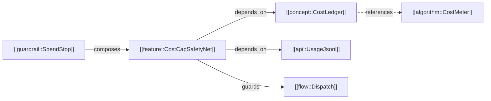
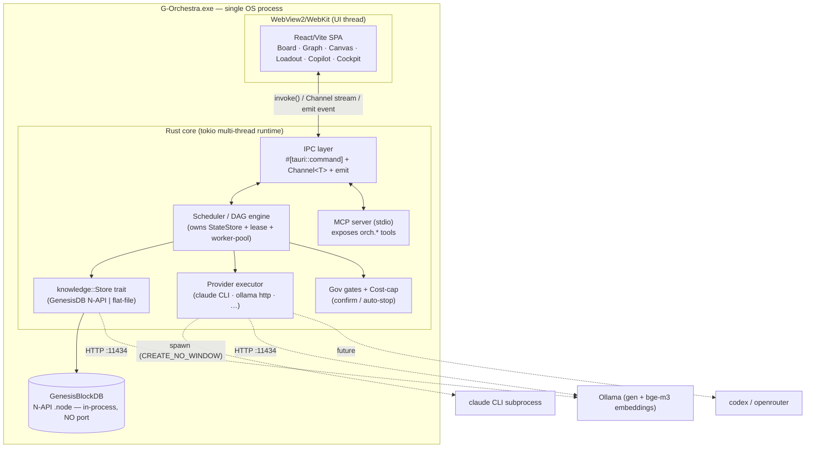
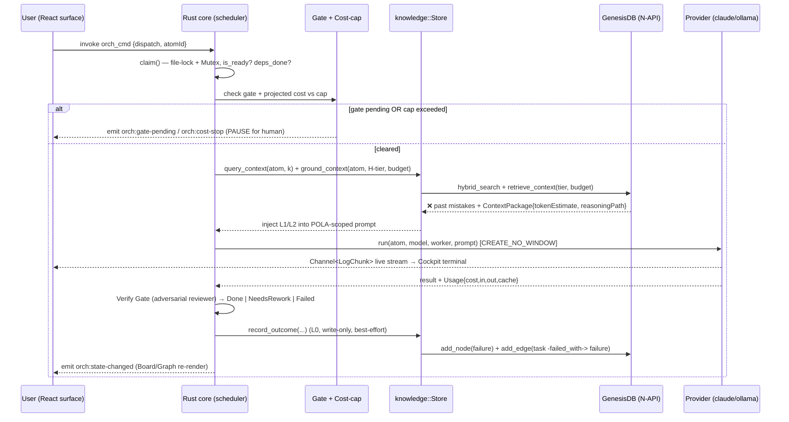
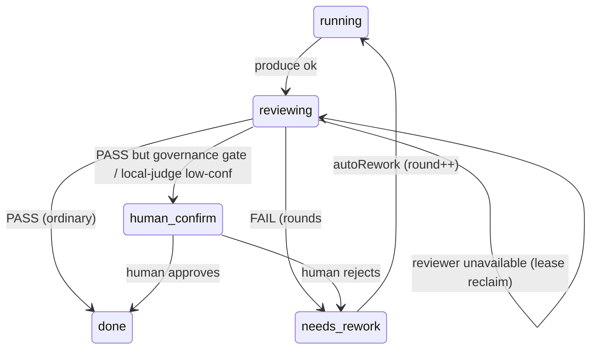
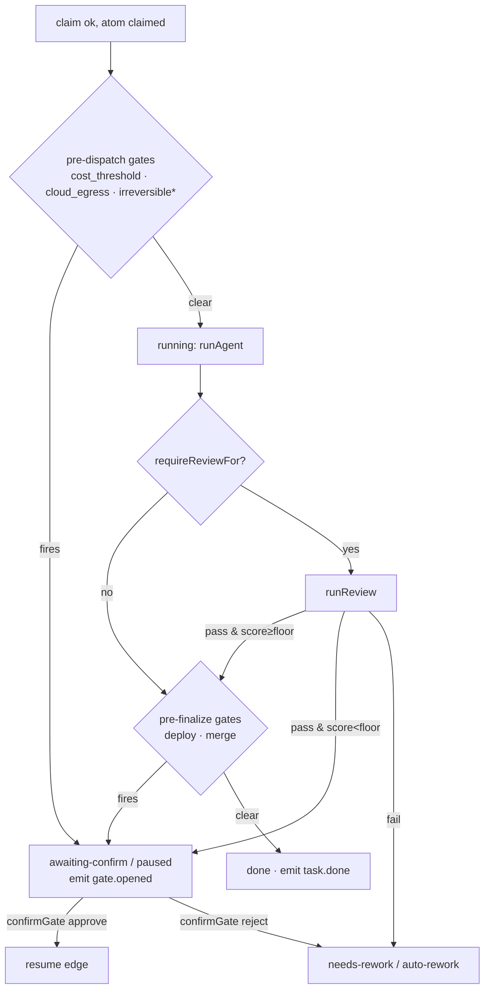
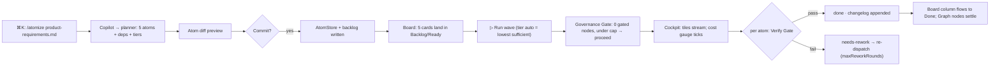
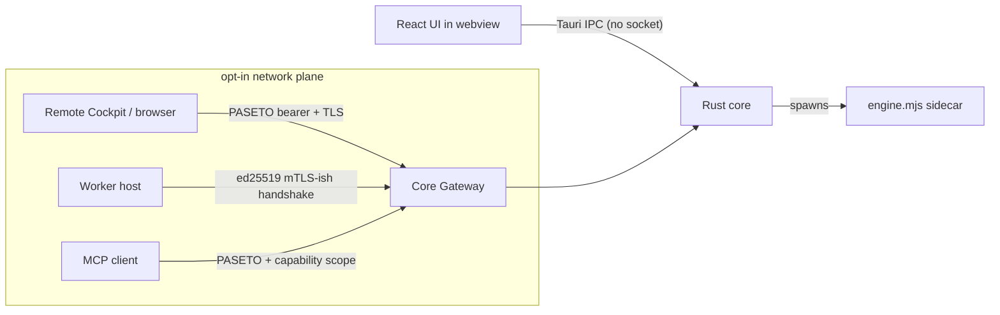
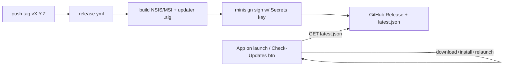
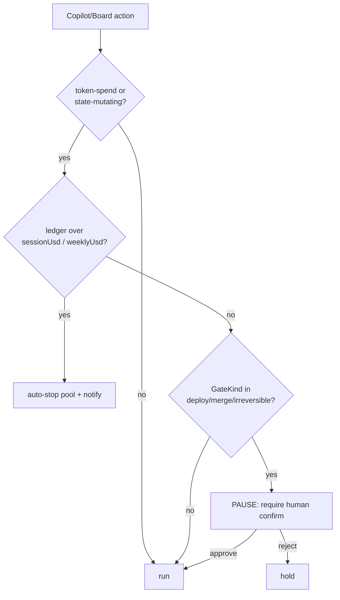

# G-Orchestra v2 — Unified Design Document: A Desktop-First, Atom-Native Multi-Agent Build Command Center

> **Status:** candidate · **Date:** 2026-06-25
> Re-scopes G-Orchestra from an internal dev-only Node tool into a **standalone Tauri v2 + Rust-core desktop product**; **supersedes** `SRS--G-ORCHESTRA.md`, `FEAT--MULTI-AGENT-ORCHESTRATOR.md`, `ADR-O-002`.
> **§0 is authoritative** on the Genesis Block standard, id naming (`Type::Name` logical + `type--name` slug), the three context axes (H / D / T), and the Ownership Layer. Where the auto-drafted §§1–9 diverge, §0 wins (reconciliation map in §0.8).

## Table of Contents
- §0 — Canonical Genesis Block Standard (authoritative)
- 1. Vision, Identity & Personas
- 2. Core Data Model — Genesis Block Atoms
- 3. System Architecture (Tauri v2 + Rust core + GenesisDB)
- 4. Agent System & Loadout (Inventory)
- 5. Doc-to-Code / Spec-to-Code Pipeline & Traceability
- 6. Autonomy, Governance Gates & Cost Safety
- 7. UI, Information Architecture, Surfaces & User Flows
- 8. Product Packaging — Auth, Multi-host, Updater, Licensing, Cross-platform
- 9. Phased Roadmap, Migration & Risks
- Appendix A — Glossary
- Appendix B — Open Decisions (for the owner)

## Executive Summary
**G-Orchestra v2** re-scopes the proven internal `orchestration/` Node tool into a standalone, sellable **Tauri v2 + Rust-core desktop product**: a multi-agent "visual vibe-code" mission-control that turns docs and specs into shipped code via a governed fleet of AI agents. By explicit owner decision this session, the old dev-only constraints (SRS-O, FEAT, ADR-O-002 — "must stay outside Tauri, Node-http-only, no auth") are **SUPERSEDED**. The product is tracked like Jira, arranged like Trello, claimable like Linear, and navigable like Obsidian, with **drag-and-drop as the signature verb** across all four gestures (agent→task, edge creation, node↔DB, block→pipeline). It runs fully autonomous DAG execution but **pauses for a human at governance gates** (deploy / merge / irreversible) and ships with a **cost-cap auto-stop** safety-net because it spends other people's money.

The keystone that makes this more than a pretty queue is the **Genesis Block atom**: one typed, compact record that is *simultaneously* the spec (doc-to-code), the backlog Task, the Obsidian graph node, and the GenesisBlockDB node+vector. There is no separate "task model" and "graph model" — there is the atom and there are projections of it. Atoms carry an `id` written as a wikilink `[[TYPE::Name]]` (which IS a graph edge), standard fields (version, hierarchy slot, status, `context_scaling_tier`), and a body. They are organized in the **Masterplan→Roadmap→Phase→Epic→Sprint→Task→Subtask** hierarchy — the Jira/Linear project tree. Wikilinks across atoms form the editable knowledge graph (Obsidian surface) and the GenesisDB graph edges; the execution flow composes atoms (hook→protocol→api→concept→runbook→algo→safety→stack→audit→mcp) into a runnable pipeline.

The single most important mechanism is **`context_scaling_tier` H0–H5** — the token-efficiency knob that maps 1:1 onto `GenesisDB.retrieveContext(targetId, tier, budget)`. H0 = atom-only (0 graph hops, for subtasks/PRs) up through H5 = the entire knowledge base (5 hops, for masterplan/enterprise vision). Higher tier = more context = more tokens, so the planner assigns the **lowest tier that suffices** to keep agents cheap. This same tier is visible on Board cards, selectable in the Loadout, printed on the cost gauge, and is the spine that ties planning, retrieval, autonomy, and UI together.

Architecturally, v2 is **one desktop process**: a Rust execution core that owns all state and scheduling, a React/Vite webview that renders every surface, and an **embedded GenesisBlockDB** wired **in-process via N-API** as the knowledge/memory backend — behind the existing `store/knowledge.mjs` adapter, with a **mandatory flat-file fallback** (front-matter Markdown is the source of truth; GenesisDB is a rebuildable derived index). The GenesisDB audit verdict is favorable: real BETA (142 tests, cross-OS CI, benched vs Neo4j/Qdrant), runs fully in-process with **no server and no port** (so it dodges the `:3000` Dota-GSI reservation entirely), with a real callable API (addNode/addEdge, retrieveContext, hybridSearch, neighbors, bitemporal supersedeNode/asOf, governance proposeConsensus/signVote/Merkle). Caveats are managed by **pinning a known-good win32-x64 binary**, gating on `schemaVersionSync()`, wiring N-API directly (not its thin/buggy MCP), and treating the DB dir as single-process-owned.

The agent system reuses the engine's proven role→provider resolution and adds the **Loadout** — a first-class, drag-and-droppable inventory atom (`[[support::AgentLoadout]]`) styled like the Persona Forge LOADOUT/EVA stat-sheet. An agent equips a Model ("hat"), Tools/Capabilities, Skills, a **MemoryOS** (long-term persistent per-agent knowledge backed by GenesisDB or filesystem), a POLA context scope + tier, and a persona + role-authority matrix (reviewer cannot modify_files, worker cannot deploy). Owner-approved, an agent may equip an **SLM/LLM-as-tool** — a smaller callable model for cheap classify/extract/summarize or as an LLM-as-judge — which serves token-efficiency and unblocks the Verify Gate from being claude-only. The Loadout is an *override+enrichment layer* over today's `roles[role].preferred`; an empty Loadout reduces exactly to current behavior.

The doc-to-code pipeline closes the loop **intent → atoms → tasks → executed code → verified code → recorded trace**, with a bitemporal traceability graph (implemented_by / verified_by / depends_on / supersedes / failed_with edges) answering "which spec asked for this, which task built it, which test proves it, what did we believe when we shipped it." The **anti-error / belief-revision loop already exists** (`knowledge.mjs` L0/L1/L2, `engine.mjs::pastMistakesBlock`/`groundedBlock`, passing PoC); v2's job is to promote it from a failure-only side-channel into the primary atom-keyed traceability backbone. Autonomy hardens the existing `runPool`/`executeWithReview`/`runReview` loop with a typed gate model enforced **pre-dispatch in the scheduler** (an agent cannot be trusted to honor a gate it could rationalize around), a real cost guard (`projectRunCost` + soft/hard caps — today's null limits MUST become non-null defaults), a kill-switch, and an immutable Merkle-anchored audit trail with a flat-file hash-chain fallback. Default autonomy is **`wave`**, not `auto`.

The UI ships **G-Orchestra's own frontend** inside the Tauri webview (it does NOT import GoVibe, which stays a separate sibling product; an MCP bridge is a future, not v1 goal). Its design law: **one object, six lenses** — Board card, Graph node, Canvas node, Copilot output, and Cockpit tile are all views of the same atom row via a single normalized `AtomStore`, so "claim on the board" and "node turns amber in the graph" stay in sync. Six v1 surfaces ship: the Board (Jira+Trello+Linear with claimable RICE/MoSCoW cards and a rich task-card modal), the editable Obsidian-style Graph, the Node↔DB canvas, the Agent Loadout, the Copilot Console (Maiden-persona chat-to-command), and the Live Cockpit. Product packaging mirrors G-Maiden's working machinery (Tauri updater + minisign + tag-triggered CI) and adds auth, multi-host (a Coordinator host owns the DB; DB-backed leased claims with fencing tokens replace the single-host `.state.lock`), licensing/entitlement, and a Windows-first cross-platform path. The phased roadmap follows a **"strangler around a sidecar"** sequence: keep the proven `engine.mjs` alive and wrapped (P0/P1), port hot paths (scheduler/claim/gates) to Rust with a Node fallback (P2), then retire Node for a multi-host, signed, cross-platform core (P3) — ship the cheap H0/H1 tiers first on flat-file, unlock the expensive H3–H5 graph tiers only once GenesisDB N-API is load-bearing. The launch is explicitly **Windows-first** (the pinned binary is win32-x64-only); mac/Linux semantic recall waits on the napi cross-compile CI matrix and degrades to flat-file until then.

---

## 0. Canonical Genesis Block Standard (authoritative — overrides drift below)

> This section is the **single source of truth** for the Genesis Block atom format, naming, and the context axes. It is grounded in **`SPEC-GKS-001 v1.2.0`** (`G:\govibe\docs\specs\SPEC-Genesis-Block.md`, `source_of_truth: true`, owner THESEUS) and the implemented on-disk reality of GoVibe's `.brain` (real `GENESIS--*` atoms + a populated `genesis-graph.jsonl` of 1,858 nodes / 1,392 edges + a 565-atom `atomic_index.jsonl`). **Where §§1–9 (auto-drafted) diverge from this section, §0 wins.** A reconciliation map is at the end of §0.

### 0.1 Product thesis — G-Orchestra is the *first real runtime* of the Genesis Block standard

GoVibe authored the standard (specs), the manifests (real atoms), and a real **graph backend** — but the **executable runtime** (decompose → compose → dispatch) and the **native compaction engine** are *specified but unbuilt* (`packages/msp/src/genesis/` and the Rust compaction crate do not exist on disk). **G-Orchestra v2 is therefore not a consumer of the standard — it is the engine that makes the standard runnable.** That is the moat: we hold the spec, the populated graph DB, and the first working `load → compose → execute → record` loop.

The owner's framing is literal and is the core authoring loop:

```
   any system / spec ──DECOMPOSE──►  typed Genesis Block atoms (LEGO bricks)
        atoms ──link via Type::Name──►  ASSEMBLE into an execution flow
   agent claims a brick ──scoped by H-tier (enforced)──►  builds it
        Verify Gate ──►  result recorded back into the graph (provenance)
```

### 0.2 Two lineages → one canonical choice

The corpus contains two overlapping lineages of the same idea. **We canonicalize as follows (override any section that says otherwise):**

| Concern | Lineage A — "Physical Compaction" (THESEUS) | Lineage B — "Composite Unit" (EVA 4.0) | **G-Orchestra canon** |
|---|---|---|---|
| Story | **decompose** (pack atoms into 1 file, re-split) | **assemble** (manifest → composed prompt) | **adopt A's decompose discipline + B's compose runtime** |
| Atom id / link | `[[TYPE::Name]]` (double **colon**) | `TYPE--Name` (double **dash**) — *implemented on disk* | **`Type::Name` is the canonical *logical* id; a `type--name` *slug* is the derived path/URL/DB-safe form** |
| Type space | open `[A-Z]+` | **closed 5-dimension core** + optional extensions | **closed 5-core + extensions** (0.4) |

#### 0.2.1 Id representation — `::` logical, `--` slug (owner decision, 2026-06-25)

The canonical **logical id is `Type::Name`** (double colon) — chosen deliberately because the core is **Rust**, where `::` is the path/namespace separator, so `Feature::EditableGraph` reads as a Rust path and communicates intent in the core's own idiom. The **only** real cost of `::` is that a colon is **illegal in Windows filenames** and unsafe in URLs — but that cost is avoided entirely because atoms are stored in **GenesisDB (string keys)** and inside **compound Markdown blocks (id = a header token, not a filename)**, never as one-file-per-id. Wherever an id *does* touch a filename, URL, or an external key that rejects `:`, we **auto-derive a slug**:

```rust
struct AtomId { ty: AtomType, name: Name }       // a newtype — the id is a real Rust value
impl Display for AtomId { /* "Feature::EditableGraph" */ }      // logical / UI / wikilink / Rust
impl FromStr  for AtomId { /* parse "Type::Name" or the slug */ }
impl AtomId  { fn slug(&self) -> String { /* "feature--editable-graph" */ } } // filename / URL / DB key if needed
```

- **Wikilink / body / UI form:** `[[Feature::EditableGraph]]`.
- **Slug (derived, never hand-authored):** `feature--editable-graph` — used for filenames, URLs, and as the GenesisDB node-id *iff* the engine rejects `:` in keys (otherwise the `::` form is stored directly).
- **GoVibe interop:** their on-disk atoms use `--`; a thin `::`⇄`--` boundary function is the only adapter needed if we ever ingest their graph (low priority — separate product).

> ⚠️ **Read-through rule:** §§1–9 below were drafted using `[[TYPE::Name]]`. That **matches** the canonical logical form (treat the auto-drafted `[[X::Y]]` as canonical); just remember the path/URL/DB-key projection is the derived `x--y` slug.

### 0.3 Atom physical format (SPEC-GKS-001 §1)

An atom is a Markdown unit. Two physical shapes are both valid:

- **Compound file (Lineage A):** many atoms packed in one `.md`, each introduced by a header matching the canonical regex (verbatim §1.2):
  `^#\s(?P<type>[A-Z]+):\s(?P<name>.+)\s\[(?P<layer>L\d-.+)\]\s(?P<id>[A-Z0-9_--]+)`
  → groups `type` (MOD/FEAT/ALGO/ENTITY…), `name` (human), `layer` (**L0–L7**), `id` (unique, for relinking). Example: `# FEAT: Editable Graph [L2-Feature] Feature::EditableGraph`.
- **Standalone file (Lineage B):** one atom = one `.md` with YAML frontmatter; body is everything after the closing `---`. (File named by **slug**, never by the raw `::` id.)

**Hub-and-Spoke metadata (the token-noise reducer — SPEC §2):**

```yaml
# FULL-SCALE METADATA  — only on the Genesis "hub" (type: genesis)
id: Module::CentralStockControl
version: <semver>
masterplan: …  roadmap: …  phase: …  epic: …  sprint: …  task: …   # WBS slot
domain: …  cluster: …  layer: …  role: …
status: active | candidate | stable
context_scaling_tier: H3-H5      # hubs sit high

# MINIMAL METADATA — on every leaf atom / spoke (DRY: inherits the rest via block_id)
id: Algo::FefoSort
block_id: Genesis::CentralStockControl
context_scaling_tier: H0-H2      # leaves sit low
role: …
status: active | candidate | stable
```

### 0.4 Atom TYPE catalog (closed core + open extensions)

**The 5-dimension CORE is closed** (this backs the real atoms). `Genesis::*` is the *manifest*, not a sixth member:

| Role | Prefix | Purpose |
|---|---|---|
| Cognitive | `Cognitive::` | the mental lens/frame the block reasons with (read first at compose time) |
| Algo | `Algo::` | step-by-step executable logic |
| Runbook | `Runbook::` | procedural how-to / SOP — when & how to apply the algo |
| Concept | `Concept::` | the "why" — origin, self-consistency, ethical root |
| Params | `Params::` | tunable values |

**Optional extensions** (add only when the concern exists): `Guard::` (data invariants), `Safety::` (alignment rules — **required when the block takes outbound action**: file writes, API calls, deploys), `Stack::` (tech inventory), `Protocol::` (external surface: MCP/A2A/HTTP/FFI — absorbs api/mcp), `Mod::` (module boundary + public API), `Spec::`, `Entity::`, `Adr::`, `Framework::`, `Persona::`. The index stores `type` as a string, so the extension space is **open**; the **core is fixed**. Promotion to "Master Block" requires ≥4 of 5 core dimensions filled.

> Type prefixes are PascalCase in the `::` logical form (`Safety::`, not SAFTY); the slug/regex form is the uppercase `SAFETY--`. There is **no** `mcp`/`api`/`audit`/`hook`/`flow`/`tech_stack` atom *type* — those fold into `Protocol::` (mcp/api), the bitemporal graph log (audit/provenance), the `## EXECUTION FLOW` mermaid (flow), and `Stack::` (tech_stack). Do **not** confuse `Cognitive::` (a reasoning lens) with `Framework::` (governance/architecture).

**Block Manifest** (`Genesis::<Name>`, declares membership + authority):

```yaml
manifest_version: <semver>
members:
  core: { cognitive: [Cognitive::…], algo: [Algo::…], runbook: [Runbook::…],
          concept: [Concept::…], params: [Params::…] }        # all 5, ≥1 each
  optional: { guard: […], safety: […], stack: […], protocol: […], mod: […], spec: […] }
daci: { driver: Mod::… | Persona::…, approver: [...], contributor: [...], informed: [...] }
```
Authority = **DACI** (Driver decides/owns, Approver promotes to `stable`, Contributor, Informed). Every `members.*` id must resolve and be mirrored into `crosslinks.references`. **DACI doubles as the ownership model — see §0.9.**

### 0.5 The THREE axes (never conflate them — the word "tier" is overloaded)

| Axis | Range | What it controls | Where it lives |
|---|---|---|---|
| **H — Context Hop** | **H0–H6** | **enforced tool access control** for the agent (the token engine) | atom field `context_scaling_tier`; enforced by the Rust core + GenesisDB `retrieveContext(id, tier, budget)` |
| **D — Compaction Height** | **D1–D5** | how many structural layers pack into one physical `.md` (D5≈HLD … D1≈code) | the compaction parser (ADR-018 split this OFF from H) |
| **T — Dispatch Tier** | **T1–T3** | cost/model routing at execution time | the provider router / Loadout |

**H is the real token-saving mechanism — it is enforced as actual tool restriction, not a hint (SPEC §3, verbatim behavior):**

| Tier | Hops | WBS rung | Enforced runtime rule |
|---|---|---|---|
| **H0** | 0 | Subtask / PR | single file only — **`glob` forbidden; `grep` restricted to the assigned file path** |
| **H1** | 1 | Task | self + direct `import/export` neighbors |
| **H2** | 2 | Story / Spec | current dir + same-feature neighbors — **requires Plan Approval (human)** |
| **H3** | 3 | Epic | all files within `module_id` scope (default for a hub) |
| **H4** | 4 | Phase / Theme | all files within `system_id` scope |
| **H5** | 5 | Masterplan / Vision | the entire GKS index (docs + metadata) |
| **H6** | 6 | Enterprise ceiling | full-network traversal — **requires architectural override** |

The planner assigns the **lowest H that suffices** (by the task's WBS rung), so a 1-line subtask physically cannot `glob` the repo. **This is the concrete realization of "atomic task + context scope to save tokens."**

> §§1–9 call this `H0–H5` and treat it as a context *budget*. That is the **H-axis** specifically; their model is correct but should read **H0–H6**, with the access-control semantics above, and kept distinct from the **T**-axis (cost routing) and **D**-axis (file packing).

### 0.6 Validation & integrity rules (SPEC §5 + manifest §4)

- **GKS-001** — no duplicate atom `id` in the global `atomic_index.jsonl`.
- **GKS-002** — every `wikilink` relation must be **acyclic** (deterministic backlinks run one-directionally up the chain).
- **GKS-003** — if understanding a task needs **> 6 hops**, return `COUPLING_RISK_WARN` (flags spaghetti coupling → refactor).
- **Status cascade** — `status(block) = min(status(members))` over `stub < raw < draft < active < stable`; one `deprecated`/`superseded` member propagates immediately.
- **Block-Overwrite parser** — to edit one atom, compute the **byte-offset** of its header→end and do a surgical read-update-write, preserving all parent (L1–L4) metadata. This is how agents edit at atom granularity without rewriting whole files — and it is the natural **borrow granularity** for §0.9.
- **WBS axis ⟂ Time axis** — the `Masterplan→…→Subtask` work tree is kept **strictly separate** from the `Release→Sprint` time tree. Time *pulls* from WBS; it never restructures it.

### 0.7 Mapping to GenesisBlockDB (graph = real, vector = to build)

- **Atom → node**: `id` → node id (the `::` form, or its `--` slug if the engine rejects `:`); `type` → labels (`["FEAT","ATOM"]`); frontmatter → props. **`crosslinks` → edges** (`references` / `implements` / `supersedes` / `parent_blueprint`).
- **Bitemporal**: `valid_from` / `valid_to` / `superseded_by` / `recorded_at` — retraction sets `valid_to`, never deletes; **Log Compaction** rewrites the append-only `genesis-graph.jsonl` to current-truth under a `.lock` + atomic swap. **This bitemporal layer is what makes the Ownership Layer's MVCC reads possible (§0.9).**
- **Vector half** (HNSW symbol search) is currently **mocked** in GoVibe → **G-Orchestra builds the real embedding path** (Ollama `bge-m3`, 1024-dim, supplied externally; `vectorDim` configurable). See [[genesisblockdb-readiness]].

### 0.8 Reconciliation map (apply when reading §§1–9)

| §§1–9 say | Canonical (per §0) |
|---|---|
| `id: [[TYPE::Name]]` (colon) | **canonical** — `Type::Name` is the logical id; `type--name` slug is the derived path/URL/DB-key form (0.2.1) |
| `AtomType = module \| feature \| algorithm \| …` (lowercase, open) | core 5 (`Cognitive/Algo/Runbook/Concept/Params`) + optional extensions (0.4); the lowercase list is a convenience alias |
| "`context_scaling_tier` H0–H5, a context budget" | **H0–H6, enforced tool-access control** (0.5); keep distinct from **T1–T3** cost routing and **D1–D5** packing |
| "Verify Gate is claude-only" (current) → "SLM/LLM-as-judge unblocks it" (target) | both true; tie-break = Claude when enabled+under-cap, local judge only on offline/cost-cap/explicit pin |
| `usageLimits = null` | **must ship non-null** session/weekly caps (owner sets defaults in §8) |
| GenesisDB via MCP | **wire N-API directly** (its MCP is 3-tool + has a 1536≠1024 dim bug) |
| claim / `.state.lock` / lease | the single-writer claim **is an exclusive `&mut` borrow** under the Ownership Layer (§0.9); DACI = ownership roles |

### 0.9 Ownership Layer — an agent-level Borrow Checker (owner idea, 2026-06-25)

**The multi-agent claim/lease problem _is_ an ownership problem, so we model it as one.** Each atom carries ownership/borrow metadata; the Rust core enforces it as an **agent-level borrow checker**. The metadata is the *spec* of the rules and the Rust runtime is the *enforcement* — the same model at two altitudes, which makes the orchestrator a **live, visual simulation of Rust's ownership semantics** (a teaching surface) while giving the concurrency control a sound, well-understood foundation instead of ad-hoc locks.

**Exact mapping (not a metaphor):**

| Rust | Genesis Block / orchestrator |
|---|---|
| Owner (exactly one) | `owner` = the DACI **Driver** (agent/host) |
| `&T` shared borrow (∞ readers) | agents reading the atom as context (`retrieveContext`), reviewer, Informed |
| `&mut T` exclusive borrow (1 writer) | the agent that **claimed** the task — today's `.state.lock` |
| lifetime `'a` | the **lease** (`leaseMs`); expiry = `reapStale` |
| move (ownership transfer) | `assign` / multi-host handoff — old holder invalid afterward |
| borrow-check error (`&mut` aliased) | **claim conflict / write-write race → rejected** |
| `Drop` | task done/failed → borrow released to the pool |
| fencing token | lease `fence`/generation = use-after-move guard (multi-host) |
| `Send`/`Sync` | which atoms are safe to hand to another host/thread |

```yaml
ownership:
  owner: Agent::Athena
  borrow:
    mode: exclusive            # exclusive | shared | none
    holder: Agent::Coder-3     # for exclusive: the claimer (≤ 1 at a time = the checker's core invariant)
    shared_by: [Agent::Reviewer, Agent::Scout]
  lease:  { since: <ts>, ttl_ms: 1_800_000, fence: 42 }
  moves:  [ { from: …, to: …, at: …, fence: … } ]
```

**Borrow rules (the checker):**
1. **≤ 1 exclusive borrow** per atom at a time → single-writer (this *is* the atomic claim).
2. **Shared borrows are unlimited and concurrent** → cheap parallel context reads.
3. Every borrow has a **lifetime = lease**; expiry drops it (`reapStale`) → no leaked locks.
4. A **move bumps `fence`**; any holder of a stale fence is rejected → no use-after-move across hosts (= the classic multi-host **fencing token**).
5. **Reviewer / Informed get `&` only, never `&mut`** → this *is* the "reviewer cannot modify_files" authority rule. **The DACI authority matrix becomes borrow capabilities.**

**MVCC synergy (why this is sound, not just cute):** GenesisDB is **bitemporal**. A reader takes a shared borrow **`asOf` the last stable version** (a snapshot) while a writer holds `&mut` and produces a *new* version via `supersedeNode`. Readers never block writers, there are no data races, and every version carries provenance. **Ownership metadata + bitemporal DB = MVCC.**

**Granularity & liveness:** borrow granularity = the atom, or the `L0-Method` byte-range via the Block-Overwrite parser (§0.6). Deadlock-freedom = lease-timeout (liveness floor) + total-order borrow acquisition (or wound-wait) for the multi-atom case.

**Payoff:** (a) one principled model unifies claim + lease + DACI + reviewer-authority + multi-host fencing; (b) it is **visually learnable** — the UI animates exclusive borrows (amber), shared borrows (cyan halos), moves (ownership arrows), drops (release), and contention (rejected `&mut`); (c) the metadata model and the Rust core's real `Arc`/`RwLock`/ownership are the same model, so the system is, by construction, a working tutorial of Rust ownership.

---


---

## 1. Vision, Identity & Personas

### 1.1 What G-Orchestra v2 is

**G-Orchestra v2** is a desktop-first **multi-agent mission-control** for "visual vibe-coding": you feed it docs and specs, and a governed fleet of AI agents turns them into shipped code while you watch, steer, and approve from one command center. It is autonomous where autonomy is safe — a real DAG of work executes itself wave by wave — and it *pauses for a human* at the gates where mistakes are expensive or irreversible (deploy, merge, money). The screen feels like a calm esport command room: a **Board** you track like Jira and arrange like Trello, where any agent can *claim* a card like Linear; an **editable knowledge Graph** you traverse and rewire like Obsidian; a **Node↔DB canvas** for dropping work into long-term memory; an **Agent Loadout** you equip like a game inventory; and a **Copilot Console** where a Maiden-style persona takes natural language and drives the orchestrator. Drag-and-drop is the signature verb across all of it.

The thing that makes this more than a pretty queue is the **Genesis Block atom** — one typed, compact record that *is* four things at once: the **spec** (doc-to-code), the **backlog task** (Jira/Linear tree), the **graph node** (Obsidian wikilinks), and the **DB record** (GenesisBlockDB graph+vector store). Because all four surfaces are projections of the *same* atom, dragging a node in the graph, editing a spec field, claiming a card, and writing to the knowledge base are not four integrations to keep in sync — they are four views of one mutation. Each atom also declares a `context_scaling_tier` (H0–H5) that maps 1:1 to GenesisDB's `retrieveContext(tier, budget)`: the planner equips each agent with the *lowest* tier of context that still suffices, so a 1-line subtask doesn't get billed for a whole-architecture scan. That is the spine of the product — token economy and project structure expressed in the *same* number.

This document re-scopes G-Orchestra from where it started. **v1 was an internal, dev-only Node tool** (`orchestration/`, a `:4577` web UI, "must stay outside Tauri", per the now-superseded SRS-O / FEAT / ADR-O-002) used to build *G-Maiden*. **v2 is a standalone Tauri v2 + Rust-core product** intended to be sold to other developers. That shift is an explicit owner decision and it pulls a chain of real requirements behind it: auth, multi-host, an in-app updater (the Tauri updater plugin — the same mechanism G-Maiden already ships), code-signing, license/entitlement, and a cross-platform roadmap. It does **not** weaken the privacy posture: **local-first by default, cloud providers strictly opt-in.** The proven execution engine in `orchestration/engine.mjs` (topological `waves()`, cycle detection, atomic single-host claim via `.state.lock`, the 8-state machine, role→provider routing, the adversarial Verify Gate, POLA scoping, the cost ledger) is **kept and migrated to the Rust core** — we are wrapping a working engine in a product shell, not rewriting a working engine.

### 1.2 The re-scope, at a glance

```
                 v1 (SUPERSEDED)                      v2 (THIS DOC)
  Identity   internal dev-only Node tool   →   standalone Tauri v2 + Rust desktop product
  Audience   one builder (us), for G-Maiden →  other devs as paying customers
  Runtime    Node :4577 web UI, no Tauri   →   React/Vite frontend inside Tauri webview
  Core       engine.mjs (Node ESM)         →   same algorithms, ported to robust Rust core
  Autonomy   manual claim/dispatch         →   full autonomous DAG + human-confirm gates
  Cost brake usageLimits = null            →   session/weekly USD auto-stop (hard requirement)
  Memory     flat-file state.json          →   GenesisBlockDB N-API in-process + flat fallback
  Surfaces   List / DAG(read-only) / Room  →   Board · Graph(editable) · Node↔DB · Loadout ·
                                               Copilot · Live Cockpit
```

**Superseded docs** (rewritten by the v2 set, not deleted-in-place — keep as historical record with a `superseded_by` pointer): `SRS--G-ORCHESTRA.md` (SRS-O), `FEAT--MULTI-AGENT-ORCHESTRATOR.md`, `ADR-O-002` (the "G-Orchestra absorbs GoVibe" note). The non-functional requirements they assert about *internal-only* posture (`NFR-O-001`) are explicitly reversed; the ones about discipline (`NFR-O-004` token-spend stays an explicit action, `NFR-O-005` secrets never logged/committed) are **promoted to product-wide hard constraints**.

### 1.3 The unifying thesis — one atom, four roles

This is the single most important idea in the product; every later section assumes it.

```
                       ┌──────────────────────────────┐
                       │   GENESIS BLOCK ATOM (one      │
                       │   typed record, compact schema)│
                       └──────────────────────────────┘
                          ╱        │         │        ╲
                         ╱         │         │         ╲
        ┌──────────────┐  ┌─────────────┐ ┌──────────┐ ┌───────────────┐
        │  SPEC         │  │  TASK        │ │  GRAPH    │ │  DB RECORD     │
        │ (doc→code:    │  │ (Board card: │ │  NODE     │ │ (GenesisBlockDB│
        │  Description, │  │  status,RICE,│ │ (Obsidian │ │  addNode +     │
        │  Pseudo Logic,│  │  DOD, owner, │ │ wikilink  │ │  addVector;    │
        │  acceptance)  │  │  changelog)  │ │  = edge)  │ │  retrieveCtx)  │
        └──────────────┘  └─────────────┘ └──────────┘ └───────────────┘
            same id              same id      same id        same id
                         [[TYPE::Name]]  ←  one identity, four projections
```

An atom carries a fixed compact schema. The reference TypeScript shape (the contract the Rust core serializes to / from, and the GenesisDB node payload):

```ts
type AtomType =
  | "module" | "feature" | "algorithm" | "framework" | "runbook" | "concept"
  | "params" | "entity" | "flow" | "safety" | "guardrail" | "audit" | "hook"
  | "tech_stack" | "protocol" | "api" | "mcp" | "support";   // extensible registry

type ContextTier = "H0" | "H1" | "H2" | "H3" | "H4" | "H5";  // graph hops 0..5
type AtomStatus  =                                            // == engine 8-state machine
  | "todo" | "ready" | "claimed" | "running"
  | "reviewing" | "done" | "needs-rework" | "failed";

interface GenesisAtom {
  // ── identity (the wikilink IS the graph edge target) ──
  id: `[[${string}::${string}]]`;   // e.g. "[[feature::EditableGraph]]"
  type: AtomType;
  version: string;                  // semver of the atom itself

  // ── hierarchy: the Jira/Linear project tree ──
  masterplan: string; roadmap: string; phase: string;
  epic: string; sprint: string; task: string; subtask?: string;

  // ── token-economy spine (1:1 with GenesisDB retrieveContext) ──
  context_scaling_tier: ContextTier;
  cluster?: string; domain: string; layer: string; role: string;

  // ── execution / board state ──
  status: AtomStatus;
  links: Array<`[[${string}::${string}]]`>;   // outbound edges (Obsidian + GenesisDB)

  // ── body: the spec ──
  body: {
    description: string;
    pseudo_logic?: string;
    schemas?: Record<string, unknown>;
    acceptance?: string[];          // == Definition of Done
  };

  // ── product overlay (board/card affordances) ──
  rice?: { reach: number; impact: number; confidence: number; effort: number };
  moscow?: "must" | "should" | "could" | "wont";
  changelog?: Array<{ version: string; date: string; agent: string; summary: string }>;
}
```

**The hierarchy** is the project tree every PM tool already speaks:

```
Masterplan → Roadmap → Phase → Epic → Sprint → Task → Subtask
```

**The tier `H0..H5`** is where the money lives — it is the dial between "cheap and blind" and "expensive and omniscient", chosen per atom by the planner:

| Tier | Hops | Context delivered | Typical unit | Cost |
| ---- | ---- | ----------------- | ------------ | ---- |
| H0 | 0 | atom only, minimal disk I/O | subtask / PR fix | cheapest |
| H1 | 1 | immediate imports/exports | component assembly | low |
| H2 | 2 | feature folder + types/API | story / spec | medium |
| H3 | 3 | cross-module | epic / module integration | high |
| H4 | 4 | architecture scan | phase / system architecture | higher |
| H5 | 5 | entire GKS knowledge base | masterplan / enterprise vision | most |

> **Design rule (stated as a recommendation):** the planner MUST assign the **lowest tier that satisfies the acceptance criteria**, never a flat default. Rationale: tier is the only lever that simultaneously bounds *token spend*, *latency*, and *blast radius of a wrong edit*. A flat "always H3" planner is the single biggest way this product silently burns other people's money. Tier escalation (H_n → H_{n+1}) is allowed only on a `needs-rework` round, and is itself logged to the cost ledger. This makes the cost-cap safety-net (session/weekly USD auto-stop) *predictable* rather than reactive.

Wikilinks `[[TYPE::Name]]` are not decoration — each one is simultaneously an Obsidian-style edge the user can see/edit on the Graph surface **and** a GenesisDB edge (`addEdge`) the planner traverses. The **execution flow** composes atoms in a fixed pipeline order — `hook → protocol → api → concept → runbook → algorithm → safety → tech_stack → audit → mcp` — into a runnable plan. So "the spec graph" and "the execution plan" are the same object read two ways.

### 1.4 Personas & adoption arc

We design for **one builder first, and earn the team and the customer second.** The ordering is deliberate: the solo loop must be magical before multiplayer or selling matter.

| # | Persona | Who | Core job | Surfaces they live in | What v1 must nail |
| - | ------- | --- | -------- | --------------------- | ----------------- |
| **P0** | **The Solo Founder-Builder** ("the owner") | One dev driving an agent fleet to ship a real product (e.g. building G-Maiden) | Turn my own specs into shipped code without babysitting every step; never get a surprise bill | Copilot Console → Board → Live Cockpit → Loadout | Local-first works fully offline; cost-cap auto-stop; the doc→atom→code loop produces a real PR |
| **P1** | **The Small Team** (2–6) | A founder + a few devs/contractors sharing one mission control | Claim work without collisions; see who/what each agent touched; review at gates | Board (claimable cards) + Graph + Verify Gate + auth | Multi-host claim (lease/reclaim), per-user identity, role authority (reviewer ≠ deployer) |
| **P2** | **The Customer Dev** (other devs buying it) | A developer who installs G-Orchestra to run *their* projects | Trust it with my repo, my keys, my money; update it safely; own my data | Updater + license/entitlement + provider settings | Code-signed installer, in-app updater, opt-in cloud, "my keys never leave my box" |

**Adoption arc:** **P0 dogfood** (we build G-Maiden with it, in-process GenesisDB memory, Windows-first) → **P1 multiplayer** (auth + multi-host claim + governance gates) → **P2 commercial** (signing, entitlement, cross-platform CI matrix, vendored GenesisDB binaries per OS). Every later requirement (auth, updater, signing) traces to a persona above; we don't build P2 machinery before P0 is delightful.

### 1.5 Elevator pitch

> **G-Orchestra is mission control for an AI build crew.** Drop in your specs; a fleet of agents claims the work, writes the code, and reviews each other — autonomously down the dependency graph, but it stops and asks you before it deploys, merges, or spends past your cap. Track it like Jira, arrange it like Trello, claim it like Linear, wire its knowledge like Obsidian, and equip each agent like loadout in a game. One typed "Genesis Block" is your spec, your ticket, your graph node, and your memory — so nothing ever falls out of sync. **Local-first, your keys, your machine, your budget.**

### 1.6 The five product promises

Each promise is a contract the rest of the doc must satisfy — stated here, owned by a later section.

| # | Promise | One-liner | Mechanism (atom-backed) |
| - | ------- | --------- | ----------------------- |
| 1 | **Track it like Jira** | Status/phase columns, the full Masterplan→Subtask tree, rich task cards (FR/version/DOD/changelog/export) | `status` + hierarchy fields + `changelog` on the atom |
| 2 | **Easy as Trello** | Drag a card across columns; drag an agent onto a card to assign | drag mutates `status`/owner on the atom; signature gesture |
| 3 | **Claim it like Linear** | Any agent (or human) atomically claims a card; stale claims auto-reclaim | engine atomic claim + `leaseMs` reclaim, now multi-host |
| 4 | **Graph it like Obsidian** | View *and edit* dependency/relation edges; traverse the knowledge graph | `[[TYPE::Name]]` wikilinks = GenesisDB edges; editable on canvas |
| 5 | **Equip it like a game** | A loadout/forge screen to equip each agent: model, tools, skills, MemoryOS, persona, context tier | Agent Loadout reads/writes atom `role`/scope + per-agent MemoryOS |

### 1.7 Non-goals (v1)

Stating these protects scope and the timeline. v1 explicitly will **not**:

1. **Absorb or re-implement GoVibe.** GoVibe (`G:/govibe`) stays a separate sibling product. G-Orchestra builds its *own* React/Vite frontend inside the Tauri webview and does **not** import GoVibe code. A future **MCP bridge** is the only sanctioned coupling. (This reverses the old ADR-O-002 "absorbs GoVibe" note.)
2. **Bind port `:3000`.** Reserved permanently for Dota-2 GSI (G-Maiden). No G-Orchestra service may listen there. GenesisBlockDB runs **in-process via N-API with no port**, which sidesteps the collision entirely; the dev UI server keeps its historical `:4577`.
3. **Be cloud-first or upload user data.** Local-first is the default. Cloud providers (Gemini/Claude API/etc.) are **opt-in**; provider secrets are never written to logs or committed config (promoted `NFR-O-005`). No telemetry of source/specs without explicit consent.
4. **Run fully unattended through governance gates.** Autonomy stops for human confirm at deploy / merge / irreversible / over-budget actions. "Spend real tokens" stays an explicit, gated action (promoted `NFR-O-004`). There is no "YOLO mode" in v1.
5. **Ship multi-OS binaries in v1.** GenesisBlockDB's prebuilt N-API binary is **win32-x64 only and unpublished**, and the DB is pre-1.0 (rapid churn). v1 is **Windows-first** with a *vendored, pinned* binary gated on `schemaVersionSync()`; macOS/Linux via a napi cross-compile CI matrix + npm publish is a later phase, not v1.
6. **Depend on GenesisDB to function.** The knowledge layer MUST degrade to flat-file (the existing `store/knowledge.mjs` adapter + `state.json`) if GenesisDB is absent or its schema mismatches. GenesisDB is the *upgrade*, not the *floor*.
7. **Heavyweight account/billing/marketplace.** No SSO/teams-server, no agent/skill marketplace, no usage-based metered billing back-end in v1. License/entitlement is a thin local check; the commercial surface (P2) is scaffolded but not built out.
8. **Replace the proven engine with a speculative rewrite.** The Rust core re-implements the *existing* `engine.mjs` algorithms (waves, claim, state machine, routing, verify gate) — keeping it robust and near-zero-dependency. No new orchestration semantics are invented in the port itself.


**Open issues (this section):**
- Atom id stability vs rename: [[TYPE::Name]] doubles as graph-edge target AND primary key — owner must decide whether renaming an atom rewrites all inbound wikilinks (and how GenesisDB supersedeNode/asOf bitemporal history reconciles with that) or whether ids are immutable slugs decoupled from display Name.
- Licensing/entitlement model for P2 customers is named but undefined: per-seat vs per-machine, offline grace period, and whether the Tauri updater channel is gated by entitlement — needs an owner call before any signing/updater work starts.
- GoVibe MCP bridge is declared a non-goal for v1 but a future yes; owner should confirm the boundary contract (which atoms/events cross the bridge) so v1 data model doesn't foreclose it.
- Planner tier-assignment policy (lowest-tier-that-suffices, escalate only on needs-rework) is asserted as a design rule but needs a concrete heuristic/spec in the Planner section, plus how it ties into the session/weekly USD auto-stop thresholds.
- context_scaling_tier vocabulary (H0-H5) must be reconciled with GenesisDB retrieveContext(tier,budget) signature — confirm whether tier is passed as the integer hop-count or the H-string, and who owns the mapping table.

---

## 2. Core Data Model — Genesis Block Atoms

The **Genesis Block atom** is the single unit that every surface of G-Orchestra shares. One typed record is *simultaneously* a spec (doc-to-code), a backlog Task, an Obsidian graph node, and a GenesisBlockDB node+vector. There is no separate "task model" or "graph model" — there is the atom, and there are projections of it. This section pins the schema, the type registry, the edge model, the H0–H5 retrieval contract, and the four-way mapping precisely enough to start building from.

### 2.1 Design stance (decisions, not options)

- **One canonical store, two-way projection.** The atom is authored/edited as Markdown-with-front-matter (Obsidian-friendly, diff-friendly, git-friendly) **and** materialized into GenesisBlockDB as a `node` + `vector`. Front-matter Markdown is the **source of truth**; GenesisDB is a **derived index** that must be rebuildable from disk. *Rationale:* honors the hard constraint that the knowledge layer degrades to flat-file when GenesisDB is absent — if the DB is gone, atoms still load, the Board still renders, only semantic retrieval downgrades to lexical (already implemented in `orchestration/store/knowledge.mjs`'s `fileStore()`).
- **`id` IS the edge.** Following the keystone, the atom id is written `[[TYPE::Name]]` — an Obsidian wikilink that is *also* a typed graph-edge endpoint. Any `[[TYPE::Name]]` appearing inside another atom's body or relation fields is a live edge. Humans never author an edge table; edges are *extracted* from wikilinks plus a small set of structured relation fields.
- **The atom IS the GenesisDB node 1:1; H-tier is the retrieval contract.** `context_scaling_tier` (H0–H5) maps directly to `retrieveContext(targetId, tier, budget)`. It is not decoration — it is the knob the planner turns to keep agents cheap.
- **The execution Task is a *view* over the atom, not a copy.** The proven engine (`orchestration/engine.mjs`) consumes `{id, title, type, phase, deps, est, accept, scope}`. We **derive** that exact shape from the atom (§2.7) so the existing DAG/claim/verify machinery runs unchanged. No fork of the engine's task contract.

### 2.2 The atom schema (authoritative type)

```typescript
/** AtomId — a wikilink that is BOTH a primary key and a graph-edge endpoint. */
type AtomType =
  | "module" | "core" | "feature" | "algorithm" | "framework" | "runbook"
  | "concept" | "params" | "entity" | "flow" | "safety" | "guardrail"
  | "audit"  | "hook"   | "tech_stack" | "protocol" | "api" | "mcp"
  | "support" | "cognitive"
  | (string & {});                 // extensible: registry-validated, not closed (see §2.4)

type AtomId = `[[${AtomType}::${string}]]`;   // e.g. "[[feature::CostCapSafetyNet]]"

/** H0..H5 — graph-hop radius == retrieveContext tier == token-budget class (§2.5). */
type ContextTier = "H0" | "H1" | "H2" | "H3" | "H4" | "H5";

/** Engine 8-state lifecycle (unchanged from engine.mjs). */
type AtomStatus =
  | "todo" | "ready" | "claimed" | "running"
  | "reviewing" | "done" | "needs-rework" | "failed";

interface GenesisAtom {
  // ---- IDENTITY ----
  id:        AtomId;                // [[TYPE::Name]] — canonical key + self-edge label
  type:      AtomType;              // redundant-but-explicit; MUST equal the TYPE inside id
  version:   string;               // semver of THIS atom's contract (bumped on body/accept change)
  title:     string;               // human label (engine Task.title)

  // ---- HIERARCHY (Jira/Linear project tree; every level is itself an AtomId) ----
  masterplan: AtomId;              // [[module::...]]  — enterprise vision root
  roadmap:    AtomId;              // [[flow::...]]
  phase:      AtomId | string;     // engine Task.phase (e.g. "pre" | "spike" | "[[phase::G2]]")
  epic:       AtomId;
  sprint:     AtomId | null;
  task:       AtomId;              // the task-level atom this belongs to (self if this IS the task)
  subtask:    AtomId | null;       // leaf; H0 work lives here

  // ---- ROUTING / CONTEXT (drives planner + GenesisDB retrieval) ----
  context_scaling_tier: ContextTier;   // §2.5 — planner assigns LOWEST tier that suffices
  cluster:  string;                // community label (GenesisDB detectCommunities output)
  domain:   string;                // e.g. "orchestration" | "knowledge" | "ui"
  layer:    string;                // e.g. "core" | "adapter" | "surface"
  role:     "architect" | "coder" | "worker" | "reviewer" | "scout" | "manual";
  status:   AtomStatus;

  // ---- DEPENDENCY (DAG; gates claim/dispatch in engine.waves()) ----
  deps:     AtomId[];              // hard deps — topological edges (rel: "depends_on")
  relations: Relation[];           // typed non-DAG edges (§2.6)

  // ---- BODY (the spec; doc-to-code payload) ----
  body: {
    description:  string;          // WHAT + WHY (markdown)
    pseudoLogic:  string;          // HOW — pseudocode / algorithm sketch
    schemas?:     string;          // type sigs, JSON-schema, API shapes (fenced code)
    acceptance:   string[];        // DOD — testable assertions == engine Task.accept (joined)
    changelog:    ChangelogEntry[];// append-only audit of this atom (§2.8)
    trace:        TraceEntry[];     // execution provenance: which run produced/verified it
  };

  // ---- VECTOR (derived; never hand-authored) ----
  embedding?: number[];            // bge-m3 @ vectorDim (1024 in PoC); supplied to GenesisDB
  tokenEstimate?: number;          // cached from last retrieveContext() for this atom

  // ---- BITEMPORAL (maps to GenesisDB asOf/validFrom/causedBy) ----
  validFrom?: string;              // ISO; when this atom version became "true"
  causedBy?:  string;              // run-id / agent / "verify-gate" that authored the change
  supersedes?: AtomId | null;      // prior atom this replaces (GenesisDB supersedeNode)
}

interface ChangelogEntry { at: string; by: string; from?: string; to?: string; note: string; }
interface TraceEntry {
  at: string; runId: string; agent: string; provider: string; model: string;
  event: "claimed" | "produced" | "reviewed" | "reworked" | "failed";
  costUsd?: number; tokensIn?: number; tokensOut?: number; verdict?: "pass" | "fail";
}
```

**Field-derivation rule (load-bearing):** `type` MUST equal the `TYPE` segment parsed out of `id`; loaders reject a mismatch. `acceptance[]` joined by `\n` IS the engine's `Task.accept` string — there is exactly one source for DOD. `deps` are `AtomId[]` but the engine wants bare ids (`["S-1"]`); the bridge (§2.7) strips `[[TYPE:: … ]]` to the bare `Name` so `engine.depsDone()` / `engine.waves()` run untouched.

### 2.3 On-disk representation (the rebuildable source of truth)

Each atom is one Markdown file under `genesis/atoms/<type>/<Name>.md`. YAML front-matter holds the typed fields; the document body holds `description / pseudoLogic / schemas / acceptance / changelog / trace`. Wikilinks in prose are real edges.

```markdown
---
id: "[[feature::CostCapSafetyNet]]"
type: feature
version: 0.1.0
masterplan: "[[module::G-Orchestra]]"
roadmap: "[[flow::AutonomousDAGExecution]]"
phase: "G2"
epic: "[[feature::GovernanceGates]]"
sprint: "[[sprint::S3]]"
task: "[[feature::CostCapSafetyNet]]"
subtask: null
context_scaling_tier: H2
cluster: governance
domain: orchestration
layer: core
role: coder
status: ready
deps: ["[[concept::CostLedger]]", "[[api::UsageJsonl]]"]
rice: { reach: 5, impact: 3, confidence: 0.9, effort: 3 }   # Board RICE (§ Board section owns)
moscow: must                                                # Board MoSCoW
---
## Description
...
```

`genesis/atoms.index.json` is a **derived manifest** (atom id → file path + content hash + last embedded-at) used to (a) detect dirty atoms for re-embedding and (b) drive the flat-file fallback search. Deleting it forces a full re-index; it is never the source of truth.

### 2.4 Type registry (extensible, not closed)

Atom `TYPE` is validated against a **registry file** `genesis/registry/atom-types.json`, not a hardcoded TypeScript union — that is what makes it extensible without recompiling the Rust core. Seed registry (from the keystone):

| Category | Types | Role in the execution flow |
| --- | --- | --- |
| Structure | `module`, `core`, `feature` | the buildable units / project tree roots |
| Logic | `algorithm`, `flow`, `concept`, `params`, `entity` | the *what/how* — flow composes the pipeline |
| Platform | `framework`, `tech_stack`, `protocol`, `api`, `mcp` | the substrate an agent targets/calls |
| Ops | `runbook`, `hook`, `audit` | operational + provenance |
| Safety | `safety`, `guardrail` | gate atoms — block dispatch / require confirm |
| Cognitive | `support`, `cognitive` | persona / agent-reasoning aids |

Each registry entry declares: `{ type, defaultRole, defaultTier, icon, color, allowedRelations[], gatePolicy? }`. `gatePolicy: "human-confirm"` on `safety`/`guardrail`/`audit` is how the data model itself, not ad-hoc code, marks an atom as a **governance gate** (deploy/merge/irreversible) that PAUSES autonomous execution — satisfying the locked autonomy decision. Adding a new type = appending one registry entry (plus an embedding-template); existing atoms are untouched. **Recommendation:** ship the seed registry read-only-by-default and require a signed change (GenesisDB `proposeConsensus`/`signVote`) to mutate it once multi-host lands — type drift across hosts would silently corrupt graph semantics.

### 2.5 `context_scaling_tier` H0–H5 — exact hop & token semantics

This is the spine. The tier is the **graph-hop radius** the planner allows when grounding an agent, and it maps 1:1 to `retrieveContext(targetId, tier, budget)`. Higher tier = more hops = more nodes pulled = more tokens. The planner assigns the **lowest** tier whose `ContextPackage.tokenEstimate` still satisfies acceptance — cheap by default.

| Tier | Graph hops | Scope pulled | Typical atom level | Budget class (tokens) |
| --- | --- | --- | --- | --- |
| **H0** | 0 | atom only (minimal disk I/O) | subtask / PR-sized fix | ~2–4k |
| **H1** | 1 | immediate imports/exports (direct neighbors) | component assembly | ~4–6k |
| **H2** | 2 | feature folder + its types/API atoms | story / spec | ~6–8k |
| **H3** | 3 | cross-module surface | epic / module integration | ~8–12k |
| **H4** | 4 | architecture scan | phase / system architecture | ~12–20k |
| **H5** | 5 | entire GKS knowledge base | masterplan / enterprise vision | budget-capped, summarized |

```text
retrieveContext("[[feature::CostCapSafetyNet]]", "H2", 8000)
        │
        ▼  GenesisDB walks neighbors(seed, {depth: 2})  ── depth == tier number
   ContextPackage {
     nodes:[…2-hop atoms…], edges:[…], superNodes:[…compacted clusters…],
     tokenEstimate: 7240,          // planner compares to scope.budgetTokens
     reasoningPath: "[[feature::CostCapSafetyNet]] → [[concept::CostLedger]] → [[api::UsageJsonl]]"
   }
```

**Hierarchy → tier default (planner override allowed):** `subtask→H0, task→H1, sprint/story→H2, epic→H3, phase→H4, roadmap/masterplan→H5`. The planner may *raise* a tier when acceptance references cross-module behavior, and *lower* it when the ledger shows budget pressure (the cost-cap safety-net can force-downgrade tier to stay under the session/weekly USD cap). This is the concrete mechanism by which an atom controls its own token cost — H-tier is the dial, `scope.budgetTokens` (engine default 8000) is the ceiling, `tokenEstimate` is the read-back.

### 2.6 Edges — three kinds, one graph

Every edge resolves to a GenesisDB `addEdge({ from, to, rel, asOf })`. Three authoring channels, all extracted at load time:

1. **Wikilink edges** — any `[[TYPE::Name]]` in body prose ⇒ `rel: "references"`. This is the Obsidian surface and is editable by typing in the doc.
2. **Dependency edges** — `deps[]` ⇒ `rel: "depends_on"` (the DAG; gates claim in `engine.waves()`). These are the *only* edges that block execution; cycles are rejected by `engine.detectCycle()`.
3. **Typed relations** — structured `relations[]` for non-DAG semantics the graph editor exposes as labeled, directional edges:

```typescript
type RelKind =
  | "implements" | "refines" | "supersedes" | "blocks" | "composes"
  | "calls" | "guards" | "tests" | "derived_from" | "member_of";
interface Relation { rel: RelKind; to: AtomId; direction?: "out" | "in"; note?: string; }
```

The **execution flow** is itself a relation chain the keystone fixes:
`hook → protocol → api → concept → runbook → algorithm → safety → tech_stack → audit → mcp`, expressed as `composes` edges; the node-based pipeline editor (drag blocks to compose a pipeline) reads/writes exactly these.

**Edge → GenesisDB mapping & lifecycle:**

| Atom-side action | GenesisDB call |
| --- | --- |
| add `deps`/`relation`/wikilink | `addEdge({from, to, rel, validFrom, causedBy})` |
| delete edge in graph UI | `retractEdge(...)` (bitemporal: edge ends, history kept) |
| replace atom version | `supersedeNode(oldId, newAtom)` + `supersedes` field |
| "show graph as of last green build" | `neighbors(seed,{depth,rel,asOf})` / `retrieveContext(..,asOf)` |

Because GenesisDB is bitemporal, edits never destroy history — the editable Obsidian graph is also a **time machine** (`asOf`), which the Board's changelog/audit surfaces reuse.



### 2.7 The four-way mapping (atom ⇄ Task ⇄ graph node ⇄ DB node+vector)

One atom, four projections, zero divergence:

```text
                       ┌──────────────────────────────────────────┐
                       │           GenesisAtom (canonical)        │
                       │   genesis/atoms/<type>/<Name>.md (truth) │
                       └──────────────────────────────────────────┘
            project ↓ (pure, no copy)        materialize ↓ (derived index)
 ┌───────────────────────────┐      ┌──────────────────────────────────────┐
 │ engine Task (view)        │      │ GenesisDB node + vector              │
 │ {id,title,type,phase,     │      │ addNode({id, labels:[type], lang,    │
 │  deps(bare),est,accept,   │      │   props:{…flat atom fields…},        │
 │  scope:{docs,needs,       │      │   embedding, validFrom, causedBy})   │
 │  excludes,budgetTokens}}  │      │ + addEdge per dep/relation/wikilink  │
 └───────────────────────────┘      └──────────────────────────────────────┘
            ↑ consumed by                    ↑ queried by
   engine.mjs (waves/claim/verify)   retrieveContext / hybridSearch / neighbors
```

Field bridge (exact):

| Atom field | engine Task field | GenesisDB node field |
| --- | --- | --- |
| `id "[[feature::X]]"` | `id "X"` (bare Name) | `node.id "feature::X"` (label-prefixed key) |
| `type` | `type` (→ `roleFor`/routing) | `labels: [type]` |
| `phase` | `phase` (→ `scopeFor.byPhase`) | `props.phase` |
| `deps` (AtomId[]) | `deps` (bare id[]) | `addEdge rel:"depends_on"` |
| `body.acceptance.join` | `accept` | `props.accept` |
| `context_scaling_tier` | (→ chooses `scope.budgetTokens` band) | `retrieveContext(id, tier, budget)` arg |
| `body.description`+`pseudoLogic` | (prompt body via `buildPrompt`) | `props` + `embedding` text |
| `status` | engine state-machine status | `props.status` (and bitemporal `asOf`) |
| `body.trace[]` | `usage.jsonl` rows | `addNode labels:["trace"]` + `addEdge rel:"produced"` |

**Key consequence:** the engine's existing `scopeFor(task)` (POLA: `docs/needs/excludes/budgetTokens`) and `getStore(CONFIG).groundContext(task,{tier,budget})` already accept this shape — wiring N-API in-process behind `store/knowledge.mjs` (genesisdb mode) makes the atom's `context_scaling_tier` *literally* the `tier` argument with **no engine change**. The flat-file fallback keeps the same `queryContext/groundContext` contract, just lexical instead of semantic.

GenesisDB key convention: node id = `"<type>::<Name>"` (drop the `[[ ]]`), so the round-trip `AtomId ↔ node.id` is lossless and collision-free across types (two atoms may share a Name under different types).

### 2.8 An atom is BOTH a spec and an executable task

The same record is read two ways:

- **As a spec (doc-to-code):** `body.description` + `body.pseudoLogic` + `body.schemas` are the contract handed to a coder agent; `body.acceptance[]` is the DOD the Verify Gate adversarially checks. Authoring an atom *is* writing the spec.
- **As a task:** the moment `deps` are `done` and `status` flips `todo→ready`, the engine claims it (atomic `.state.lock`), dispatches per `role→provider:model`, and on completion the **independent reviewer** checks output against `acceptance[]`. Pass ⇒ `done`; fail ⇒ `needs-rework` (≤ `maxReworkRounds`) ⇒ `failed`. Every transition appends a `TraceEntry` (provenance) and, for spend, writes the cost ledger.

Lifecycle on the atom (engine 8-state, with the locked governance pause):

```text
 todo ──deps done──▶ ready ──claim(lock)──▶ claimed ──dispatch──▶ running
                                                                     │ produce
                                                                     ▼
   done ◀──verdict:pass── reviewing ◀────────────────────── (Verify Gate)
    │                          │ verdict:fail
    │  IF gatePolicy ==        ▼
    │  "human-confirm"    needs-rework ──retry≤N──▶ running
    │  (deploy/merge/                     └─exhausted─▶ failed
    │   irreversible)
    └─────────▶ ⏸ PAUSE: await human confirm before applying side-effect
```

A `safety`/`guardrail`/`audit` atom (or any atom whose registry `gatePolicy: "human-confirm"`) does **not** auto-complete its side-effect; it parks at a confirm gate. The cost-cap safety-net is itself an atom of this class, so the data model carries its own brakes.

### 2.9 Worked example (one concrete atom, end to end)

`genesis/atoms/feature/CostCapSafetyNet.md`:

```markdown
---
id: "[[feature::CostCapSafetyNet]]"
type: feature
version: 0.1.0
masterplan: "[[module::G-Orchestra]]"
roadmap: "[[flow::AutonomousDAGExecution]]"
phase: "G2"
epic: "[[feature::GovernanceGates]]"
sprint: "[[sprint::S3]]"
task: "[[feature::CostCapSafetyNet]]"
subtask: null
context_scaling_tier: H2
cluster: governance
domain: orchestration
layer: core
role: coder
status: ready
deps: ["[[concept::CostLedger]]", "[[api::UsageJsonl]]"]
relations:
  - { rel: guards, to: "[[flow::Dispatch]]" }
  - { rel: derived_from, to: "[[guardrail::SpendStop]]" }
validFrom: "2026-06-25T00:00:00Z"
causedBy: "planner.mjs#atomize"
---
## Description
Enforce session/weekly USD spend caps. Today `usageLimits.sessionUsd/weeklyUsd`
are null (no brake) and we spend OTHER people's money — must change. Before any
token-spending dispatch, sum the running cost from `usage.jsonl`; if it would
breach the cap, AUTO-STOP the wave and park at a human-confirm gate.

## Pseudo Logic
on beforeDispatch(task):
  spent = sum(usage.jsonl where window in {session, week})
  projected = spent + estCost(task, scope.budgetTokens)
  if projected > limits[window]:
     emit("spend-stop", {window, spent, projected})
     status = paused            # gatePolicy: human-confirm
     return BLOCK
  else allow

## Schemas
type UsageLimits = { sessionUsd: number|null; weeklyUsd: number|null }
type SpendStopEvent = { window:"session"|"week"; spent:number; projected:number }

## Acceptance
- [ ] dispatch is BLOCKED when projected > limit (unit test w/ seeded usage.jsonl)
- [ ] paused wave resumes only after explicit human confirm
- [ ] caps configurable; null means "ask before first spend", never "unlimited"
- [ ] no provider secret or USD figure written to committed config/logs

## Changelog
- 2026-06-25 — planner.mjs — created from [[guardrail::SpendStop]]

## Trace
(empty — not yet run)
```

**What the system does with it:**

1. **Board** renders it as a claimable card in phase `G2` / epic `GovernanceGates`, MoSCoW=must, with RICE score and the `## Acceptance` list as the DOD checklist.
2. **Graph (Obsidian)** shows nodes `CostLedger`, `UsageJsonl` (incoming `depends_on`), `Dispatch` (outgoing `guards`), `SpendStop` (`derived_from`) — all draggable to add/cut edges.
3. **GenesisDB** materializes `addNode({id:"feature::CostCapSafetyNet", labels:["feature"], props:{…}, embedding: bge-m3("…CostCapSafetyNet… enforce session/weekly USD caps…")})` + two `depends_on` + two relation edges. `hybridSearch` later surfaces it for any new spend-related task; `retrieveContext(id,"H2",8000)` pulls the 2-hop cost subgraph for the coder agent.
4. **Engine** projects Task `{id:"CostCapSafetyNet", type:"feature", phase:"G2", deps:["CostLedger","UsageJsonl"], accept:"<acceptance joined>", scope:{budgetTokens:8000}}`, gates it until both deps are `done`, claims, dispatches to a coder model, Verify-Gates against acceptance, and — because it carries `gatePolicy: human-confirm` — **pauses for confirm** before the cap logic goes live. Each step appends a `TraceEntry`.

One file. Spec, backlog task, graph node, DB record, and governance gate — all the same atom.

**Open issues (this section):**
- GenesisDB node-id convention `type::Name` drops the `[[ ]]` wikilink brackets — confirm this matches the keystone's expected key format and that GenesisBlockDB allows `::` in ids (else pick a separator); a Name collision across two types is resolved by the type prefix, but a Name collision WITHIN one type must be rejected at load — owner to confirm Names are unique-per-type.
- RICE/MoSCoW live in front-matter here but are 'owned' by the Board section — need a cross-section decision on whether scoring fields are first-class atom fields or a Board-only sidecar to avoid double-authoring.
- `context_scaling_tier` default-by-hierarchy mapping (subtask→H0 … masterplan→H5) and the planner's authority to auto-downgrade tier under cost-cap pressure overlaps the Execution/Planner section — that section must agree on who owns the final tier decision (planner vs. authored value).
- vectorDim is per-DB/per-collection and bge-m3 is 1024 in the PoC; the atom carries `embedding?` but the schemaVersionSync()/pinned-binary gating and the 1536-vs-1024 MCP bug (avoided by wiring N-API directly) belong to the GenesisDB-integration section — confirm the embedding contract (model + dim) is pinned there, not here.
- Type registry mutation via GenesisDB consensus (proposeConsensus/signVote) is proposed for multi-host; single-host v1 needs a simpler lock — confirm the registry write path for Windows-first v1.

---

## 3. System Architecture (Tauri v2 + Rust core + GenesisDB)

G-Orchestra v2 is **one desktop process** (a Tauri v2 app) that hosts three cooperating layers inside a single OS process: a **Rust execution core** that owns all state and scheduling, a **React/Vite webview** that renders every v1 surface, and an **embedded GenesisBlockDB** that is the knowledge/memory spine. There is no standalone Node server in the shipped product — the legacy `server.mjs :4577` web UI is replaced by Tauri IPC. External AI providers run *out-of-process* (CLI subprocesses, local HTTP) exactly as today; only the orchestration brain moves into Rust.

The unifying contract across all three layers is the **Genesis Block atom**. A task in the scheduler, a node in the graph surface, a record in GenesisDB, and a spec parsed from a doc are *the same typed atom*; `context_scaling_tier` (H0–H5) is the single knob that decides how much graph context an agent is fed, and it maps 1:1 onto `retrieveContext(targetId, tier, budget)`.

### 3.1 Process & threading model



**Thread allocation (decisive):**

| Concern | Where it runs | Rationale |
| --- | --- | --- |
| UI render | WebView UI thread | Tauri-managed; never blocked by core work |
| Scheduler tick, claim/lease, DAG | tokio worker threads | async, non-blocking; many tasks in flight |
| **GenesisDB N-API calls** | `tokio::task::spawn_blocking` pool | N-API/native is *synchronous + single-process-owned*; must not block async reactor |
| Provider subprocess I/O | dedicated `tokio::process` tasks, one per agent | streaming stdout → log file + IPC channel |
| Embeddings (Ollama HTTP) | tokio async tasks | network-bound; cheap to parallelize |
| MCP server | one tokio task reading stdio | external agents drive `orch.*` |

The single most important threading rule: **GenesisDB is an embedded, single-writer, single-process database.** Its N-API entrypoints are synchronous Rust→native FFI. All DB access funnels through one `KnowledgeActor` owning the `GenesisDatabase` handle, fed by an `mpsc` channel, with the actual `addNode/hybridSearch/retrieveContext` executed on `spawn_blocking`. This guarantees the "DB dir owned by one process / one writer" invariant from the audit and keeps the async reactor responsive.

### 3.2 The Rust execution core (port engine.mjs, do NOT keep a Node sidecar)

**Recommendation: port `engine.mjs` to native Rust from day one. Do NOT ship a Node sidecar during migration.** Justification:

- The product is sold to other developers — bundling a Node runtime + a long-lived sidecar process means a second attack surface, a second crash domain, IPC serialization overhead on every state read, and a fragile updater (two binaries to sign/version). A single signed Rust binary is the whole point of the Tauri re-scope.
- `engine.mjs` is ~600 lines of pure, dependency-free, deterministic logic (DAG waves, lease reaping, an 8-state machine, atomic file-lock claim). It is *exactly* the kind of code that ports cleanly to Rust and benefits from the borrow checker (the file-lock + state-mutation discipline becomes a compiler-enforced `Mutex<StateStore>`).
- The proven *behaviors* (topological `waves()`, `reapStale` after `leaseMs`, cycle detection, POLA `scopeFor`, Verify-Gate adversarial default-fail) are ported as a Rust test-parity suite: the existing Node functions become the golden oracle. We keep the `.mjs` engine alive **only** as a reference/oracle in CI (run both, diff the JSON snapshot), not in the shipped app.

The one place a Node sidecar is tolerable is a **time-boxed bring-up phase**: if a provider integration (e.g. an exotic CLI) is not yet ported, the Rust core may `spawn` the existing `.mjs` provider runner as a child *executor* — but the scheduler/state/lock is Rust-native from commit one. This is a fallback, not the plan.

**Core module layout (`src-tauri/src/orch/`):**

```
src-tauri/src/
  main.rs                  # Tauri builder: plugins, manage(AppState), invoke_handler
  orch/
    mod.rs
    atom.rs                # GenesisAtom struct + AtomType enum + H-tier
    state.rs               # StateStore: tasks map, 8-state SM, persistence
    lock.rs                # single-host lock (advisory file lock + in-proc Mutex)
    dag.rs                 # deps_done, is_ready, detect_cycle, waves()
    scheduler.rs           # claim/setStatus/assign/reap; worker-pool (run wave/auto)
    lease.rs               # reapStale: ACTIVE && now-claimedAt > lease_ms -> todo
    gate.rs                # governance gates (deploy/merge/irreversible) + cost-cap
    review.rs              # Verify Gate: build prompt, run reviewer, parse verdict
    cost.rs                # usage ledger (usage.jsonl), session/weekly windows, auto-stop
  knowledge/
    mod.rs                 # trait Store
    genesis.rs             # GenesisDB N-API actor (spawn_blocking)
    flatfile.rs            # zero-dep jsonl fallback (parity with store/knowledge.mjs)
  providers/
    mod.rs                 # trait Provider + dispatch
    claude.rs  ollama.rs  codex.rs  openrouter.rs
  ipc.rs                   # #[tauri::command] handlers + Channel plumbing
  mcp.rs                   # orch.* MCP server (stdio)
```

**Atom type (the spine), Rust:**

```rust
// orch/atom.rs
#[derive(Serialize, Deserialize, Clone)]
pub struct GenesisAtom {
    pub id: AtomId,                 // [[TYPE::Name]] wikilink-id — IS a graph edge target
    pub atom_type: AtomType,        // module|feature|algorithm|runbook|concept|safety|api|mcp|…
    pub version: String,
    pub hierarchy: Hierarchy,       // masterplan→roadmap→phase→epic→sprint→task→subtask
    pub h_tier: HTier,              // H0..H5 — context_scaling_tier (token-efficiency knob)
    pub cluster: Option<String>,
    pub domain: Option<String>,
    pub layer: Option<String>,
    pub role: Option<Role>,         // architect|coder|worker|reviewer|scout
    pub status: TaskState,          // 8-state machine
    pub links: Vec<AtomId>,         // [[TYPE::Name]] wikilinks → GenesisDB edges
    pub body: AtomBody,             // description, pseudo_logic, schemas, acceptance
}

#[derive(Serialize, Deserialize, Clone, Copy, PartialEq)]
pub enum TaskState {              // ported 1:1 from engine.mjs ACTIVE set
    Todo, Ready, Claimed, Running, Reviewing, Done, NeedsRework, Failed,
}
impl TaskState { pub fn is_active(&self) -> bool {
    matches!(self, Self::Claimed | Self::Running | Self::Reviewing) } }

#[derive(Serialize, Deserialize, Clone, Copy)]
pub enum HTier { H0, H1, H2, H3, H4, H5 }
impl HTier {
    /// graph hops fed to retrieveContext(tier, budget) — the token/cost lever
    pub fn hops(&self) -> u8 { *self as u8 }
    /// planner picks the LOWEST tier that suffices (keeps agents cheap)
    pub fn budget_hint(&self) -> u32 { match self {
        HTier::H0 => 4_000,  HTier::H1 => 6_000,  HTier::H2 => 8_000,
        HTier::H3 => 10_000, HTier::H4 => 12_000, HTier::H5 => 16_000 } }
}
```

**Locking & concurrency (port of `withLock` → compiler-enforced):** the Node engine uses an `openSync(LOCK,"wx")` spin-lock to make claim atomic across hosts. In Rust the *in-process* atomicity is a `parking_lot::Mutex<StateStore>` (no spin), and the *single-host* cross-process guard becomes an OS advisory file lock on `.state.lock` held for the duration of a mutation. Defaults are preserved verbatim: `concurrency = 3`, `lease_ms = 1_800_000` (30 min). `reap_stale` runs on every scheduler tick and on snapshot, reverting any `is_active()` task whose `now - claimed_at > lease_ms` back to `Todo` — identical semantics to today.

```rust
// orch/scheduler.rs — claim is the atomic critical section
pub fn claim(&self, id: &AtomId, worker: &str) -> Result<Claim, OrchError> {
    let _guard = self.host_lock.lock()?;     // advisory file lock (single-host)
    let mut st = self.state.lock();          // in-proc Mutex
    self.reap_stale(&mut st);
    let t = self.dag.atom(id).ok_or(OrchError::NotFound)?;
    if !self.dag.is_ready(t, &st) { return Err(OrchError::NotReady); }
    let claim = st.transition(id, TaskState::Claimed, worker);  // attempts += 1
    self.persist(&st)?;
    Ok(claim)
}
```

The worker-pool (`run wave` = one snapshot of ready tasks, no cascade; `run auto` = cascade until drained or stopped) ports directly from `runPool`/`tick`, but `inflight` becomes a `JoinSet`, and `executeWithReview` becomes an async fn that drives produce → (Verify Gate) → `Done | NeedsRework | Failed`. **Every dispatch passes through `gate.rs` and `cost.rs` first** (§3.6).

### 3.3 Knowledge layer — GenesisDB N-API in-process, behind `knowledge::Store`, flat-file fallback

The existing `store/knowledge.mjs` adapter is the design template; it is ported to a Rust trait so the rest of the core never touches the DB directly:

```rust
// knowledge/mod.rs
#[async_trait]
pub trait Store: Send + Sync {
    async fn record_outcome(&self, o: Outcome) -> Result<()>;                 // L0 write-only
    async fn query_context(&self, t: &GenesisAtom, k: usize) -> Vec<Mistake>; // L1 ❌ past mistakes
    async fn ground_context(&self, t: &GenesisAtom, tier: HTier, budget: u32)
        -> Option<Grounded>;                                                  // L2 retrieveContext
    async fn upsert_atom(&self, a: &GenesisAtom) -> Result<()>;               // graph/canvas writes
    async fn neighbors(&self, seed: &AtomId, depth: u8) -> Vec<Edge>;         // Obsidian traversal
}
```

**GenesisDB binding (audit-driven decisions):**

- **Wire N-API directly, never via its MCP.** The audit found the bundled MCP server is thin (3 tools) and ships a 1536-vs-1024 `vectorDim` default bug. We call `GenesisDatabase::open`, `add_node`, `add_edge`, `hybrid_search`, `retrieve_context`, `neighbors`, `supersede_node`, `retract_edge` directly. The PoC at `orchestration/poc/genesis-roundtrip.mjs` already proves the round-trip (`addNode` + `hybridSearch` + `retrieveContext`) against the real binary.
- **No port, ever.** N-API runs fully in-process. This is *why GenesisDB was chosen over Neo4j/Qdrant for v1*: it dodges the **`:3000` GSI reservation** (G-Maiden) and the historical `:4577` entirely — there is no socket to collide.
- **Vendor a PINNED Windows binary.** Ship `index.win32-x64-msvc.node` (the audited, ABI-stable N-API v8 binary — not pinned to a Node version) inside the Tauri bundle, pinned to a known-good commit (the upstream churns ~111 commits/14 days, pre-1.0). Gate startup on `schemaVersionSync()`: if it diverges from the pinned schema, the core **refuses GenesisDB and falls back to flat-file**, surfacing a UI banner. Windows-first for v1; the napi cross-compile CI matrix + npm publish for macOS/Linux is a post-v1 task (§3.8).
- **Mandatory flat-file fallback.** `flatfile.rs` mirrors `fileStore()` from the Node adapter: `record_outcome` appends to `failures.jsonl`; `query_context` does lexical-overlap retrieval; `ground_context` returns `None` (degrades to static `scope.docs`). Selection is config-driven (`store.knowledge = "genesisdb" | "file"`) **and** auto-downgrades on any open/schema failure. The execution core MUST remain fully functional with the DB absent — knowledge is an enhancement, never a dependency.

**Embeddings are external and stay external.** GenesisDB does not embed; callers supply vectors. We use **local Ollama `bge-m3:latest` (1024-dim)** over `:11434` — the same model and dimension the PoC validated — and set `vectorDim = 1024` per-DB to match. The embed call is the one network hop in the knowledge path; it is async and cached per atom-id within a session.

```rust
// knowledge/genesis.rs — actor pattern: ONE owner of the DB handle
pub struct GenesisActor { tx: mpsc::Sender<KnowledgeReq> }   // public handle, Clone

// internal loop owns `db: GenesisDatabase`; every op is spawn_blocking
async fn handle(db: &GenesisDatabase, req: KnowledgeReq) {
    match req {
      KnowledgeReq::Query { atom, k, reply } => {
        let qv = embed_bge_m3(&format!("{} :: {}", atom.title(), atom.accept())).await?;
        let hits = spawn_blocking(move || db.hybrid_search(HybridArgs {
            query_vector: qv, k: k + 2, alpha: 0.5, lang: "th".into(), ..Default::default()
        })).await??;                                           // vector+lexical, alpha-blended
        reply.send(dedupe(hits).into_iter().map(Mistake::from).take(k).collect());
      }
      KnowledgeReq::Ground { atom, tier, budget, reply } => {
        // retrieveContext(targetId, tier, budget) — the H0..H5 → ContextPackage mapping
        let pkg = spawn_blocking(move || db.retrieve_context(seed, tier.hops(), budget, true)).await??;
        reply.send(Some(Grounded { token_estimate: pkg.token_estimate,
                                    reasoning_path: pkg.reasoning_path, lines: pkg.titles() }));
      }
      // upsert_atom / neighbors / record_outcome … all via spawn_blocking on the single handle
    }
}
```

**Bitemporal edits, surfaced to the UI.** The Graph and Canvas surfaces (v1) need *editable* edges and node supersession. We expose GenesisDB's `supersede_node` / `retract_edge` + `asOf/validFrom/causedBy` through `upsert_atom`/`neighbors`, so the Obsidian-style graph edit ("delete this dependency edge") is a non-destructive `retract_edge` (audit trail preserved), and "render only selected files/atoms back from DB" is a `neighbors(seed, depth)` scoped by the user's selection.

### 3.4 Provider execution (out-of-process, ported from providers.mjs)

Providers stay external processes/HTTP — the core only orchestrates them. The `providers.mjs` registry ports to a `Provider` trait; capability tags (`file_edit`, `shell_exec`, `code_review`, `text_gen`, `streaming`, `vision`, `long_context`, `sandbox`) and the `task.type → role → provider:model` routing are preserved.

```rust
#[async_trait]
pub trait Provider {
    fn capabilities(&self) -> &[Cap];
    async fn health(&self) -> Health;
    /// streams stdout to a log file AND to an IPC Channel; returns Usage for the ledger
    async fn run(&self, t: &GenesisAtom, model: &str, worker: &str,
                 prompt: String, sink: LogSink) -> ProviderResult;
}
```

- **claude** — `tokio::process::Command` spawning the `claude` CLI with `-p --output-format stream-json --verbose --permission-mode acceptEdits` (verbatim from `config.json`). stdout is line-parsed; the `{"type":"result"}` line yields `total_cost_usd` + token usage for the ledger. Auth mode (`plan` ↔ `apikey`) toggles `ANTHROPIC_API_KEY` in the child env exactly as `childEnvFor` does today.
- **ollama** — async HTTP to `:11434` (`/api/chat`, streaming), plus the tool-loop variant (`read_file/write_file/list_dir/bash`) for the promoted full-agent mode. Same model used for generation *and* embeddings.
- **codex / openrouter / antigravity** — disabled in v1 config; trait stubs present.

**Windows hard rule (from memory):** every subprocess spawn sets `CREATE_NO_WINDOW` (`std::os::windows::process::CommandExt::creation_flags(0x0800_0000)`). A bare spawn flashes a console and minimizes Dota — non-negotiable on the target box.

**LLM-as-tool / SLM-as-tool** (owner-approved, Loadout): a provider run may itself call a *smaller* model as a callable tool (e.g. an opus worker invoking local ollama for cheap classify/extract, or an ollama judge to unblock the claude-only Verify Gate). This is modeled as a nested `Provider::run` with its own POLA budget, surfaced in the ledger as a child cost line.

### 3.5 IPC — Tauri commands, events, and **streamed agent logs**

The webview talks to the core through three Tauri primitives. This is the replacement for `server.mjs`'s `GET /api/state`, `GET /api/log`, `POST /api/cmd`:

| Old HTTP (`:4577`) | New Tauri IPC | Shape |
| --- | --- | --- |
| `GET /api/state` | `invoke("orch_snapshot")` | returns `Snapshot` (progress, counts, waves, tasks, usage, **usageLimits now non-null**) |
| `POST /api/cmd {action}` | `invoke("orch_cmd", {action,id,worker,model,mode,max})` | claim/done/fail/release/assign/dispatch/run/stop/setauth/reset |
| `GET /api/log?id&offset` (poll tail) | **`Channel<LogChunk>`** streamed | push, not poll — see below |
| `GET /api/providers` | `invoke("orch_providers")` | health per provider |
| n/a (new) | `emit("orch:state-changed")` / `emit("orch:gate-pending")` | core → all windows, reactive |

**Live agent logs use a Tauri `Channel`, not polling.** Today the UI polls `readLogChunk(id, offset)` every interval — wasteful and laggy. In v2 the React Cockpit opens a per-agent channel; the Rust provider task tees subprocess stdout into both the on-disk log (durable) and the channel (live):

```rust
#[tauri::command]
async fn orch_stream_log(id: String, worker: String,
                         on_chunk: tauri::ipc::Channel<LogChunk>,
                         state: State<'_, AppState>) -> Result<(), String> {
    state.scheduler.subscribe_log(&id, &worker, move |chunk: LogChunk| {
        let _ = on_chunk.send(chunk);     // backpressure-aware push to webview
    }).await.map_err(|e| e.to_string())
}
```

```ts
// React side — Live Cockpit
const ch = new Channel<LogChunk>();
ch.onmessage = (c) => appendToTerminal(agentId, c.text);   // maiden-blue execution trace
await invoke("orch_stream_log", { id, worker, onChunk: ch });
```

Broadcast state changes (a task moving columns on the Board, an edge added in the Graph by another agent, a gate becoming pending) are pushed with `app.emit("orch:state-changed", &snapshot)` so all surfaces re-render without polling. This is what makes the Board/Graph/Cockpit feel real-time.

### 3.6 Governance gates & cost-cap (the safety net the old engine lacks)

Two behaviors are *new architecture*, mandated by the owner re-scope because the product spends other people's money:

1. **Confirm-at-gate.** Full autonomous DAG execution runs unattended, but any atom whose `body` carries a `safety`/`guardrail` link or whose type implies an irreversible action (`deploy`, `merge`, anything tagged irreversible) **pauses** in a new pseudo-state surfaced via `emit("orch:gate-pending")`. The pool will not dispatch it until `orch_cmd {action:"approve_gate"}` (a human click in the Cockpit). Token-spend/state-mutating actions require explicit confirm — honoring the hard constraint.
2. **Cost-cap auto-stop.** `usageLimits.sessionUsd / weeklyUsd` are **null today (no brake)** — v2 makes them mandatory and enforced. Before *every* dispatch, `cost.rs` sums the rolling window from the usage ledger; if `session` or `weekly` projected spend would cross the cap, the pool auto-stops and emits `orch:cost-stop`. The ledger format (`usage.jsonl`: `{t,id,model,mode,cost,in,out,cache}`) and the 5-hour session / 7-day weekly windows port verbatim from `readUsage`; the cap check is the only addition.

Provider secrets never touch logs or committed config (audit rule preserved from `childEnvFor`): keys live in the OS keychain via Tauri, injected into child env only, redacted from any log line.

### 3.7 End-to-end data flow (doc → atom → agent → DB → UI)



The H-tier is the load-bearing efficiency knob in this flow: the planner stamps the lowest sufficient `h_tier` on each atom (H0 for a subtask/PR = atom-only, H3 for an epic = cross-module, H5 only for masterplan-level work), and that number is passed straight into `retrieve_context(tier, budget)`. Cheaper tiers = fewer graph hops = fewer tokens = lower spend against the cost-cap — the same lever serves token-efficiency *and* the financial safety net.

### 3.8 Ports, file ownership, migration path

**Ports (honor the reservation):**

| Port | Owner | Notes |
| --- | --- | --- |
| **`:3000`** | **Dota-2 GSI (G-Maiden) — RESERVED** | No G-Orchestra service may bind it. |
| `:11434` | Ollama (gen + bge-m3 embeddings) | client only; we connect, don't bind |
| `:4577` | legacy Node web UI | **removed** in v2 (replaced by IPC) |
| *(none)* | GenesisDB | in-process N-API, **no socket** |
| *(none)* | Rust core | IPC over Tauri, **no HTTP listener** |

The product binds **zero** TCP ports of its own. This is a deliberate architectural property, not an accident — it removes an entire class of collisions and firewall prompts for a shipped consumer app.

**File ownership:** the GenesisDB directory (`<appData>/orch.gdb`) is owned by the single `KnowledgeActor`; `state.json`, `.state.lock`, `usage.jsonl`, `failures.jsonl`, and `logs/` move under the Tauri-managed app-data dir (per-OS, writable, not the install dir). One running instance per data dir, enforced by Tauri's single-instance plugin + the advisory state-lock.

**Migration path (Node `:4577` → Tauri):**

1. **Parity oracle.** Freeze `engine.mjs` as the golden reference. Rust `dag.rs`/`scheduler.rs`/`lease.rs` are TDD'd against snapshot diffs of the Node engine on the same `backlog.json`/`config.json` (waves, ready set, reap timing must match byte-for-byte in JSON).
2. **Knowledge first, behind the trait.** Port `flatfile.rs` (trivial) and `genesis.rs` (PoC already green) — both already isolated behind `store/knowledge.mjs`'s interface, so this is a clean lift.
3. **Providers next.** Port `claude.rs` + `ollama.rs`; leave codex/openrouter as stubs (disabled in config anyway).
4. **IPC last.** Replace the 3 HTTP routes with `orch_snapshot` / `orch_cmd` / `orch_stream_log` + events; the React surfaces consume IPC instead of `fetch`.
5. **MCP surface.** Stand up `mcp.rs` exposing `orch.*` (snapshot, dispatch, claim, query_context) so external agents (and a future GoVibe bridge) drive the orchestrator without importing it — keeping G-Orchestra and GoVibe separate products joined only by MCP.

The Tauri crate already carries the needed dependencies (`tauri 2.0`, `tokio` multi-thread, `tauri-plugin-updater`, `tauri-plugin-process`, `axum` available if ever needed for a local-only listener) — so the in-app updater, code-signing, and cross-platform path the product audience requires are inherited from the existing G-Maiden shell rather than built anew.

**Open issues (this section):**
- GenesisDB N-API is consumed from Rust — needs a confirmed binding strategy: call the prebuilt .node via a Node embedding, or (preferred) get/build a native Rust FFI/crate against the same engine. The PoC proves the JS N-API surface only; the Rust→native call path must be validated before committing to 'no Node sidecar'. If only the .node exists, a thin Node embedding (e.g. via a napi host) may be unavoidable for v1.
- macOS/Linux ship is blocked until the napi cross-compile CI matrix + npm/binary publish exists (audit: prebuilt binary is win32-x64 ONLY and unpublished). v1 is Windows-only by this constraint — needs explicit owner sign-off on Windows-first.
- Exact GenesisDB schemaVersion to pin (and the known-good upstream commit hash) must be chosen and frozen; upstream is pre-1.0 with API churn. Need a vendored-binary update policy.
- Governance-gate detection rule needs precise definition: which atom types/links (deploy/merge/safety/guardrail) trigger a mandatory human confirm vs. run autonomously — this is a product policy decision, not just code.
- Cost-cap default values (sessionUsd/weeklyUsd) are currently null and must be set to sane non-null defaults; need owner input on the shipped defaults and whether they are user-editable vs. license-tier-bound.
- Single-host claim today assumes one machine. Multi-host/auth (a stated product requirement) will require replacing the advisory-file-lock claim with a coordinated lock — out of scope for the in-process v1 core but flagged as a future architectural fork.

---

## 4. Agent System & Loadout (Inventory)

This section defines the agent/role model, the 3-layer provider registry that already ships in `orchestration/providers.mjs` + `config.json`, and the new **Loadout** abstraction that turns "what model + tools + memory + authority an agent carries" into a first-class, drag-and-droppable inventory object. The Loadout is itself a Genesis Block atom (`[[support::AgentLoadout]]`), so equipping gear, assigning context tiers, and recording an agent's persistent memory all flow through the same atom + `context_scaling_tier H0–H5` spine as the rest of the system.

Design stance: **the engine's existing role→provider resolution is correct and must be preserved**, not replaced. The Loadout is an *override + enrichment layer* on top of `roles[role].preferred`, never a fork of it. An empty Loadout reduces exactly to today's behavior.

### 4.1 The agent model — three nouns, one resolution

There are three distinct nouns. Conflating them is the most common design error here, so they are pinned:

| Noun | What it is | Where it lives | Mutable at runtime |
| --- | --- | --- | --- |
| **Provider** | A runnable AI system + its transport/auth/capabilities | `config.providers.*` (registry) | No (config) |
| **Role** | A job archetype that requires capabilities and prefers a provider:model chain | `config.roles.*` (registry) | No (config) |
| **Agent (Loadout instance)** | A *configured, equipped* worker: a role + a Loadout of gear, memory, scope, persona, authority | new `loadouts/*.json` atoms | **Yes — the inventory surface** |

A `task.type` routes to a **role**; a **role** resolves to a **provider:model**; an **agent** is a role that has been kitted out with a Loadout and can carry session state (claim, lease, MemoryOS). The dispatch identity string `worker` (`w1`, `w2`, …) in the engine is the runtime handle for an agent instance.

```mermaid
flowchart LR
  T["task.type<br/>(atom)"] -->|routing[type]| R["role<br/>architect/coder/worker/<br/>reviewer/scout/+ext"]
  R -->|roles[role].requires + preferred| RES["resolveForRole()"]
  L["Loadout atom<br/>[[support::AgentLoadout]]"] -.override/enrich.-> RES
  RES --> PM["provider:model<br/>(e.g. claude:sonnet)"]
  PM --> P["provider def<br/>caps/transport/auth"]
  L -.equips.-> SUB["sub-model tool<br/>(SLM/LLM-as-tool)"]
  L -.equips.-> MEM["MemoryOS<br/>GenesisDB | file"]
  L -.scopes.-> CTX["context tier H0–H5<br/>+ budgetTokens"]
```

#### 4.1.1 Built-in roles (extensible registry)

The five shipping roles are kept verbatim from `config.json` (do not rename — routing and the Verify Gate key off them). The registry is **open**: new roles are added by writing a `roles.<name>` entry; nothing in the engine hardcodes the set.

| Role | `requires` (caps) | Default preferred chain | Authority intent |
| --- | --- | --- | --- |
| `architect` | `long_context` | `claude:opus` → `openrouter:…sonnet-4` → `ollama:gemma4-12b` | plan/design, **no file_edit by default** |
| `coder` | `file_edit` | `claude:sonnet` → `codex` → `ollama:rust-coder-9b` | implement, edit files, run shell |
| `worker` | `text_gen` | `claude:haiku` → `ollama:qwen3.5:4b` → … | scaffold/config/docs, light edits |
| `reviewer` | `code_review` | `claude:opus` → `claude:sonnet` | **read-only verdict**, never modify_files |
| `scout` | `text_gen` | `ollama:qwen3.5:4b` → `claude:haiku` → … | research/draft, no edits, no deploy |

Recommended **new roles for v2** (additive, ship behind config):
- `orchestrator` — the Copilot Console persona; can dispatch/pause/cancel but **cannot itself edit files or deploy** (it commands other agents).
- `releaser` — the only role permitted at the deploy/merge governance gate, and only *after* explicit human confirm (§4.7).
- `judge` — a lightweight `code_review`-capable role used by the LLM-as-judge tool (§4.5) so a local or non-Claude model can unblock the Verify Gate offline.

### 4.2 The 3-layer provider registry (formalized)

The registry already implements the three layers; this is the canonical contract for v2. Layer boundaries matter because **capabilities are matched, not assumed** (`resolveForRole` in `providers.mjs` iterates the preferred chain and picks the first provider that is `enabled !== false` **and** whose `capabilities ⊇ role.requires`).

```ts
// Layer 3 — PROVIDER: a runnable system
interface ProviderDef {
  enabled: boolean;
  capabilities: Capability[];           // file_edit|shell_exec|code_review|text_gen|streaming|vision|long_context|sandbox
  transport: "subprocess" | "http";
  // subprocess:
  command?: string; baseArgs?: string[]; extraArgs?: string[];
  // http:
  host?: string;
  auth?: { mode?: "plan" | "apikey"; apiKey?: string; envKey?: string };
  tiers?: Record<string, string>;       // claude: {opus,sonnet,haiku}
  profiles?: Record<string, OllamaProfile>;  // ollama num_ctx/num_predict/temperature
}

// Layer 2 — ROLE: a job archetype
interface RoleDef {
  description: string;
  requires: Capability[];               // HARD gate — provider must satisfy ALL
  preferred: string[];                  // ordered "provider:model" fallback chain
  authority?: AuthorityPolicy;          // NEW (§4.6) — can/cannot, default-deny on gates
}

// Layer 1 — ROUTING: task.type -> role
type Routing = Record<string /*task.type*/, string /*role name*/ | null>;
```

**Capability matching rule (locked).** `resolveForRole(role)` returns the first chain entry where `parseModel(entry)` resolves to an enabled provider whose caps superset `role.requires`. If none match → `null` → the task is surfaced as `manual` (no silent fallback to a wrong-capability model). v2 keeps this exactly; the Loadout's `modelOverride` is checked *before* the chain (precedence in §4.6) but **still passes the same capability gate** — you cannot equip a `text_gen`-only ollama model onto a `reviewer` slot that `requires: ["code_review"]`. The inventory UI must grey-out / refuse such drops (§4.8).

**Provider stable set for v1:** `claude` (subprocess CLI, plan|apikey) and `ollama` (http :11434, tools loop) are enabled and proven. `codex`/`openrouter`/`antigravity` remain `enabled:false` scaffolds. **GenesisDB is NOT a provider** — it is the MemoryOS/knowledge backend (in-process N-API, no port), wired through `store/knowledge.mjs`, and must never appear in `config.providers`. The reserved **:3000 GSI port** is untouched by anything here; ollama is :11434, the UI dev server historically :4577, GenesisDB has no port.

### 4.3 The Loadout — slots, schema, and the inventory metaphor

A Loadout is the "what hat does the head wear" object. It is the **EVA stat-sheet / Persona Forge LOADOUT** of an agent. Each slot is a drop-target; each gear item is a typed atom you drag onto it.

```
┌──────────────────────── AGENT LOADOUT ─────────────────────────┐
│  ROLE: coder            persona: [[support::MaidenCoder]]      │
│  ┌─ SLOT: MODEL (hat) ─────────────┐  ┌─ STAT READOUT ───────┐ │
│  │  ◈ claude:sonnet   [EPIC]       │  │ speed   ███████░  T2 │ │
│  │     caps: file_edit shell …     │  │ cost/Mtok ██░░░░░ $$ │ │
│  └─────────────────────────────────┘  │ ctx     H2  budget 9k│ │
│  ┌─ SLOT: TOOLS / CAPABILITIES ────┐  │ authority deploy ✗   │ │
│  │  [file_edit][shell][web]+       │  └──────────────────────┘ │
│  ┌─ SLOT: SKILLS ──────────────────┐  ┌─ SLOT: SUB-MODEL TOOL┐ │
│  │  ⚒ rust-test-pack  ⚒ docgen     │  │  🔧 ollama:qwen → judge│ │
│  ┌─ SLOT: MEMORYOS ────────────────┐  └──────────────────────┘ │
│  │  🧠 GenesisDB  ns=coder/main    │   drag gear → slot         │
│  └─────────────────────────────────┘   rarity = tier T0..T5    │
└────────────────────────────────────────────────────────────────┘
```

**Canonical Loadout schema** (`loadouts/<agentId>.json`; also serializable as a `[[support::AgentLoadout]]` atom body):

```ts
interface AgentLoadout {
  id: string;                       // [[support::AgentLoadout::coder-main]]
  version: string;                  // bumped on edit; participates in atom changelog
  role: RoleName;                   // binds to roles.* — inherits requires + authority defaults
  label: string;                    // UI name, e.g. "Maiden · Rust Coder"

  // ── SLOT 1: MODEL (the hat) ────────────────────────────────
  model?: {
    override?: string;              // "provider:model"; null => use role.preferred chain
    pin?: string;                   // hard pin (ignore chain, fail if unavailable)
    tierHint?: "opus"|"sonnet"|"haiku"|"local"; // for cost-aware planner downshift
  };

  // ── SLOT 2: TOOLS / CAPABILITIES ───────────────────────────
  tools: {
    grant: Capability[];            // subset the agent MAY use this session
    deny:  Capability[];            // hard removal even if provider/role allows
  };

  // ── SLOT 3: SKILLS (equippable packs) ──────────────────────
  skills: string[];                 // ["rust-test-pack","docgen"] — see §4.4

  // ── SLOT 4: MEMORYOS (persistent per-agent KB) ─────────────
  memory: {
    backend: "genesisdb" | "file" | "none";
    namespace: string;              // e.g. "coder/main" — isolates this agent's graph+vectors
    write: "outcomes" | "all" | "off";
    read:  { enabled: boolean; tier: HTier; budgetTokens: number; k: number };
  };

  // ── SLOT 5: CONTEXT / SCOPE (POLA) ─────────────────────────
  context: {
    tier: HTier;                    // H0..H5 -> GenesisDB retrieveContext(tier,budget)
    budgetTokens: number;           // 8000..12000 default band (POLA)
    docs?: string[]; needs?: string[]; excludes?: string[];
  };

  // ── SLOT 6: SUB-MODEL TOOL (SLM/LLM-as-tool) ───────────────
  subModels?: SubModelTool[];       // §4.5

  // ── PERSONA + AUTHORITY ────────────────────────────────────
  persona?: string;                 // [[support::Maiden*]] atom id — voice/behavior
  authority?: AuthorityPolicy;      // overrides role defaults; can only NARROW, never widen gates
}

type HTier = "H0"|"H1"|"H2"|"H3"|"H4"|"H5";
```

**Rarity/tier mapping (the game feel).** "Rarity" is not cosmetic — it encodes cost/capability so the planner and the player both read it at a glance:

| Tier (rarity) | Model class | Cost signal | Typical slot |
| --- | --- | --- | --- |
| T5 Mythic | `claude:opus` | $$$$ | architect, hard reviewer |
| T4 Legendary | `openrouter:…sonnet-4` | $$$ | architect fallback |
| T3 Epic | `claude:sonnet` | $$ | coder |
| T2 Rare | `claude:haiku` | $ | worker |
| T1 Uncommon | `ollama:rust-coder-9b` (local) | $0 (counterfactual ~sonnet) | coder/local |
| T0 Common | `ollama:qwen3.5:4b` (local) | $0 | scout/worker/sub-tool |

The **stat readout** (EVA sheet) renders, per equipped Model: `speed` (provider transport + ollama profile `num_predict`/`num_ctx`), `cost/Mtok` (from the cost ledger pricing table; local = $0 actual / counterfactual sonnet rate), `context = Hx + budgetTokens`, and `authority` chips (deploy ✗, merge ✗). These are computed, never hand-entered.

### 4.4 Skills — equippable packs

A Skill is a reusable instruction+tool bundle (akin to a Claude skill) the agent may invoke. Modeled as a `[[support::Skill]]` atom so it shows up in the graph and can be versioned. Equipping a skill **injects its preamble into `buildPrompt()`** and **whitelists any tools it declares** (intersected with the Loadout `tools.grant` — a skill cannot grant a capability the Loadout denies).

```ts
interface SkillPack {
  id: string;                       // [[support::Skill::rust-test-pack]]
  version: string;
  preamble: string;                 // prepended to the task prompt
  requiresCaps: Capability[];       // must be satisfied by the agent's resolved model
  tools?: ToolDef[];                // optional extra callable tools (e.g. ollama-tools entries)
  appliesTo?: RoleName[];           // gating: which roles may equip it
}
```

Resolution order at dispatch: `role.authority` → Loadout `authority`/`tools` → Skill `requiresCaps`/`tools`, with **deny always winning**. A skill that `requiresCaps: ["code_review"]` simply won't equip onto a `scout` whose model lacks it (UI refuses the drop).

### 4.5 SLM / LLM-as-tool — equipping a sub-model as a callable tool

This is the owner-approved token-efficiency lever and the inventory's most interesting gear. An agent (e.g. an `opus` worker) equips a **smaller model as a callable tool** for cheap classify/extract/summarize sub-queries, or an **LLM-as-judge** for the Verify Gate. The sub-model is exposed to the parent agent exactly like `read_file`/`bash` are exposed in the existing ollama tools loop (`OLLAMA_TOOLS` in `providers.mjs`).

```ts
interface SubModelTool {
  name: string;                     // tool name the parent calls, e.g. "classify", "judge", "summarize"
  model: string;                    // "ollama:qwen3.5:4b" — MUST be enabled + capable
  purpose: "classify"|"extract"|"summarize"|"judge"|"embed"|"rerank";
  maxCalls: number;                 // per task — hard cap (default 8)
  budgetTokensEach: number;         // per call (default 2048)
  profile?: string;                 // ollama profile (fast|balanced|tools)
  costCeilingUsd?: number;          // aborts the sub-tool if exceeded (default 0 for local)
}
```

**Routing & execution.** A sub-model tool call does **not** create a backlog task or claim a lock. It is an in-process dispatch through `runProvider(provider, syntheticTask, model, "<worker>.sub.<name>", subPrompt, …)`, where `syntheticTask` carries a scoped, tiny POLA prompt (the parent supplies the text; the sub-model never sees the full backlog). For local ollama this is the fast path (no quota, $0). The parent agent receives the sub-model's text back as a tool result string.

**Cost accounting (must be exact, because we spend other people's money).** Every sub-model invocation appends its own ledger row to `usage.jsonl` with the same shape the engine already writes:

```jsonc
{ "id": "T17.sub.judge", "model": "ollama:qwen3.5:4b", "mode": "ollama",
  "cost": 0, "inTok": 312, "outTok": 88, "cache": 0, "parent": "T17", "kind": "subtool" }
```

`cost-meter.mjs` already treats any `model` containing `ollama` as local ($0 actual, counterfactual at sonnet rates) and rows whose `id` contains `#review` as review spend; sub-tool rows extend this naturally. The new **cost-cap safety-net** (session/weekly USD auto-stop) sums *all* rows including `subtool`/`#review` before authorizing the next dispatch — sub-models are inside the cap, not outside it.

```mermaid
flowchart TD
  W["opus worker (parent)"] -->|tool: classify(text)| ST["sub-model<br/>ollama:qwen3.5:4b"]
  ST -->|result string| W
  ST -.append.-> LED["usage.jsonl<br/>id=T17.sub.classify · $0"]
  W -->|tool: judge(diff)| JU["LLM-as-judge<br/>ollama:judge-role"]
  JU -.verdict JSON.-> W
  LED --> CAP["cost-cap check<br/>session/weekly USD"]
```

### 4.6 Override precedence & authority (can/cannot)

**Model resolution precedence (highest first):**
1. `loadout.model.pin` — hard pin; if unavailable/incapable → task surfaces as blocked (never silently downgraded).
2. `loadout.model.override` — preferred but still passes the capability gate; if it fails the gate, fall through.
3. `task.modelOverride` (the existing per-task field in `state.tasks[id]`).
4. `roles[role].preferred` chain via `resolveForRole` (today's default).
5. → `null` → `manual`.

**Authority policy** (default-deny on irreversible actions, honoring the governance-gate constraint):

```ts
interface AuthorityPolicy {
  canEditFiles: boolean;            // reviewer:false, scout:false
  canRunShell: boolean;
  canDeploy: boolean;               // ALWAYS false except `releaser`, and only post-confirm
  canMerge: boolean;                // gate — requires human confirm
  canSpendUsd: number | null;       // per-agent sub-cap under the global cost-cap; null=inherit
  maxTier: HTier;                   // ceiling on context tier this agent may request
}
```

Authority can only **narrow** what the role/provider allows — a Loadout can revoke `canDeploy` but can never grant it past a governance gate. The reviewer's `canEditFiles:false` is what makes the Verify Gate adversarially honest: it physically cannot "fix and pass" its own complaint.

### 4.7 The Verify Gate — and how a local/non-Claude reviewer or judge unblocks it

Today the Verify Gate (`review.enabled`, `reviewerRole:"reviewer"`, `failOn:"critical"`, `maxReworkRounds:1`, adversarial default-fail) resolves the reviewer through `resolveForRole("reviewer")`, whose chain is Claude-only. The documented failure mode is **"reviewer-unavailable ⇒ task stays `reviewing`"** (engine: `if (!review.ran) return "reviewing"`). Offline or cost-capped, work stalls.

**Fix (decisive recommendation): make the reviewer role's preferred chain degrade to a local judge, gated by a confidence policy.** Concretely:

```jsonc
"roles": {
  "reviewer": {
    "requires": ["code_review"],
    "preferred": ["claude:opus", "claude:sonnet", "ollama:judge"],   // local fallback
    "authority": { "canEditFiles": false, "canDeploy": false }
  }
}
```
- A local model used as judge must be tagged `code_review`-capable **for the judge purpose only** — we add `code_review` to the ollama provider caps *behind a `judgeProfile`* (a constrained, JSON-schema-forced prompt), not to its general edit path. This is exactly the `SubModelTool{purpose:"judge"}` mechanism (§4.5): the parent gate calls `judge(diff, acceptance)` and gets back the same verdict JSON the engine already parses.
- **Confidence gating.** A local-judge PASS on a task touching a governance gate (deploy/merge/irreversible) does **not** auto-advance to `done`; it advances to a new `reviewing→human-confirm` hold (the pause-for-confirm gate), surfacing in the Live Cockpit. A local-judge PASS on an ordinary subtask auto-advances, preserving autonomy where it's cheap and safe.
- **Cost effect.** Moving review to a local judge attacks the single biggest remaining lever the cost-meter already names (`review $X (Y% = next lever)`), driving Verify-Gate spend toward $0 while keeping the adversarial-fail default.



### 4.8 Inventory UX — drag gear onto slots (Persona Forge / EVA mapping)

The Loadout surface is the game-like forge. Interaction contract (one of the four signature drag gestures, here **drag agent ↔ gear**):

- **Drag a Model card onto the MODEL slot** → sets `loadout.model.override`. On hover, the EVA stat-sheet live-recomputes speed/cost/context. **Capability guard:** if dropping the model would violate `role.requires` (or any equipped Skill's `requiresCaps`), the slot shows a red "incompatible" state and the drop is rejected with a tooltip naming the missing cap — never a silent partial-equip.
- **Drag a Capability chip** into TOOLS → mutates `tools.grant`; right-drag to DENY pile → `tools.deny`. Denied chips render struck-through on the stat readout.
- **Drag a Skill pack** → appends to `skills[]`; the pack's `requiresCaps` are validated against the equipped Model immediately.
- **Drag a sub-model gear (the small "🔧" token)** onto the SUB-MODEL slot → adds a `SubModelTool`; the UI asks purpose (classify/judge/…) and shows its per-call budget and cost ceiling. This is the visible "an agent can carry a smaller model as a tool" metaphor.
- **MemoryOS slot** toggles backend (GenesisDB ↔ file) and namespace; switching to GenesisDB shows a live "🧠 connected · ns=coder/main · 412 atoms" badge or, if N-API is absent, a "degraded → flat-file" state (honoring the mandatory fallback).

Rarity color is driven by tier (T0–T5 above) using the Maiden-blue palette state colors; nothing in the loadout art may obscure the live stat numbers (operational data wins over ambient character art, per the visual language).

### 4.9 MemoryOS — the persistent per-agent knowledge base

MemoryOS is the agent's own long-term memory across sessions, backed by **GenesisBlockDB** (graph + vector, in-process N-API) or plain filesystem, through the existing `store/knowledge.mjs` adapter — **with mandatory flat-file fallback** (`getStore()` returns `fileStore()` when `store.knowledge !== "genesisdb"` or the binding is absent). The Loadout's `memory.namespace` maps to an isolated GenesisDB collection / node-prefix so two agents don't pollute each other's recall.

| Operation | GenesisDB path (N-API) | File fallback |
| --- | --- | --- |
| write outcome | `addNode{labels:["failure"], embedding}` + `addEdge(task→failure,"failed_with")` | append `brain/failures.jsonl` |
| recall mistakes (L1) | `hybridSearch({queryVector, k, alpha, lang})` | lexical overlap over jsonl |
| grounded context (L2) | `retrieveContext(seedId, tier, budget)` → `{tokenEstimate, reasoningPath}` | static `scope.docs` |

The Loadout's `context.tier (H0–H5)` is passed straight into `retrieveContext(tier, budget)` — **the same H-tier knob the planner uses to keep agents cheap** (H0 = atom-only for subtasks/PRs; H5 = whole knowledge base for masterplan work). The recommended default per role: `scout/worker → H1`, `coder → H2`, `architect → H3`, governance/architecture spikes → H4, and reserve H5 for explicit masterplan atoms. Writes are **fire-and-forget best-effort** (the adapter contract forbids throwing into the dispatch/Verify-Gate path), and the DB dir is treated as owned by one process (single-process embedded), matching the audit's caveat. Provider secrets never touch MemoryOS, logs, or committed config.

**Open issues (this section):**
- Pinned GenesisDB binary is win32-x64 only and unpublished — MemoryOS on macOS/Linux must transparently fall back to file backend until the napi cross-compile CI matrix + npm publish lands; needs an owner call on whether v1 ships GenesisDB-backed MemoryOS Windows-only or file-only everywhere.
- Granting ollama a `code_review` capability for the local-judge path risks the planner picking it for general review when Claude IS available — needs a tie-break/confidence policy (proposed: Claude wins whenever enabled+under-cap; local judge only on offline OR cost-cap-hit OR explicit Loadout pin). Owner to confirm the auto-advance-on-local-PASS rule for non-governance tasks.
- Authority enforcement point is unspecified at the Rust-core boundary — when the engine moves to Rust, can/cannot (canDeploy/canMerge/canSpendUsd) must be enforced in the core dispatcher, not just the JS/UI layer, or the gate is bypassable. Needs a decision on where AuthorityPolicy is checked.
- Per-agent `canSpendUsd` sub-caps interact with the global session/weekly cost-cap — need to define precedence when a sub-cap and the global cap disagree, and what happens to in-flight sub-model calls when the global cap trips mid-task (abort vs. finish-current).
- Skill pack distribution/trust model is open — equippable skills that declare extra callable tools (shell/web) are an attack surface for a SOLD product; needs a signing/allowlist policy before a marketplace of skill packs is exposed.
- Sub-model tool result trust — a local SLM's classify/extract output is fed back into a higher-tier agent's reasoning; need a policy on whether sub-model output can influence governance-gate decisions or is advisory-only.

---

## 5. Doc-to-Code / Spec-to-Code Pipeline & Traceability

This section defines the closed loop that turns **intent → Genesis Block atoms → backlog tasks → executed code → verified code → recorded trace**, and the bitemporal traceability graph that makes every line of generated code answer the question *"which spec asked for this, which task built it, which test proves it, and what did we believe when we shipped it?"*. The unifying spine is the **Genesis Block atom** plus its **`context_scaling_tier` (H0..H5)**, which is the token-efficiency knob wired 1:1 into `GenesisDB.retrieveContext(targetId, tier, budget, fuzzy)`.

The good news for implementers: the **anti-error / belief-revision loop already exists in code** (`orchestration/store/knowledge.mjs` L0/L1/L2, `engine.mjs::pastMistakesBlock`/`groundedBlock`, and the passing PoC `orchestration/poc/genesis-roundtrip.mjs`). v2's job is not to invent it — it is to **promote it from a failure-only side-channel into the primary, atom-keyed traceability backbone**.

### 5.1 The pipeline at a glance

```
 INTENT                COMPILE              SCHEDULE           EXECUTE                VERIFY              RECORD
 ┌──────────┐  author  ┌──────────┐ atomize ┌──────────┐ claim ┌──────────┐ produce ┌──────────┐ outcome ┌──────────┐
 │ Copilot  │ ───────▶ │ Genesis  │ ──────▶ │ Backlog  │ ────▶ │ Agent +  │ ──────▶ │ Verify   │ ──────▶ │ GenesisDB│
 │ Console  │  Spec/   │ Block    │  +tier  │ DAG      │  +gate│ retrieve │  diff   │ Gate     │  pass/  │ trace +  │
 │ or Editor│  Doc     │ atoms    │  assign │ (waves)  │       │ Context  │         │ (adversl)│  fail   │ supersede│
 └──────────┘          └────┬─────┘         └────┬─────┘       └────┬─────┘         └────┬─────┘         └────┬─────┘
                            │ [[TYPE::Name]]     │ deps               │ H0..H5 budget    │ acceptance         │ asOf history
                            └────────────────────┴────────────────────┴──────────────────┴────────────────────┘
                                         one editable knowledge graph (Obsidian surface = GenesisDB edges)
                                         ▲ belief-revision: failures re-enter as nodes, retrieved before retry ▲
```

Six stages, each a pure function over the atom store so any stage is independently testable and the whole thing degrades to flat-file when GenesisDB is absent (`getStore()` returns `fileStore()` — proven in `l1-smoke.mjs file`).

### 5.2 The Genesis Block atom — the one schema that is spec, task, node, and record

Every unit is the **same** typed atom. There is no separate "task model" and "spec model"; the backlog task **is** a projection of the atom. This is what collapses Jira/Obsidian/the DB into one artifact.

```ts
// The canonical atom. Authored in the editor, stored in GenesisDB, projected onto the board.
interface GenesisAtom {
  // ── identity & graph ──
  id: string;                       // "[[feature::CostCapGuard]]" — Obsidian wikilink IS the node id & edge target
  type: AtomType;                   // module|feature|algorithm|framework|runbook|concept|params|entity
                                    // |flow|safety|guardrail|audit|hook|tech_stack|protocol|api|mcp|support  (extensible)
  version: string;                  // semver; supersedeNode() on change (never mutate in place)

  // ── hierarchy (the Jira/Linear project tree) ──
  masterplan: string; roadmap: string; phase: string;
  epic: string; sprint: string; task: string; subtask?: string;

  // ── execution scoping (THE token knob) ──
  context_scaling_tier: 'H0'|'H1'|'H2'|'H3'|'H4'|'H5';  // graph-hop budget → retrieveContext tier
  cluster: string; domain: string; layer: string; role: AgentRole;

  // ── lifecycle (maps to engine's 8-state machine) ──
  status: 'todo'|'ready'|'claimed'|'running'|'reviewing'|'done'|'needs-rework'|'failed';

  // ── body: the spec content ──
  description: string;
  pseudoLogic?: string;             // "Pseudo Logic" — what the algorithm/flow must do
  schemas?: Record<string, unknown>;// type contracts the produced code must satisfy
  acceptance: string[];            // DOD: each a checkable criterion → drives Verify Gate (engine `accept`)

  // ── edges (wikilinks parsed out of body + explicit) ──
  links: AtomEdge[];               // [[hook::X]] [[protocol::Y]] … → GenesisDB.addEdge
}

interface AtomEdge { rel: EdgeRel; to: string /* atom id */; }
type EdgeRel =
  | 'depends_on'      // backlog dependency → engine DAG gate (blocks claim)
  | 'composes'        // execution-flow ordering: hook→protocol→api→concept→runbook→algo→safety→stack→audit→mcp
  | 'implemented_by'  // spec atom → code artifact node      ┐
  | 'verified_by'     // spec/code → test atom               ├ THE TRACEABILITY EDGES
  | 'failed_with'     // task → failure node (already in code: knowledge.mjs:100)
  | 'supersedes'      // vN → vN-1 (bitemporal)              ┘
  | 'relates_to';     // generic Obsidian backlink
```

**Backlog projection.** The engine's task schema (`planner.mjs`: `{id,title,type,phase,deps,est,accept}`) is a *narrowing* of the atom, computed by one function — no second source of truth:

```ts
function atomToTask(a: GenesisAtom): EngineTask {
  return {
    id: a.task || a.id,
    title: a.description.split('\n')[0],
    type: ATOM_TYPE_TO_TASK_TYPE[a.type],          // feature→code, runbook→config, audit→test, concept→docs…
    phase: a.phase,
    deps: a.links.filter(e => e.rel === 'depends_on').map(e => e.to),
    est: estimateFromTier(a.context_scaling_tier), // H0≈1, H5≈8
    accept: a.acceptance.join(' AND '),
    scope: { budgetTokens: TIER_BUDGET[a.context_scaling_tier], tier: a.context_scaling_tier },
  };
}
```

### 5.3 Stage 1 — Authoring atoms (Copilot Console / Spec editor)

Two entry points, one output (atoms):

1. **Copilot Console** (Maiden-persona chat-to-command): freeform intent → the **planner** (`planner.mjs::planTasks`, an *architect*-role frontier model) atomizes into 3–7 atoms. v2 upgrades the planner prompt to emit full `GenesisAtom`s (with `type`, `links`, `context_scaling_tier`) rather than bare tasks, and to **assign the lowest sufficient tier** (see 5.4).
2. **Spec/Doc editor** (Obsidian-style): the human writes/edits atoms directly; `[[TYPE::Name]]` autocompletes against `GenesisDB.neighbors()` and each typed wikilink immediately becomes an editable graph edge.

**Recommendation:** the planner must **never** invent edges to atoms that don't exist. Before emitting `depends_on`/`composes`, it runs `hybridSearch({queryVector: embed(intent), k, alpha:0.5})` over existing atoms and links to real ids; unmatched references are created as `status:'todo'` stub atoms so the graph stays closed (no dangling wikilinks). Rationale: a dangling edge silently breaks both the DAG gate and traceability — fail closed.

### 5.4 The token-efficiency mechanism — why `context_scaling_tier` + atomic decomposition is the whole game

This is the section's load-bearing claim, so it is concrete. **Tier = number of graph hops `retrieveContext` is allowed to walk = how much context (tokens) the agent receives.** The planner's prime directive is **assign the LOWEST tier that still satisfies acceptance**, because higher tiers cost linearly more tokens and local SLMs degrade fast past their context sweet spot.

| Tier | Hops | `retrieveContext` walks | Typical atom | Budget (recommended) |
|------|------|-------------------------|--------------|----------------------|
| **H0** | 0 | atom body only, minimal disk I/O | subtask / PR-sized edit | 2k |
| **H1** | 1 | + immediate imports/exports | component assembly | 4k |
| **H2** | 2 | + feature folder types/API | story / spec | 6k |
| **H3** | 3 | + cross-module surface | epic / integration | 8k |
| **H4** | 4 | architecture scan | phase / system arch | 10k |
| **H5** | 5 | entire GKS knowledge base | masterplan / vision | 12k |

Two compounding savings, both **already wired**:

1. **Tiered retrieval caps the context.** `groundContext(task, {tier, budget})` (knowledge.mjs:114) calls `db.retrieveContext(seed, tier, budget, true)` which returns a `ContextPackage{ nodes, edges, tokenEstimate, reasoningPath }` — the DB itself stops walking at `tier` hops and at `budget` tokens. The agent gets a **bounded, relevant slice**, not the whole repo. `engine.mjs::groundedBlock` then renders it with its measured `~${tokenEstimate} tok` label.
2. **Atomic decomposition shrinks the unit of work.** A 12k-token "build the Board" epic is split into seven H0/H1 atoms of ~2–4k each. Each agent prompt carries only its atom's acceptance + ≤1-hop context. `pastMistakesBlock` (engine.mjs:236) further caps injected failure context at **≤15% of `budgetTokens`** (`Math.floor(budget*0.15)*4` chars). 

**Concrete arithmetic (local SLM, the case that matters):** a naive "here's the repo, do the epic" prompt to `ollama:*` easily exceeds 12k input tokens and blows the RTX-3060 prefill (per memory: VRAM-contention-bound). The same epic as 7× H1 atoms at 4k budget each = ~28k tokens **total across the wave**, but **never more than 4k in any single context window** — which keeps each local run inside its prefill sweet spot and lets concurrency (`default 3`) actually parallelize. The tier knob converts an impossible single call into cheap parallel calls. **This is the moat: the spec format and the token budget are the same field.**

> Decision: `TIER_BUDGET` lives in config (`CONFIG.scope.byPhase`/`default.budgetTokens` already exists, engine.mjs:229) keyed by tier, so a user on a 24GB card can raise H1→6k without code change. Default table above targets the 8GB-free baseline.

### 5.5 Stage 4–5 — Execute with scoped context, then Verify against acceptance

The execution path **reuses the engine verbatim**; only the context source changes from static `scope.docs` to GenesisDB-grounded.

```
claim (atomic .state.lock, lease 30min)
  └─ scopeFor(task) → {budgetTokens, tier}                        // engine.mjs:223
  └─ pastMistakes = store.queryContext(task, {k:3})               // L1: similar past failures (5.7)
  └─ grounded     = store.groundContext(task, {tier, budget})     // L2: retrieveContext slice
  └─ prompt = buildPrompt(task, model, provider, reworkNote, pastMistakes, grounded)  // engine.mjs:264
  └─ runAgent → produce diff
        └─ Verify Gate: independent reviewer, adversarial default-fail            // engine.mjs:467
              emits {verdict, score, issues:[{severity,area,detail,fix}], summary}
              pass  → status:done   → recordOutcome(done)  + linkTrace            // 5.6
              fail  → status:needs-rework (round<maxRework? rework : stop)
                      → recordOutcome(needs-rework, review)  → failure nodes      // 5.7
```

The Verify Gate checks the diff **against `atom.acceptance`** (the DOD that came straight from the spec body) — closing spec↔code at the assertion level. **Recommendation:** unblock the gate from being claude-only by equipping a reviewer agent with an **LLM-as-judge tool** (an owner-approved local `ollama:*` model in the Agent Loadout's "SLM/LLM-as-tool" slot) for `code_review`; keep claude as the default reviewer, fall back to the local judge when claude is unavailable so the gate never silently parks tasks in `reviewing`.

### 5.6 The closed traceability loop (spec ↔ code ↔ task ↔ test, bitemporal)

On **every** outcome — not just failures — v2 writes the trace edges. This is the one real expansion over today's failure-only `recordOutcome`:

```ts
// runs after Verify Gate, both on pass and fail
async function recordTrace(atom, task, result, review, store) {
  // 1. immutable code-artifact node per produced file (carries the diff hash)
  for (const f of result.changedFiles) {
    const code = await db.addNode({ labels:['code'], props:{ path:f.path, sha:f.sha, taskId:task.id },
                                    embedding: await embed(f.path + ' ' + f.summary) });
    await db.addEdge({ from: atom.id, to: code.id, rel: 'implemented_by',
                       causedBy: task.id, validFrom: result.at });        // bitemporal
  }
  // 2. test atoms the acceptance produced → verified_by
  for (const t of result.tests) {
    const test = await db.addNode({ labels:['test'], props:{ name:t.name, passed:t.passed, taskId:task.id } });
    await db.addEdge({ from: atom.id, to: test.id, rel: 'verified_by', validFrom: result.at });
  }
  // 3. outcome (pass OR fail) — failures keep today's behaviour (failed_with), see 5.7
  await store.recordOutcome({ taskId:task.id, taskTitle:atom.description, type:task.type,
                              model:result.model, status:result.status,
                              issues: review?.issues ?? [], summary: review?.summary,
                              at: result.at });
  // 4. spec changed mid-flight? supersede, don't mutate — preserves "what we believed when"
  if (atom.versionBumped) await db.supersedeNode(atom.prevId, atom.id, { causedBy:'spec-edit' });
}
```

**Why bitemporal matters here.** GenesisDB exposes `asOf` / `validFrom` / `causedBy` and `supersedeNode`/`retractEdge`. The traceability graph is therefore **time-travelable**: `retrieveContext(atomId, tier, budget, fuzzy, {asOf: lastReleaseTs})` answers *"what did this feature's spec, code, and tests look like at v0.7.0?"* — and `eventsSince(ts)` drives the roadmap/board's incremental update. A "blame" view on the Board card is a single `neighbors(codeNodeId, {rel:'implemented_by', direction:'in', asOf})` query. The four edge types (`implemented_by`, `verified_by`, `depends_on`, `supersedes`) **are** the closed loop: from any code node you can walk back to the spec atom, forward to the tests, sideways to dependencies, and backward in time to prior beliefs.

```
   [[feature::CostCapGuard]] ──implemented_by──▶ code(src/cost/guard.rs @sha)
        │  ▲                                          │
 depends_on │ verified_by                             │ failed_with (round 1)
        ▼  │                                          ▼
   [[api::usageLimits]]   test(cap_autostop ✓)   failure(node: "null usageLimits = no brake")
                                                       │ supersedes
                                                       ▼  (asOf history preserved)
                                                  failure(v0: earlier mis-fix)
```

### 5.7 Anti-error / belief-revision loop (store failures, retrieve before retrying)

This is the mechanism that makes the fleet **get cheaper and more correct over time**, and it is the piece already proven end-to-end (`genesis-roundtrip.mjs`, `l1-smoke.mjs`). The loop, named after its three operations in the existing code:

- **G2 Remember** — every Verify-Gate rejection becomes a `failure` node (`labels:['failure'], causedBy:'verify-gate'`) with an embedding of `"${title} :: ${issue}"`, edged `task —failed_with→ failure` (knowledge.mjs:99-100). Each `issue` in the review becomes its **own** row so it is independently searchable (`failureRows`, knowledge.mjs:30). It is **also** appended to `brain/failures.jsonl` — durable + the flat-file fallback corpus.
- **G3 Retrieve (belief revision)** — *before* an agent retries (or before a new-but-similar atom even starts), `queryContext(task,{k:3})` runs `hybridSearch({queryVector: embed("${title} :: ${accept}"), k, alpha:0.5, lang})` over `failure` nodes and returns the top similar past mistakes as `{issue, fix, task}`.
- **G1 Inject** — `pastMistakesBlock` renders them into the prompt as a **`## ❌ ความผิดที่เคยเกิด … ห้ามทำซ้ำ`** block (engine.mjs:236), capped at ≤15% of budget. The agent literally sees *"❌ hallucinated `actions/setup-rust@v3` → ✅ use `dtolnay/rust-toolchain@stable`"* and avoids re-committing the class of error. This is the system-level analogue of Maiden's mid-sentence Belief Revision: when a belief was wrong, the next utterance corrects itself.

**Flat-file degradation (hard constraint honored):** with `store.knowledge:'file'`, G3 falls back from semantic `hybridSearch` to **lexical token-overlap** over `failures.jsonl` (knowledge.mjs:45-53). Same interface, same `❌ past mistakes` injection — verified by `node l1-smoke.mjs file`. The knowledge layer therefore **never hard-depends on GenesisDB**.

### 5.8 Sequence diagram — intent to verified, traced code

```mermaid
sequenceDiagram
    autonumber
    actor Dev
    participant CC as Copilot Console
    participant PL as Planner (architect)
    participant DB as GenesisDB (N-API, in-proc)
    participant BL as Backlog/DAG (engine)
    participant AG as Agent (claimed)
    participant VG as Verify Gate (adversarial)
    participant BD as Board/Roadmap (UI)

    Dev->>CC: intent ("add session/weekly cost-cap auto-stop")
    CC->>PL: atomize(intent, repoSummary)
    PL->>DB: hybridSearch(embed(intent), k) %% link to real atoms, no dangling edges
    DB-->>PL: existing atoms + edges
    PL-->>DB: addNode(atoms) + addEdge(depends_on/composes), tier=LOWEST sufficient (H0/H1)
    PL-->>BL: atomToTask() projection (deps, accept, budgetTokens=TIER_BUDGET[tier])

    BL->>BL: waves() topo-sort + cycle check; gate on depends_on
    AG->>BL: claim (.state.lock, lease 30m)
    AG->>DB: queryContext(task,k=3) %% G3: similar PAST FAILURES first
    DB-->>AG: ❌ past mistakes [{issue,fix}]
    AG->>DB: groundContext(task,{tier,budget}) -> retrieveContext(tier,budget)
    DB-->>AG: ContextPackage{nodes, tokenEstimate, reasoningPath}  %% bounded by tier
    AG->>AG: buildPrompt(+pastMistakes ≤15%, +grounded) -> produce diff

    AG->>VG: diff vs atom.acceptance (DOD)
    alt verdict = fail
        VG-->>DB: addNode(failure) + addEdge(task,failed_with) %% G2 Remember
        VG-->>BL: status=needs-rework (round<max? rework : stop)
        Note over AG,DB: next attempt re-runs G3 -> sees this failure -> Belief Revision
    else verdict = pass
        VG-->>DB: addEdge(atom,implemented_by,code) + (atom,verified_by,test) %% TRACE
        VG-->>DB: supersedeNode(prev,curr) if spec bumped %% bitemporal
        VG-->>BL: status=done
    end
    BL-->>BD: eventsSince(ts) -> board column + roadmap update, blame view via neighbors(asOf)
```

### 5.9 Guardrails honored in this pipeline

- **No `:3000` bind.** GenesisDB is in-process N-API (no port); the planner/agents use the existing Ollama `:11434` for embeddings and (historically) `:4577` for the dev UI. The Dota-2 GSI port stays free.
- **Token-spend gates.** Atomize→claim→produce all run autonomously, but the planner stamps `composes`-flow atoms of type `safety`/`guardrail`/`audit` (e.g. deploy/merge) with a **`requiresConfirm`** flag; the DAG **pauses** at those waves for human confirm, and the cost-cap auto-stop (`usageLimits.sessionUsd/weeklyUsd`, today null) halts the wave loop before claim if the ledger projects over budget.
- **Secrets never logged.** The trace writes `path`/`sha`/`taskId`/`issue`/`fix` — provider keys are never embedded or written to `failures.jsonl` or atom props.
- **Degrades to flat-file.** Every stage routes through `getStore(CONFIG)`; with GenesisDB absent the loop runs on `failures.jsonl` + lexical retrieval. Pin a known-good GenesisDB binary/commit and gate the `genesisdb` path on `schemaVersionSync()` before opening the DB.

### 5.10 Build order (so a senior engineer can start tomorrow)

1. **Promote the atom schema** (`GenesisAtom`) and `atomToTask()` — single source of truth; planner emits atoms.
2. **Add the trace edges** (`recordTrace`: `implemented_by`/`verified_by` on pass) — today only `failed_with` exists.
3. **Planner tier assignment** — prompt + `TIER_BUDGET` config; lowest-sufficient rule with a unit test asserting epic→H0/H1 fan-out.
4. **LLM-as-judge reviewer fallback** — unblock the claude-only Verify Gate via the Loadout SLM-tool slot.
5. **Bitemporal Board queries** — `eventsSince`/`neighbors(asOf)` powering column moves + the card "blame/traceability" tab.

Steps 1–2 are the only net-new persistence work; steps 3–5 are wiring atop primitives that already pass smoke tests.

**Open issues (this section):**
- Tier-assignment heuristic needs a labeled corpus or eval harness to validate the planner truly picks the LOWEST sufficient H-tier (vs. over-fetching H3 'to be safe'); recommend a regression test comparing planner tier choices to a human-graded gold set before trusting auto-spend.
- supersedeNode semantics for an in-flight spec edit (atom version bumps while a task is claimed against the prior version) need an owner decision: abort+reclaim the running task, or let it finish against the stale spec and flag the trace? Affects lease/reclaim logic.
- GenesisDB is pre-1.0 (111 commits/14 days) and the prebuilt binary is win32-x64 only; the traceability graph becomes load-bearing here, so we need a pinned-binary + schemaVersionSync() gate decision and a migration story before multi-OS GA.
- Cost-cap auto-stop granularity: does the wave loop check usageLimits before each claim, or estimate the whole next wave? Per-claim is safer but the engine currently has no pre-claim cost projection hook — needs a small addition to runPool.
- Embeddings are external (Ollama bge-m3, 1024-dim): if Ollama is down, G3 semantic retrieve silently degrades to lexical even in genesisdb mode — confirm that's acceptable, or add a health-gated 'embeddings unavailable' banner in the Copilot Console.
- requiresConfirm gate marking is proposed as a planner-stamped flag on safety/guardrail/audit atoms; need owner sign-off on the exact governance-gate atom types and whether merge/deploy detection is by atom type, by edge to a [[guardrail::*]] atom, or by an explicit field.

---

## 6. Autonomy, Governance Gates & Cost Safety

> This section makes "full autonomous + confirm at gates" concrete. It hardens the existing `runPool`/`executeWithReview`/`runReview` loop in `orchestration/engine.mjs` into a governed autonomy layer with a real cost brake (today `usageLimits.sessionUsd`/`weeklyUsd` are `null` — **no brake**), a typed governance-gate model, a per-role authority matrix, and an immutable Merkle-anchored audit trail in GenesisBlockDB. Everything is keyed off the **Genesis Block atom** and its `context_scaling_tier` (H0–H5) so autonomy decisions ride the same spine as planning and retrieval.

### 6.0 Design stance (decisions, not options)

| Decision | Choice | Rationale |
| --- | --- | --- |
| Default autonomy | **`wave`**, not `auto` | `auto` cascades across dependency waves unattended; spending other peoples money, the safe default is one wave then re-confirm. Power users opt into `auto`. |
| Gate enforcement point | **Pre-dispatch in the scheduler**, not inside the agent | An agent cannot be trusted to honour a gate it could rationalise around. The Rust core blocks the transition `claimed -> running` (and `reviewing -> done` for deploy/merge) before any token is spent. |
| Cost cap behaviour | **Hard auto-pause of the pool**, advisory soft warning earlier | A budget overrun must stop spend deterministically, not nag. Soft threshold (80%) warns; hard threshold (100%) pauses; kill-switch (`Esc Esc` / API) aborts in-flight. |
| Verify Gate under autonomy | **Adversarial default-fail stays**, low-confidence verdict becomes a **gate**, not an auto-pass | Reuses today's `runReview` semantics (reviewer-unavailable stays `reviewing`); adds a confidence floor so a hedging reviewer escalates to a human instead of silently passing. |
| Audit substrate | **GenesisBlockDB bitemporal events + Merkle root**, flat-file mirror mandatory | The DB is audited-ready and gives `proposeConsensus/signVote(ed25519)/getMerkleRoot/eventsSince` for free. Flat-file `audit.jsonl` is the degrade path so governance never depends on the DB being present. |
| Privacy | **Local-first by default; cloud providers opt-in per atom/run** | Shipped product spends on other peoples cloud keys — a cloud call is itself a (soft) gate the first time per session. |

---

### 6.1 Autonomy modes

Three modes, a strict superset ladder. Mode is a **pool-level** setting (extends today's `runPool({mode})` which only knows `wave`/`auto`); `manual` is the human-stepped equivalent of today's `dispatchOne`.

```
manual ───────────► wave ───────────► auto
 1 task/confirm     1 dep-wave/run     full DAG, cascades
 (dispatchOne)      (snapshot set)     until empty or gate
```

| Mode | Scheduler behaviour | Stops when | Gate posture |
| --- | --- | --- | --- |
| **`manual`** | Human dispatches one atom at a time (the `▶` button → `dispatchOne`). | After each atom. | Every governance gate fires (human is already in the loop). |
| **`wave`** *(default)* | Claims the **ready set at the instant Run is pressed** (`target = readyTasks()` snapshot), runs them ≤`concurrency`, does **not** pull newly-unblocked atoms. | The snapshot set is drained. | Gates fire; on a gate the offending atom parks in `awaiting-confirm`, the rest of the wave continues. |
| **`auto`** | Continuously pulls any atom whose deps are `done` (cascade across waves) until backlog empty or a gate/cap halts it. | Backlog empty, `stop`, cost-cap pause, or kill-switch. | Gates fire; a **blocking** gate (deploy/merge/irreversible) pauses the *whole pool* at that frontier; non-blocking gates park only the atom. |

**Recommendation:** ship `wave` as default, expose `auto` behind an explicit "Autopilot" toggle in the Live Cockpit that *requires* a non-null `usageLimits.sessionUsd` to be set first. You may not engage Autopilot without a budget — the toggle is disabled until a cap exists.

**Mode is also an atom field.** Add `autonomy: "manual"|"wave"|"auto"` to the run/session atom (a `runbook`-type atom). The planner can downgrade a sub-tree to `manual` (e.g. anything tagged `domain: infra`) regardless of the global mode — least-autonomy-wins, mirroring least-privilege.

```ts
type AutonomyMode = "manual" | "wave" | "auto";

interface PoolConfig {
  mode: AutonomyMode;
  max: number;            // = CONFIG.concurrency (default 3)
  worker: string;
  budgetRef: BudgetRef;   // REQUIRED when mode === "auto"
  gates: GatePolicy;      // see 6.2
}
```

---

### 6.2 Governance gates

A **gate** is a typed predicate evaluated by the Rust core at a state-machine edge. If it fires, the atom does not advance; it moves to a new explicit state and emits a `gate.opened` audit event. The eight-state machine gains two governance states (no existing state is removed):

```
todo → ready → claimed → running → reviewing → done
                  │          │          │
                  │          │          └─(low-confidence)─► awaiting-confirm
                  │          └─(cost cap hit mid-run)──────► paused
                  └─(pre-dispatch gate)────────────────────► awaiting-confirm
        needs-rework ◄─ reviewing        failed ◄─ running
```

- **`awaiting-confirm`** — atom is blocked pending a human decision on a specific gate. Carries `gate` payload. Resolved by `confirmGate(taskId, gateId, decision)`.
- **`paused`** — atom (or whole pool) halted by the cost cap / kill-switch; resumable without re-running completed work.

#### 6.2.1 The gate registry

Gates are data, not code branches — an extensible registry keyed like the atom type registry. v1 ships six:

| Gate id | Trigger predicate | Blocking? | Default resolver |
| --- | --- | --- | --- |
| `deploy` | atom `type ∈ {runbook,framework}` **and** `tags` include `deploy`/`release`, or touches `tauri.conf.json` version / CI release workflow | **Yes (pool)** | human-only |
| `merge` | atom performs VCS merge to a protected branch (`main`) or PR merge | **Yes (pool)** | human-only |
| `irreversible_write` | shell/tool op matches an irreversible pattern (`rm -rf`, DB `DROP`/migration, `git push --force`, GenesisDB `supersedeNode`/`retractEdge` on a non-draft) | **Yes (atom)** | human-only |
| `cost_threshold` | projected run cost would cross a soft (80%) / hard (100%) cap line (see 6.3) | soft: no · hard: **yes (pool)** | auto-pause; human raises cap or confirms |
| `low_confidence` | Verify verdict `pass` but `score < confidenceFloor`, or reviewer hedged, or reviewer unavailable on a `requireReview` atom (see 6.4) | **Yes (atom)** | human reviews diff |
| `cloud_egress` | first cloud-provider dispatch of a session while privacy mode = `local-first` (see 6.7) | soft (once/session) | human consents; remembered for session |

```ts
type GateId =
  | "deploy" | "merge" | "irreversible_write"
  | "cost_threshold" | "low_confidence" | "cloud_egress";

interface Gate {
  id: GateId;
  taskId: string;            // atom [[TYPE::Name]] resolved id
  blocking: "atom" | "pool"; // park one atom, or freeze the frontier
  reason: string;            // human-readable
  evidence: Record<string, unknown>; // diff hash, cmd, projected cost, score…
  proposedAction: string;    // exactly what will run if confirmed
  contextTier: "H0"|"H1"|"H2"|"H3"|"H4"|"H5"; // context the human gets to decide (6.6)
  raisedAt: number;
}

type GateDecision =
  | { kind: "approve"; by: string; note?: string }
  | { kind: "reject";  by: string; note?: string }   // → needs-rework
  | { kind: "approve_once" }                          // this atom only
  | { kind: "approve_session"; scope: GateId };       // suppress same gate this session (cloud_egress only)

interface GatePolicy {
  enabledGates: GateId[];               // default: all six
  irreversiblePatterns: string[];       // regex list, editable in settings
  confidenceFloor: number;              // 0..100, default 70 (see 6.4)
  blockingGatesFreezePool: boolean;     // default true in `auto`
}
```

#### 6.2.2 Gate evaluation flow (pre-dispatch + pre-finalize)



\* `irreversible_write` is also re-checked at tool-call time inside the agent sandbox — the pre-dispatch check is a fast static scan of the atom's planned ops; the in-sandbox check is the hard backstop for ops the agent improvises.

**Where this hooks into existing code:** `runPool.tick()` already does `claim → setStatus(running) → executeWithReview`. Insert `evalGates("pre-dispatch", atom)` between `claim` and `setStatus(running)`; insert `evalGates("pre-finalize", atom)` in `executeWithReview` immediately before each `setStatus(t.id, "done")`. Both return `{clear:true}` or `{gate}` and, on a gate, route to `setStatus(id, "awaiting-confirm", {gate})` instead of advancing.

```ts
function evalGates(phase: "pre-dispatch"|"pre-finalize", atom: Atom, ctx: RunCtx):
  { clear: true } | { gate: Gate } {
  for (const g of activeGatesFor(phase, CONFIG.gates.enabledGates)) {
    const hit = g.predicate(atom, ctx);     // pure, cheap, no token spend
    if (hit) return { gate: makeGate(g.id, atom, hit) };
  }
  return { clear: true };
}
```

---

### 6.3 Cost safety-net

The single most important change vs. today: **`usageLimits` becomes load-bearing.** Today `readUsage()` computes `session`/`weekly` windows but nothing reads the caps. We add a `costGuard` that the pool consults on **every** `tick()` and before **every** dispatch.

#### 6.3.1 Real limits + projection

```ts
interface UsageLimits {
  sessionUsd: number | null;   // null = unlimited (WARN at startup if mode==="auto")
  weeklyUsd:  number | null;
  softPct: number;             // default 0.8 → warn
  perRunUsd: number | null;    // optional ceiling on a single atom's projected cost
  killSwitchHotkey: string;    // default "Esc Esc"
}

interface BudgetRef { sessionUsd: number; weeklyUsd: number; }

// projection BEFORE spend — uses the planner's tier + historical $/atom by (type, model)
function projectRunCost(atom: Atom, model: string): number {
  const base = historicalAvgCost(atom.type, model);      // from usage.jsonl, EWMA
  const tierMult = TIER_TOKEN_MULT[atom.context_scaling_tier]; // H0≈0.4 … H5≈3.0
  const reviewMult = requireReviewFor(atom) ? 1.6 : 1.0; // produce + adversarial review
  return base * tierMult * reviewMult;
}
```

`projectRunCost` ties the cap to the **`context_scaling_tier` spine**: an H5 masterplan atom is projected ~3× an H0 subtask because it pulls a 5-hop `retrieveContext` and burns more tokens. The planner is therefore incentivised to assign the **lowest sufficient tier** — cheaper atoms clear the cost gate without a human.

#### 6.3.2 The guard decision (consulted every tick)

```ts
type CostVerdict = "ok" | "warn" | "block";

function costGuard(limits: UsageLimits, projected: number): CostVerdict {
  const u = readUsage(); // {session:{cost}, weekly:{cost}}  (existing fn)
  const sHard = limits.sessionUsd, wHard = limits.weeklyUsd;
  if (limits.perRunUsd && projected > limits.perRunUsd) return "block";
  for (const [spent, hard] of [[u.session.cost, sHard], [u.weekly.cost, wHard]] as const) {
    if (hard == null) continue;
    if (spent + projected >= hard)            return "block"; // hard cap → cost_threshold gate (pool pause)
    if (spent + projected >= hard*limits.softPct) return "warn"; // soft → toast + amber meter, keep going
  }
  return "ok";
}
```

- **`warn`** → emit `cost.soft` event, paint the Cockpit cost meter amber (`--warning #FFB86B`), keep dispatching.
- **`block`** → open a `cost_threshold` gate, `setStatus(pool, "paused")`, stop pulling new atoms. **In-flight atoms finish** (we never kill a running agent to honour a cap — that wastes the spend already incurred and can leave half-written files); the cap stops *new* dispatch. Human resolves by raising the cap, or session ends.

> **Window note:** today's `readUsage` uses a **5-hour** session window (`SESSION_MS`) and 7-day weekly. Keep these as the rolling windows the cap measures against — they already match Anthropic-style rolling quotas, so a user's USD cap maps cleanly onto the same window the plan quota resets on.

#### 6.3.3 Global kill-switch

A single primitive above all modes: `abort()` sets `POOL.stop = true` (existing), **and** signals every in-flight child process to terminate (SIGTERM → 2s → SIGKILL), marks their atoms `paused` (resumable), and emits `pool.aborted`. Bound to the Cockpit panic button and `Esc Esc`. Unlike the cap, the kill-switch **does** interrupt running agents — it is the "stop spending right now" lever.

```ts
function abort(reason: "user_killswitch"|"cap_hard"|"crash"): AbortReport {
  POOL.stop = true;
  const killed = signalInflight("SIGTERM");       // then SIGKILL after grace
  for (const id of killed) setStatus(id, "paused", { abortedBy: reason });
  audit.append({ kind: "pool.aborted", reason, killed, merkleRoot: db?.getMerkleRoot?.() });
  return { killed, reason };
}
```

#### 6.3.4 Cost meter as first-class Cockpit surface

The existing `cost-meter.mjs` (hybrid-savings estimate, local runs priced counterfactually at sonnet `{in:3,out:15}`) is promoted from a terminal toy to the Cockpit's budget HUD: a horizontal bar `spent / cap` with the soft line marked, the counterfactual "≈$X saved on-device" badge (the marketing-credible hybrid story), and per-model spend from `readUsage().byModel`. Bar colour: `--success #31D0A0` < soft, `--warning #FFB86B` ≥ soft, `--danger #FF5C7A` ≥ hard.

---

### 6.4 Verify Gate under autonomy

The Verify Gate is the quality governor; under autonomy it is also a **confidence governor**. We keep today's semantics and add a confidence floor.

| Verify outcome (today) | Under autonomy (new) |
| --- | --- |
| `verdict:"pass"`, no blocking issue | `score ≥ confidenceFloor (70)` → `done`. `score < floor` → **`low_confidence` gate** → `awaiting-confirm`. |
| `verdict:"fail"` / blocking issue | `autoRework` once (`maxReworkRounds:1`) then `needs-rework` (unchanged). In `auto` mode, a second consecutive fail on the same atom escalates to a human (no infinite rework). |
| reviewer **unavailable** (`!review.ran`) | stays `reviewing` (unchanged) **and** opens a `low_confidence` gate so the human is told *why* it parked, instead of a silent stuck card. |
| reviewer is the **only** claude code-reviewer and claude is down | falls back to an **equipped SLM-as-judge tool** if the atom's agent loadout has one (owner-approved LLM-as-tool); otherwise → `low_confidence` gate. Removes today's "claude-only" single point of failure. |

```jsonc
// CONFIG.review (extends today's block)
"review": {
  "enabled": true, "requireReviewDefault": true,
  "failOn": "critical", "autoRework": true, "maxReworkRounds": 1,
  "reviewerRole": "reviewer",
  "confidenceFloor": 70,            // NEW: pass below this → low_confidence gate
  "judgeFallback": "loadout",       // NEW: "loadout" | "none" — use equipped SLM judge if claude down
  "autoEscalateAfterFails": 2       // NEW: in auto mode, N fails on same atom → human
}
```

**Recommendation:** set `confidenceFloor` higher (≈80) for atoms whose gate would be `deploy`/`merge`/`irreversible` — high-blast-radius work demands a more confident reviewer. Wire this as `confidenceFloor = atom.touchesGate ? 80 : 70`.

#### Offline behaviour (resilience)
- **Cloud reviewer offline, no SLM judge equipped:** atom holds in `reviewing`, `low_confidence` gate raised; lease still reclaims after `leaseMs` (30 min) so it never wedges permanently.
- **Cloud reviewer offline, SLM judge equipped:** review runs locally (Ollama), verdict carries `reviewer: "ollama:<model>"` and a `degraded:true` flag; a `degraded` review can `pass` but **cannot** auto-clear a `deploy`/`merge` gate — those still require a human while running on a local judge.
- **Whole machine offline (no cloud):** mirrors G-Maiden's resilience rule — the core scheduler, gates, cost ledger, GenesisDB (in-process, no network), and local SLM agents all keep running; only cloud-provider atoms park as `awaiting-confirm` (`cloud_egress` can't be satisfied) until connectivity returns.

---

### 6.5 Authority / permission matrix per role

Authority is part of the **Agent Loadout** (role authority chip), enforced by the Rust core, not by prompt etiquette. An atom is dispatched with the **intersection** of (role authority) ∩ (atom's POLA scope) ∩ (global mode). Capabilities map to today's tags (`file_edit`, `shell_exec`, `code_review`) plus governance verbs.

| Capability / verb | architect | coder | worker | reviewer | scout |
| --- | --- | --- | --- | --- | --- |
| `read_context` (retrieveContext) | ✅ H0–H5 | ✅ H0–H3 | ✅ H0–H1 | ✅ H0–H2 | ✅ H0–H2 |
| `file_edit` | plan only | ✅ | ✅ (scoped) | ❌ | ❌ |
| `shell_exec` | ❌ | ✅ (sandboxed) | ⚠️ allowlist | ❌ | ❌ |
| `code_review` | ✅ | ❌ (no self-review) | ❌ | ✅ | ❌ |
| `graph_edit` (addEdge/retractEdge) | ✅ propose | ⚠️ draft only | ❌ | ❌ | ❌ |
| `db_supersede` (supersedeNode) | ⚠️ gated | ❌ | ❌ | ❌ | ❌ |
| `deploy` / `merge` | ❌ (always gated→human) | ❌ | ❌ | ❌ | ❌ |
| `equip_slm_tool` (LLM-as-tool sub-call) | ✅ | ✅ | ✅ | ✅ (judge) | ✅ |
| `confirm_gate` | ❌ | ❌ | ❌ | ❌ | ❌ |

**Invariants (hard):**
1. **No agent role holds `confirm_gate`.** Resolving a governance gate is a *human-only* authority — agents may *propose* (raise a gate, recommend approve/reject) but only a human principal records a `GateDecision`. This is the architectural guarantee behind "PAUSE for human confirm at critical gates."
2. **Reviewer cannot `file_edit`** (today's adversarial independence) **and a worker cannot review its own output** — `runReview` already routes to a *different* role; the matrix makes it structural.
3. **No role has standing `deploy`/`merge`** — those are *always* gates, even for an architect. The only path to deploy is a human `GateDecision.approve`.

```ts
interface RoleAuthority {
  role: "architect"|"coder"|"worker"|"reviewer"|"scout";
  caps: Capability[];          // file_edit, shell_exec, code_review, graph_edit, …
  maxContextTier: "H0"|"H1"|"H2"|"H3"|"H4"|"H5";
  shellAllowlist?: string[];   // worker: only these commands
  canEquipSlmTool: boolean;
}
function effectiveAuthority(atom: Atom): Capability[] {
  return intersect(roleAuthority(atom.role).caps, atom.scope.allow, modeCaps(CONFIG.mode));
}
```

---

### 6.6 Telemetry & audit of autonomous actions

Every state transition, gate, dispatch, spend, and decision is an **append-only event**. Because the system spends other peoples money and acts autonomously, the audit trail must be **tamper-evident**, not just present.

#### 6.6.1 Dual-write: GenesisDB events (primary) + flat-file (mandatory mirror)

```ts
interface AuditEvent {
  seq: number;                 // monotonic per session
  ts: number;
  kind: "task.claimed"|"task.running"|"task.done"|"task.failed"
      | "gate.opened"|"gate.resolved"|"cost.soft"|"cost.hard"
      | "pool.started"|"pool.paused"|"pool.aborted"|"cloud.egress";
  taskId?: string;             // atom [[TYPE::Name]]
  actor: string;              // worker id OR "human:<principal>" for decisions
  model?: string;
  cost?: number; inTok?: number; outTok?: number;  // mirrors usage.jsonl
  gate?: Gate; decision?: GateDecision;
  prevHash: string;            // hash chain → tamper-evident even without DB
  hash: string;                // sha256(prevHash + canonical(event))
}
```

- **Primary:** write each event as a GenesisDB node + `causedBy` edge to the atom it concerns, using the audited bitemporal API (`addNode` with `validFrom`, `causedBy`). Governance decisions additionally go through `proposeConsensus → signVote(ed25519) → getMerkleRoot`; the **Merkle root after each human decision is stamped into the event**, so a `deploy`/`merge` approval is cryptographically anchored and `eventsSince(root)` can replay the exact autonomous timeline.
- **Mirror (mandatory):** the same event appends to `audit.jsonl` with the `prevHash`/`hash` chain. If GenesisDB is absent (the knowledge layer's degrade path), the hash chain alone still makes the file tamper-evident. **The audit write is on the critical path for gates** (a gate is not "opened" until its event is durably appended) but is fire-and-forget/best-effort for routine `task.running` telemetry — mirroring how `recordOutcome` is already best-effort so the DB never slows or breaks execution.

#### 6.6.2 What the human sees at a gate (context-tiered)

A gate payload carries a `contextTier` so the human gets *exactly enough* context to decide — the same H0–H5 dial the agents use:
- `deploy`/`merge` → **H3–H4**: cross-module / architecture scan (what else does this release touch).
- `irreversible_write` → **H1**: the immediate blast radius (imports/exports of the target).
- `cost_threshold` → **H0**: just the atom + projected $ (no graph hops needed).
- `low_confidence` → **H2**: feature folder + the reviewer's issue list and diff.

This is `retrieveContext(atomId, tier, budget)` against GenesisDB — the gate UI literally renders the returned `ContextPackage{nodes, edges, reasoningPath, tokenEstimate}`, so the human's decision view and the agent's working context are the *same* artifact at different depths.

#### 6.6.3 Replay & reasoning trace
`eventsSince(merkleRoot)` + the per-atom `reasoningPath` from `retrieveContext` gives a full **"why did the fleet do this"** replay: which atoms ran, on which model, at what tier, what each gate decided and who decided it, and the running cost. This is the Live Cockpit's history scrubber and the exportable audit log for a paying customer who needs to prove what their autonomous build agents did.

---

### 6.7 Privacy posture for a shipped product

Local-first is the default; cloud is opt-in and itself a (light) gate.

| Data class | Default residency | Egress rule |
| --- | --- | --- |
| Source code / file edits | **Local** | Never leaves the machine except as prompt context to a provider the user explicitly enabled. |
| GenesisDB knowledge graph + MemoryOS (per-agent memory) | **Local** (in-process DB dir, no port, no server) | Never uploaded. The DB dir is single-process-owned. |
| `usage.jsonl` / `audit.jsonl` / cost ledger | **Local** | Never uploaded; powers the cost cap and audit locally. |
| Provider secrets (API keys) | **Local, OS keychain via Tauri** | Never written to logs or committed config (hard constraint). Redacted from every audit event. |
| Prompts to a cloud provider (opt-in) | leaves machine **only** to the enabled provider | First cloud dispatch per session raises a `cloud_egress` gate; `approve_session` remembers consent for the session. |

```jsonc
"privacy": {
  "mode": "local-first",        // "local-first" | "cloud-ok"  (default local-first)
  "cloudProvidersEnabled": [],  // explicit allowlist e.g. ["claude"]; empty = fully local
  "redactSecretsInAudit": true, // ed25519-sign audit but strip keys/tokens
  "egressGatePerSession": true  // cloud_egress fires once per session in local-first
}
```

- **Local-first default** means a fresh install with only Ollama configured runs the entire autonomous DAG, Verify Gate (SLM judge), cost ledger, and audit chain **with zero network egress** — the privacy-credible posture for a sold product, and the same resilience guarantee G-Maiden makes.
- **Cloud opt-in** is per-provider (`cloudProvidersEnabled`) *and* per-session-gated, so enabling `claude` for planning does not silently ship code to the cloud for every worker atom — the planner can keep `file_edit` workers on local SLMs while only architect/reviewer atoms egress, and the user sees the first egress as a confirm.
- Secrets are signed-around, never signed-in: `redactSecretsInAudit` strips keys before the ed25519 signature so the tamper-evident log can be shared/exported without leaking credentials. The `:3000` Dota-GSI port stays untouched (GenesisDB needs no port; UI dev server keeps `:4577`) — no governance/audit service binds a reserved port.

---

### 6.8 Build order (so a senior engineer can start)

1. **Make the cap real** — implement `costGuard` + `projectRunCost`, read `usageLimits` in `runPool.tick()`, wire `paused` state and the hard/soft thresholds. (Unblocks the "spending other peoples money" risk immediately; smallest diff, highest safety value.)
2. **Gate registry + two states** — add `awaiting-confirm`/`paused`, `evalGates` pre-dispatch & pre-finalize hooks, `confirmGate` API. Ship `cost_threshold` first (already have the guard), then `deploy`/`merge`/`irreversible_write`.
3. **Confidence floor in Verify Gate** — `confidenceFloor` + `low_confidence` gate + SLM-judge fallback (kills the claude-only SPOF).
4. **Authority matrix** — enforce `effectiveAuthority` at dispatch; encode `confirm_gate` as human-only.
5. **Audit chain** — `audit.jsonl` hash-chain mirror first (works without DB), then GenesisDB events + Merkle anchoring on decisions.
6. **Privacy gate** — `cloud_egress` + keychain secrets + audit redaction.
7. **Kill-switch + Cockpit cost HUD** — `abort()`, panic button, promote `cost-meter.mjs` into the webview.

**Open issues (this section):**
- Confidence score semantics: today's reviewer returns an optional `score` but `runReview` only acts on issue severity, not the number. The `confidenceFloor` gate assumes a calibrated 0-100 `score` — owner must decide whether to (a) make the reviewer prompt emit a calibrated score and trust it, or (b) derive confidence from issue-count/severity instead. Recommend (b) as the v1 floor (more robust than trusting a model's self-reported number) with (a) as a later refinement.
- `projectRunCost` needs a cold-start answer: a brand-new install has an empty `usage.jsonl`, so `historicalAvgCost` has no data and the cost gate can't project. Need seed defaults per (type, model) tier, or a 'first N runs are uncapped-but-logged calibration' mode. Owner to pick the seed strategy.
- Cost cap window mismatch: the USD cap (rolling 5h session / 7d weekly from `readUsage`) does not necessarily align with the provider's *billing* period. A user could hit their weekly USD cap mid-billing-cycle or vice-versa. Decide whether caps are purely an internal safety brake (recommended, simplest) or must reconcile with real provider billing (needs provider billing APIs — out of scope for v1).
- GenesisDB governance API (`proposeConsensus/signVote/getMerkleRoot`) is pre-1.0 and single-author; anchoring deploy/merge approvals to it creates a dependency on an API that may break. The flat-file hash chain is the mandated fallback, but owner should confirm whether Merkle anchoring is v1 or deferred until the pinned GenesisDB commit is locked.
- Kill-switch vs. in-flight file writes: `abort()` SIGKILLs running agents, which can leave half-written files on disk. Need a policy — recommend agents write to a temp/worktree and atomically move on success (so an aborted agent leaves no partial files in the real tree). This intersects with the worktree strategy that belongs in the execution-core section; flag for cross-section consistency.

---

## 7. UI, Information Architecture, Surfaces & User Flows

> Scope: the desktop UI that ships inside the Tauri v2 webview (React/Vite). This is G-Orchestra's OWN frontend — it does not import GoVibe. Every surface in this section reads and writes the **same Genesis Block atom** (the spec, the backlog task, the graph node, the DB record are one object), and every "expensive" action it can fire passes a `context_scaling_tier` (H0–H5) straight through to `GenesisDB.retrieveContext(targetId, tier, budget)`. The tier is the spine: it is visible on cards, selectable in the loadout, and printed on the cost gauge.

### 7.0 Design principles (decisive, before the surfaces)

1. **One object, six lenses.** The Board card, the Graph node, the Canvas node, the Copilot output, and the Cockpit tile are all *views of the same atom row*. We do NOT keep parallel models. The frontend holds a single normalized `AtomStore` (Zustand) keyed by atom id (`[[TYPE::Name]]`); every surface subscribes to a selector. This is the only way "claim on the board" and "node turns amber in the graph" stay in sync without a refactor per surface.
2. **Tier is always on screen.** Because the tier directly costs money (higher hop count = more retrieved context = more tokens), every place an atom is shown wears an `H0..H5` chip, and every place a wave can be launched shows the *projected* token/USD for the selected tier. No silent H5.
3. **Reads are optimistic, spends are gated.** Pan/zoom/filter/open-card are instant and local. Anything that mutates state OR spends tokens (dispatch, run wave, drop-into-DB embed, merge, deploy) goes through one `confirmSpend()` chokepoint that renders the **Governance Gate** modal (§7.4 Cockpit). usageLimits are no longer null — the gate hard-stops at the cap.
4. **Drag is the verb.** The four signature gestures (§7.8) are the primary way to *act*; menus/buttons are the accessible fallback, never the only path.
5. **Maiden-Blue, operational-first.** Obsidian `#060913` ground, navy glass panels `rgba(13,20,34,0.74)`, execution traces in `#64C7FF / #9BE7FF / #226CFF`, state colors `success #31D0A0 / warning #FFB86B / danger #FF5C7A`. Denser glass than G-Maiden; ambient character art lives only in the rail footer and the Loadout forge — it never overlaps operational data (per the reference `g-orchestra-graph-command-center` direction).

### 7.1 App shell & navigation (left rail)

A persistent **64px collapsed / 232px expanded left rail** (the only global nav), a top **Command Bar**, the surface canvas, and a dockable right **Inspector**. The rail is the Obsidian-like spine; the surfaces are the workspaces.

```
┌──────────────────────────────────────────────────────────────────────────────┐
│ ⟁ G-Orchestra   ⌘K Copilot…        ▷ Run wave [H?]   ◷ session $0.00/$8.00  ●  │  ← Command Bar (always)
├────┬─────────────────────────────────────────────────────────────────┬─────────┤
│ ▦  │                                                                   │         │
│ Bd │                                                                   │  INSPEC │
│ ◈  │                                                                   │  TOR    │
│ Gr │                   ACTIVE SURFACE                                  │ (atom / │
│ ⬡  │              (Board / Graph / Canvas /                            │  agent /│
│ DB │               Loadout / Copilot / Cockpit)                        │  gate)  │
│ ⚒  │                                                                   │         │
│ Ld │                                                                   │  dock R │
│ ◴  │                                                                   │  resize │
│ Ck │                                                                   │         │
├────┤                                                                   │         │
│ ◷  │                                                                   │         │
│ ⚙  │                                                                   │         │
│ 🜂 │                                                                   │         │
└────┴─────────────────────────────────────────────────────────────────┴─────────┘
  rail                                                                    inspector
```

Rail items (top group = the 6 surfaces; bottom group = system):

| Icon | Surface | Hotkey | One-liner |
| --- | --- | --- | --- |
| ▦ | **Board** | `1` | Jira/Trello/Linear — atoms as claimable cards in status/phase columns |
| ◈ | **Graph** | `2` | Obsidian — atoms as nodes, wikilinks/deps as editable edges |
| ⬡ | **Node↔DB Canvas** | `3` | drop atoms/files into GenesisDB, render only the selected slice back |
| ⚒ | **Loadout** | `4` | the inventory/forge — equip model+tools+skills+MemoryOS+tier per role |
| ◴ | **Copilot** | `⌘K` | chat-to-command Maiden persona — authors atoms, dispatches waves |
| ◷ | **Cockpit** | `5` | live agent tiles, cost gauges, governance gates, intervene |
| ⚙ | Settings | — | providers/auth, license/entitlement, updater, DB path, caps |
| 🜂 | (footer) | — | ambient Maiden bust (brand only, mutes on `running`) |

**Cross-surface contracts (locked):**
- **Selection is global.** Selecting an atom anywhere fills the right Inspector and highlights it on every other surface when you switch.
- **The Inspector is the shared atom editor.** It is the same React component (`<AtomInspector/>`) on Board, Graph, and Canvas. Edit version/DOD/tier once; all lenses update.
- **`?` opens the keyboard map; `Esc` closes any modal/gate; `⌘K` is global Copilot from any surface.**

**Sitemap (mermaid):**

```mermaid
flowchart TD
  ROOT["G-Orchestra (Tauri webview)"] --> SHELL["App Shell · left rail + Command Bar + Inspector"]
  SHELL --> BD["▦ Board"]
  SHELL --> GR["◈ Graph"]
  SHELL --> DB["⬡ Node↔DB Canvas"]
  SHELL --> LD["⚒ Agent Loadout"]
  SHELL --> CP["◴ Copilot Console"]
  SHELL --> CK["◷ Live Cockpit"]
  SHELL --> SET["⚙ Settings"]

  BD --> BD1["Columns: by status (8-state) | by phase (Masterplan→Subtask)"]
  BD --> BD2["Claimable atom-card"]
  BD --> BD3["Rich Card Modal · FR/version/RICE/MoSCoW/DOD/changelog/export JSON·YAML·MD"]
  BD --> BD4["Backlog filters: tier / role / epic / sprint / domain"]

  GR --> GR1["Nodes = atoms"]
  GR --> GR2["Edges = [[TYPE::Name]] wikilinks + deps"]
  GR --> GR3["Drag-to-create / click-to-edit / delete edge"]
  GR --> GR4["Filter by type · Focus mode (N-hop = tier) · pan/zoom"]

  DB --> DB1["Drop atom/file → embed (Ollama bge-m3) → addNode/addVector"]
  DB --> DB2["hybridSearch + neighbors → render ONLY selected slice"]
  DB --> DB3["Collections lane · asOf time-scrubber (bitemporal)"]

  LD --> LD1["Role slots: architect/coder/worker/reviewer/scout"]
  LD --> LD2["Equip: Model · Tools · Skills · MemoryOS · Context tier · Persona/Authority · SLM-as-tool"]
  LD --> LD3["EVA stat-sheet: cost/speed/capability/authority"]

  CP --> CP1["Maiden persona chat"]
  CP --> CP2["Slash-commands /atomize /plan /dispatch /scope /equip /ask /supersede"]
  CP --> CP3["Authors atoms → preview diff → commit to backlog"]

  CK --> CK1["Live agent tiles + streaming logs (/api/log)"]
  CK --> CK2["Cost gauges (session/weekly) + cap auto-stop"]
  CK --> CK3["Governance Gate modal (deploy/merge/irreversible/over-cap)"]
  CK --> CK4["Intervene: pause/release/reassign/escalate"]
```



### 7.2 The atom — the row every surface renders

The frontend type (TypeScript) the whole UI binds to. It is a *superset* of today's `backlog.json` task and the GenesisDB node, so the existing `engine.snapshot()` maps onto it without breaking, and the Genesis Block hierarchy fields drive the Board columns.

```ts
type AtomType =
  | 'module' | 'feature' | 'algorithm' | 'framework' | 'runbook' | 'concept'
  | 'params' | 'entity' | 'flow' | 'safety' | 'guardrail' | 'audit'
  | 'hook' | 'tech_stack' | 'protocol' | 'api' | 'mcp' | 'support'; // extensible registry

type Tier = 'H0'|'H1'|'H2'|'H3'|'H4'|'H5';          // = GenesisDB hops, maps 1:1 to retrieveContext
type ExecState =                                     // the engine's 8-state machine (verbatim)
  'todo'|'ready'|'claimed'|'running'|'reviewing'|'done'|'needs-rework'|'failed';

interface Atom {
  id: string;                 // "[[feature::CostCapGate]]"  — the wikilink IS the graph edge id
  type: AtomType;
  title: string;
  version: string;            // semver string shown on the card
  // ── Genesis Block hierarchy (drives Board "by phase" columns) ──
  masterplan?: string; roadmap?: string; phase: string; epic?: string;
  sprint?: string; task?: string; subtask?: string;
  // ── retrieval / cost ──
  contextTier: Tier;          // planner-assigned LOWEST sufficient tier
  cluster?: string; domain?: string; layer?: string; role?: AgentRole;
  // ── execution (from engine.snapshot()) ──
  status: ExecState; ready: boolean; deps: string[]; worker: string|null;
  model: string|null; modelOverride: string|null; attempts: number;
  // ── body / planning ──
  description?: string; pseudoLogic?: string;
  accept: string;            // DOD / acceptance
  rice?: { reach:number; impact:number; confidence:number; effort:number; score:number };
  moscow?: 'must'|'should'|'could'|'wont';
  scope?: { docs:string[]; needs:string[]; excludes:string[]; budgetTokens:number };
  links: { rel:string; target:string }[];   // editable wikilink edges (Graph + GenesisDB)
  changelog: { version:string; date:string; agent:string; summary:string; commit?:string }[];
}
```

Tier ladder (the cost legend rendered in the Command Bar tier picker and on every card chip):

| Tier | Hops | What it pulls | Typical hierarchy unit | Cost posture |
| --- | --- | --- | --- | --- |
| **H0** | 0 | atom only, min disk I/O | Subtask / PR | cheapest — default for trivial edits |
| **H1** | 1 | immediate imports/exports | Component assembly | cheap |
| **H2** | 2 | feature folder + types/API | Story / spec | moderate |
| **H3** | 3 | cross-module | Epic / integration | expensive |
| **H4** | 4 | architecture scan | Phase / system arch | costly |
| **H5** | 5 | entire GKS knowledge base | Masterplan / enterprise | most expensive — confirm-gated |

> **Recommendation:** the tier chip is colored on the warm ramp (H0 ice-blue → H5 warning-amber) so a screen full of H5 cards reads as "this backlog is about to be expensive" at a glance, before anyone hits Run.

### 7.3 Surface 1 — Board (Jira + Trello + Linear)

**Layout.** A horizontal column board (reference: the GoVibe roadmap "Projects" board — card-grid with a status pill + progress bar). Two column modes via a segmented toggle in the surface header:
- **By Status** (default, Trello/Linear feel): `Backlog(todo) · Ready · Claimed · Running · Reviewing · Done · Needs-Rework · Failed` — the engine's 8 states, one column each (with `done` collapsed by default).
- **By Phase** (Jira/Linear tree feel): `Masterplan → Roadmap → Phase → Epic → Sprint` — pick the grouping level from a dropdown; cards nest under their parent. This is the Genesis Block hierarchy made visible.

**The card** (Trello-density, Linear-data). Each card is an `Atom`:

```
┌───────────────────────────────────┐
│ ◈ [[feature::CostCapGate]]   v0.3 │  ← id (wikilink) + version
│ Cost-cap auto-stop safety net      │
│ ●Running  @pool-2   ⚙ sonnet       │  ← state dot · worker · model badge
│ ▸ deps: ✓G2.1  ✓G2.4  •G3.1        │  ← dependency chips (✓ satisfied / • waiting)
│ H2  RICE 42  [MUST]   ◷ ~8.4k tok  │  ← tier chip · RICE · MoSCoW · projected tokens
│ ░░░░░░░░░░░░░░░▒▒▒▒  72% DOD        │  ← acceptance/DOD progress
└───────────────────────────────────┘
   drag ⤡ to a column = change state / claim    drag an agent gem onto it = assign
```

**Rich Task-Card Modal** (opened on click; reference: the Linear-like rich card + the scheduled-meeting detail card). Tabbed, scrollable, edits write straight to `AtomStore` → backlog:

1. **Overview** — title, type, `[[id]]`, version stepper, status, worker, model badge, parent breadcrumb (Masterplan ▸ … ▸ Sprint).
2. **Spec** — Description + Pseudo Logic (markdown), `accept` (DOD) as a checklist that fills the card progress bar.
3. **Priority** — RICE sliders (auto-computes `score = reach·impact·confidence/effort`) + MoSCoW segmented control.
4. **Dependencies & Links** — the editable `links[]` (wikilink edges) with add/remove; a mini-graph preview; "open in Graph" deep-link.
5. **Context** — `contextTier` picker (H0–H5 with live "≈N tokens / ≈$X" estimate from `retrieveContext` token estimate), POLA `scope.docs/needs/excludes/budgetTokens`.
6. **Changelog** — append-only `changelog[]` (version/date/agent/summary/commit), populated by agents on `done`.
7. **Export** — one-click **JSON · YAML · MD** of the atom (the MD form is the Genesis-Block `[[TYPE::Name]]` doc, round-trippable back into doc-to-code).

**Recommendation:** "By Status" is the default landing column mode because the operator's primary job is *flow* (what's claimable, what's stuck in reviewing), and the phase tree is one toggle away when they need planning context. Don't make phase the default — it buries the live-execution signal.

### 7.4 Surface 2 — Graph (Obsidian, editable)

WebGL force-directed graph (reference: the "Open-Source Network Graph Visualization" image — radial nodes on maiden-blue traces). **Nodes = atoms, edges = `links[]` wikilinks + `deps`.** This is the *editable* knowledge graph, not a read-only DAG.

- **Render:** node color by `type`, node size by `contextTier` (H5 biggest), ring by `status`. Execution-trace edges animate (dashed `#64C7FF`) when the source atom is `running`.
- **Create an edge:** drag from node A's halo to node B → edge-type chooser pops (`depends_on`, `implements`, `supersedes`, `relates`, custom) → writes `links` on A and (for `depends_on`) a `deps` entry; persists to GenesisDB `addEdge`.
- **Edit / delete:** click an edge → Inspector shows rel type + bitemporal `validFrom/causedBy`; "retract" calls `retractEdge` (keeps history — bitemporal, never hard-deletes).
- **Traverse / Focus mode:** double-click a node → it re-centers and **dims to N hops, where N = the node's `contextTier`**. This is the killer move: *focus depth literally equals the retrieval tier*, so what you see is what an agent at that tier would get from `retrieveContext`. Slider overrides N to preview a different tier's blast radius.
- **Filter:** by `type`, `phase/epic/sprint`, `status`, `domain`; pan/zoom; minimap; `cmd+F` fuzzy-jump to a node.

**Recommendation:** make Focus-mode hop-count bound to `contextTier` (not a free slider by default). It turns an abstract cost knob into a spatial, intuitive "this is how far the agent reaches" — the single best teaching tool for the H0–H5 model and a differentiator vs. plain Obsidian.

### 7.5 Surface 3 — Node↔DB Canvas (visual GenesisBlockDB)

A node-based canvas (reference: the "Factory Monitor System" isometric flow board — node clusters wired by glowing conduits, a side "Equipment List" panel). This is where atoms/files become **memory** and where you pull a *slice* of memory back.

Two lanes:
- **Left = Workspace nodes** (atoms + raw files dragged from a file tray).
- **Right = GenesisDB collections** (`listCollections()` → lanes; e.g. `backlog`, `docs`, `agent-mem:coder`).

Interactions:
- **Drop a node into a collection** → pipeline fires: read content → **embed via Ollama `bge-m3:latest` (1024-dim)** → `addNode` + `addVector` (+`addEdge` for its wikilinks). A toast shows tokens embedded and `tokenEstimate`. **This is a spend → goes through the Governance Gate** (embedding the whole `docs/` tree is not free).
- **Query back a slice** → pick a seed atom + a tier → `retrieveContext(seedId, tier, budget)` OR type a query → `hybridSearch({queryVector,k,alpha,lang})`. The canvas then **renders ONLY the returned `ContextPackage.nodes/edges/superNodes`** with the `reasoningPath` drawn as a highlighted trace and `tokenEstimate` printed on the result header. Selected-slice-only rendering is the whole point: you visually confirm exactly what context an agent will be fed before you spend on the run.
- **asOf scrubber** (bitemporal): a time slider re-runs the query `asOf` a past timestamp to see what the graph *knew then* (`supersedeNode`/`validFrom` history).

**Hard-constraint note rendered as a status chip:** GenesisDB runs **in-process via N-API, no port** (it cannot collide with the `:3000` Dota-GSI reservation). If the pinned `index.win32-x64-msvc.node` is absent or `schemaVersionSync()` fails, the canvas shows a **"Flat-file fallback"** banner and degrades to file-glob + keyword search — the knowledge layer must never hard-fail (mandatory fallback).

### 7.6 Surface 4 — Agent Loadout (the inventory / forge)

The game-y surface (reference: the Persona-Forge LOADOUT and the EVA stat-sheet / smartwatch stat tiles — radial gauges, big numbers, equip slots). One screen per **role slot** you can equip; drag gear from an inventory drawer into slots.

```
┌──────────────── LOADOUT · role: CODER ───────────────────────────────┐
│  ┌───────────┐   SLOTS                         STAT-SHEET (EVA)        │
│  │  ▦  hero  │   ◈ Model      [ sonnet     ]    ◔ cost   ▓▓▓░░ $$$     │
│  │  art /    │   ⚒ Tools      [file_edit|shell]  ◔ speed  ▓▓▓▓░ fast    │
│  │  bust     │   ✦ Skills     [tdd|refactor ]    ◔ ctx    H2  ▓▓░░░     │
│  │           │   🜂 MemoryOS   [GenesisDB ▸coder]  ◔ cap    ▓▓▓▓▓ hi     │
│  │           │   ◴ Context    [H2  budget 10k]    ◔ author ●modify_files │
│  └───────────┘   ⛨ Authority  [can:edit ✗deploy]                       │
│  INVENTORY DRAWER  (drag a chip up into a slot)                        │
│  [opus][haiku][ollama:typhoon2-3b]  [vision][web][code_review]         │
│  [skill:atomize][skill:verify]  [tool-SLM: ollama:llama3.2-1b ▸judge]  │
└───────────────────────────────────────────────────────────────────────┘
```

Equippable per role (`AgentRole = architect|coder|worker|reviewer|scout`):

```ts
interface Loadout {
  role: AgentRole;
  model: string;                         // 'opus'|'sonnet'|'haiku'|'ollama:*'  — the "hat"
  tools: Capability[];                   // file_edit|shell_exec|code_review|web|vision|...
  skills: string[];                      // equippable skill packs the agent may invoke
  memoryOS: { backend:'genesisdb'|'fs'; collection:string };  // persistent per-agent memory
  context: { tier: Tier; budgetTokens: number; docs: string[] };
  persona: { name:string; tone:string };
  authority: { can: Action[]; cannot: Action[] };             // reviewer cannot modify_files, worker cannot deploy
  slmTool?: { model: string; mode:'classify'|'extract'|'summarize'|'judge' }; // SLM-as-callable-tool
}
```

- **Stat-sheet** computes cost/speed/capability/authority from the equipped gear (opus = slow/$$$$, ollama = fast/free-ish; `code_review` lights the "verify-capable" stat). This is the EVA stat-sheet metaphor — equip-to-see-numbers.
- **SLM-as-tool** is a first-class slot: an opus worker can carry `ollama:llama3.2-1b` as a `judge`/`classify` tool, which both saves tokens and **unblocks the Verify Gate from being claude-only** (a reviewer can equip a local `code_review` SLM).
- **MemoryOS** is the per-agent persistent KB; choosing `genesisdb` wires it to its own collection (private memory across sessions), `fs` falls back to a plain folder.
- Loadouts are saved presets ("Cheap Run", "Architect Deep-Dive") and **drag-applied to roles**; the routing layer (`task.type → role → provider:model`) reads the equipped loadout instead of static config.

### 7.7 Surface 5 — Copilot Console (chat-to-command, Maiden persona)

A center chat column + a right "what I'm about to do" preview (reference: the ⌘K command-palette card — sectioned ACTIONS / results with `⌘`-key affordances). Maiden-persona, statistically-credible, gently self-aware. It is an **orchestrator you talk to**, not a generic chatbot: it authors atoms and dispatches waves, but every spend still hits the Gate.

Slash-commands (typed or `⌘K`):

| Command | Does | Output |
| --- | --- | --- |
| `/atomize <doc\|paste>` | runs `planner` → 3–7 atoms with deps + suggested tier | atom diff preview → **Commit to backlog** |
| `/plan <epic>` | builds the DAG, shows topological waves | wave preview → Cockpit |
| `/scope <atom>` | proposes POLA `scope` + `contextTier` | writes scope on confirm |
| `/equip <role> <preset>` | applies a Loadout preset | updates routing |
| `/dispatch <atom\|wave> [--tier H?]` | claims + runs (gated) | streams into Cockpit |
| `/ask <atom> [--tier H?]` | `retrieveContext`/`hybridSearch` read-only Q&A over the KB | answer + `reasoningPath` |
| `/supersede <atom>` | bitemporal version bump (`supersedeNode`) | new version, old kept |

**Authoring contract:** Copilot never writes the backlog silently. It emits an **atom diff** (green/red against current `AtomStore`); the user clicks Commit; only then does it persist + (optionally) dispatch. Dispatch shows the **projected token/USD for the chosen tier** in the preview pane and routes through `confirmSpend()`.

### 7.8 Surface 6 — Live Cockpit (mission control)

The real-time room (evolves today's Agent Room; reference: the Incident-Report dashboard — KPI tiles + a live density panel). Three bands:

1. **Cost gauges (top):** `session $x/$cap` and `weekly $x/$cap` radial gauges (smartwatch-stat style). **usageLimits are now enforced, not null** — the gauge turns `warning` at 80% and `danger`+auto-pauses the pool at 100%. Per-model breakdown chips (`opus 3 · sonnet 7 · ollama 12`).
2. **Agent tiles (middle):** one tile per `running|claimed|reviewing` atom, streaming `/api/log`, state dot pulsing. Tile actions: **pause · release · reassign (drag a new agent on) · escalate**. `reviewing` tiles show the adversarial Verify-Gate verdict inline.
3. **Alerts / gates (bottom + modal):** `BLOCKED`, `failed`, `needs-rework`, and **Governance Gate** events.

**The Governance Gate** (the single confirm chokepoint — autonomy with a brake):

```
╔═══════════════ ◷ GOVERNANCE GATE ════════════════════════╗
║  Wave W3 wants to:  MERGE branch feat/cost-cap → main      ║
║  reason: irreversible · touches release pipeline           ║
║  ─────────────────────────────────────────────────────    ║
║  atoms: 4   tier: H3   projected: ~31k tok  ·  ~$0.42      ║
║  session after: $7.10 / $8.00  ⚠ 89% of cap               ║
║  ─────────────────────────────────────────────────────    ║
║   [ Hold ]      [ Approve once ]      [ Approve + remember ]║
╚════════════════════════════════════════════════════════════╝
```

Full-autonomous DAG execution runs without prompting **until** a node is tagged `deploy | merge | irreversible` OR the projected spend would cross a cap — then it pauses here. `Hold` keeps the wave parked in `reviewing`/`claimed`; nothing destructive proceeds on a timeout (fail-safe, like the Verify Gate's default-fail). Provider secrets are never shown in the gate or logs.

### 7.9 The four drag-and-drop gestures (where each lives)

| # | Gesture | Lives on | Drop target | Effect |
| --- | --- | --- | --- | --- |
| **1** | **Agent → Task** | Board card, Cockpit tile (and Loadout drawer→role) | a task card / running tile | assign/claim: sets `worker` + `modelOverride`, transitions `todo→ready→claimed` |
| **2** | **Node → Node (edge)** | Graph | another node's halo | create a wikilink/`deps` edge → `addEdge` (rel chooser) |
| **3** | **Node/File ↔ DB** | Node↔DB Canvas | a GenesisDB collection lane (or back out) | embed+`addNode/addVector` (gated) / or render the retrieved slice |
| **4** | **Blocks → Pipeline** | Copilot preview + a "compose" strip on Canvas | the pipeline track | compose execution atoms (hook→protocol→api→concept→runbook→algo→safety→stack→audit→mcp) into a runnable wave |

All four have a button/menu fallback (a11y): right-click card → "Assign…", edge "+" button, "Add to DB" action, "/plan" command. Keyboard: every drop target is focusable; `space` picks up, arrows move, `enter` drops.

### 7.10 User flows (concrete, end-to-end)

**Flow A — idea → spec → backlog → autonomous build → review.**


**Flow B — claim & fix a failing task.** Cockpit shows a `failed` tile → click → Inspector opens the atom on the **needs-rework** path → read the Verify verdict + `reasoningPath` → drag a stronger agent gem (e.g. `opus` loadout) onto the tile (gesture 1) → bump `contextTier` H1→H2 in the card's Context tab (estimate updates) → `/dispatch <atom> --tier H2` → Gate confirms the now-higher spend → re-runs → `reviewing` → `done`.

**Flow C — wire a doc into the DB and scope an agent to it.** Open Node↔DB Canvas → drag `docs/architecture/engineering-spec.md` from the file tray into the `docs` collection lane (gesture 3) → Gate confirms embed spend → `bge-m3` embeds → `addNode/addVector`. Then open the target atom's card → Context tab → add the doc to `scope.docs`, set `contextTier H2` → run a `/ask <atom>` to preview exactly the slice `retrieveContext` returns (rendered on canvas) → dispatch with confidence the agent is reading the right context.

**Flow D — equip a loadout for cheaper runs.** Cost gauge hits 80% (warning). Open Loadout → for the `worker` role swap Model `sonnet → haiku`, equip `tool-SLM: ollama:llama3.2-1b ▸ classify`, and equip a local `code_review` SLM on the `reviewer` role (unblocks claude-only Verify) → save as preset "Cheap Run" → `/equip worker Cheap-Run` → next wave's stat-sheet shows projected cost dropping; gauge stays under cap.

**Flow E — edit the plan as a graph.** Graph surface → notice `[[feature::CostCapGate]]` should depend on `[[guardrail::UsageLedger]]` → drag node-to-node (gesture 2) → choose `depends_on` → edge persists, the Board immediately re-gates `CostCapGate` to "waiting on dep", and the DAG `waves()` recompute (cycle check rejects if it would loop). Focus-mode on `CostCapGate` dims to H2 (its tier) so you see precisely the 2-hop neighborhood an agent will retrieve.

### 7.11 Data flow & state (frontend ↔ core)

- **Reads:** the UI subscribes to core state via Tauri events (replacing today's 1.5s `/api/state` poll) — `atoms:update`, `agent:log`, `usage:tick`, `gate:open`. The React `AtomStore` is the single source the six surfaces select from.
- **Writes/spends:** every mutating/spending action calls a typed Tauri command (`invoke('dispatch'|'assign'|'embed'|'run_wave'|'retrieve'…)`); spend-class commands resolve through `confirmSpend()` → Gate before the core acts. This keeps the **execution core robust and the secrets server-side** (never in the webview/logs).
- **Knowledge:** `retrieve`/`embed`/`search` commands hit the `store/knowledge.mjs` adapter → GenesisDB N-API in-process, with the flat-file fallback path wired behind the same interface so the UI code is identical whether the DB is present or not.
- **Hard constraints honored on screen:** no surface binds `:3000`; tier/cost is always visible; H5 and all deploy/merge/irreversible/over-cap actions are confirm-gated; flat-file fallback is a visible banner, not a crash.

**Open issues (this section):**
- Tier auto-assignment authority: §7.2/§7.10A say the planner assigns the LOWEST sufficient tier, but the exact heuristic (by atom type? by hierarchy level? by dep fan-out?) is unspecified — needs the planner/§ on routing to define it so the Board's projected-cost chip is trustworthy.
- Cap defaults: usageLimits.sessionUsd/weeklyUsd are currently null in config.json. §7.8 hard-stops at the cap, but the SHIPPED default numbers (and per-license entitlement tie-in) are an owner decision pending the licensing section.
- Board column mode for the 8-state machine: 'claimed' and 'reviewing' are short-lived — confirm whether they get full columns or collapse into 'Running' to avoid empty-column clutter on small backlogs.
- Multi-host claim UI: engine uses a single-host .state.lock; if the product is sold multi-host, the Board's claim gesture needs a conflict/stale-lease (30min lease) visual that this section only gestures at.
- Node↔DB embed cost preview: embedding spend is local (Ollama) so it costs no provider USD but does cost time/VRAM (RTX 3060 ~5GB free). Decide whether the Governance Gate should gate local-only embeds at all, or just warn — gating every local embed may be friction.
- GoVibe bridge: §7 builds G-Orchestra's own frontend and does not import GoVibe, but a future MCP bridge (per owner decision) may want a shared atom schema — flag for the integration/MCP section.
- Focus-mode-hop = tier coupling (§7.4) is opinionated; confirm with design that binding spatial focus depth to retrieval tier is acceptable vs. a free hop slider.

---

## 8. Product Packaging — Auth, Multi-host, Updater, Licensing, Cross-platform

This section covers everything that turns the proven `orchestration/` engine into a **signed, sellable Tauri v2 desktop product** shipped to other developers. The old dev-only constraints (SRS-O / FEAT / ADR-O-002: "must stay outside Tauri, Node-http-only, no auth") are superseded. We mirror G-Maiden's already-working release/update machinery (Tauri updater + minisign + tag-triggered CI) and extend the engine's single-host claim model to a multi-host pool — without breaking the zero-dep, port-`:3000`-respecting, flat-file-degradable core.

**Spine note (Genesis Block atoms).** Every packaging concern below is itself a typed atom in the same registry the rest of the doc uses, so packaging is *governed by the same DAG/graph it ships*. New atom types introduced here: `entitlement`, `host`, `release`, `secret_ref`. They carry the standard fields (`id` as `[[TYPE::Name]]`, `version`, `phase`, `status`, `context_scaling_tier`) and the `context_scaling_tier` H0–H5 drives how much of the knowledge graph each packaging actor may pull (a license-check worker is **H0** — atom only; a release-orchestration runbook is **H4** — architecture scan). This keeps packaging logic auditable rather than a bag of ad-hoc shell scripts.

---

### 8.1 Identity, bundle & file layout

| Field | Value | Rationale |
| --- | --- | --- |
| productName | `G-Orchestra` | brand unity |
| identifier | `com.gorchestra.app` | distinct from `com.gmaiden.app` (sibling product, separate updater feed) |
| bundle targets | `nsis`, `msi` (Windows v1) → add `app`/`dmg` (mac), `deb`/`appimage` (linux) in v1.1 | Windows-first because GenesisDB's prebuilt N-API binary is `win32-x64` only today |
| webview | React/Vite built to `gen/web`, served from `tauri://localhost` | the historical `:4577` static server existed only because the tool lived outside Tauri — it is **removed** in v1. No prod HTTP listener at all by default |

The execution CORE stays a self-contained sidecar so it remains robust/zero-dep-ish on the road to Rust. Recommended layout:

```
G-Orchestra/
├─ src-tauri/                     # Rust shell: window, updater, IPC, license, secret vault
│  ├─ tauri.conf.json             # bundle + updater pubkey + capabilities
│  ├─ capabilities/               # least-privilege permission sets per window
│  ├─ binaries/                   # bundled sidecars (externalBin)
│  │  ├─ orchestrator-x86_64-pc-windows-msvc.exe   # node SEA of the engine (see 8.6)
│  │  └─ genesisdb/index.win32-x64-msvc.node       # PINNED vendored N-API binary
│  └─ src/{updater.rs,license.rs,secrets.rs,host.rs}
├─ src/                           # React/Vite frontend (Board/Graph/Canvas/Loadout/Copilot/Cockpit)
├─ orchestration/                 # the engine, unchanged contract (engine.mjs et al.)
│  ├─ engine.mjs  providers.mjs  planner.mjs  cost-meter.mjs
│  └─ store/knowledge.mjs         # genesisdb | file adapter (degrade-to-flat-file)
└─ .github/workflows/release.yml  # tag-triggered signed release (mirrors G-Maiden)
```

**Per-user data root** (never inside the install dir, so the updater can replace the app cleanly):

```
%APPDATA%/com.gorchestra.app/         (Win)   ~/.local/share/com.gorchestra.app/ (Linux)
├─ identity/ed25519.key               # device keypair (host id + claim signatures)
├─ vault/secrets.age                  # encrypted provider keys (8.7)
├─ license/license.json + license.sig # signed entitlement token (8.5)
├─ brain/orch.gdb/   |  brain/*.jsonl  # GenesisDB dir OR flat-file fallback (8.4)
└─ runtime/state.json + .state.lock    # engine state (claims)
```

---

### 8.2 Auth & access control

The old web UI had **zero auth** — acceptable for a localhost dev tool, unacceptable for a product that spends other people's provider budget and can `shell_exec` / deploy. Threat model: (a) the app's own UI ↔ core IPC; (b) any **exposed** API/MCP surface a user opts into (remote dashboard, multi-host workers, future MCP bridge to GoVibe); (c) the agents themselves (covered by role authority in §Agent Loadout, referenced here only at the gate).

**Decision — two-plane auth:**

- **Local plane (default, always on):** the React UI talks to the Rust core **only over Tauri IPC** (`invoke`), never over a socket. Tauri capabilities + a CSP that forbids remote origins mean there is no network attack surface in the default single-machine install. This is the local-first posture and needs **no login**.
- **Network plane (opt-in):** the moment a user enables *Remote Cockpit*, *multi-host workers*, or *expose MCP*, the core binds a **loopback-or-LAN** listener that is **authenticated, never anonymous**. Auth = a **device-bound bearer token** (PASETO v4.local, not JWT — no `alg:none` foot-gun, symmetric, short) minted by the host on pairing, plus an ed25519 device identity for worker hosts.



Token & role types (TypeScript, shared by Rust via codegen):

```ts
type Role = "owner" | "operator" | "viewer" | "worker";
// owner: gates+billing+secrets; operator: claim/dispatch, NOT secrets/license;
// viewer: read board/graph/cockpit; worker: claim+report only (no gate approval, no secret read)

interface AccessToken {              // PASETO v4.local payload
  sub: string;                      // device id (ed25519 pubkey fingerprint)
  role: Role;
  scope: Capability[];              // ["claim","dispatch","approve_gate","read_secret",...]
  hostId: string;                   // which host minted it
  exp: number;                      // short TTL (operator 12h, worker 30d rotating)
  jti: string;                      // revocation id (revocation list in state)
}
type Capability =
  | "read_board" | "claim" | "dispatch" | "approve_gate"
  | "read_secret" | "manage_license" | "manage_hosts" | "mcp_invoke";
```

**Gate authority binds here.** The governance pauses (deploy / merge / irreversible) defined elsewhere require a token carrying `approve_gate`, which only `owner` holds by default. A `worker` token physically cannot approve its own deploy — enforced at the gateway, not just the UI. Every gate decision is written as an `audit` atom (`causedBy: <jti>`), so the GenesisDB bitemporal log answers "who approved this deploy, with which token, as-of when."

---

### 8.3 Multi-host worker pools

**Today:** atomic claim via a single-host `.state.lock` (`openSync(LOCK,"wx")`), stale-claim reclaim after `leaseMs` (default 30 min), `concurrency` default 3, all keyed to one `state.json` on one disk. That filesystem `wx` lock is **not** safe across machines (no shared `O_EXCL` semantics over a network share). We need a path to multiple worker hosts claiming from one backlog.

**Decision — DB-backed leased claims via GenesisDB, not a new lease server.** GenesisDB is already wired in-process (§8.4), is bitemporal, runs with **no port** (dodges the `:3000` reservation), and has `proposeConsensus/submitVote/getMerkleRoot` for exactly this kind of contested write. Standing up a separate Redis/etcd lease server would add an operational dependency that contradicts local-first. Instead:

- **The host that owns the `brain/orch.gdb` directory is the Coordinator** (single-process-owns-the-DB-dir is a GenesisDB caveat we must honor anyway). Worker hosts do **not** open the DB directly — they claim through the Coordinator's authenticated gateway (§8.2).
- A claim becomes an **atom write** with a lease and a holder identity, replacing the bare file lock for multi-host while the file lock stays as the **local** fast path when `hosts.length === 1`.

```ts
interface Claim {                    // stored as a node + edge to the task atom
  taskId: string;
  holder: string;                    // worker host ed25519 fingerprint
  leaseUntil: number;                // now + leaseMs (30m default, configurable)
  attempt: number;
  fence: number;                     // monotonic fencing token — REJECT stale writers
}
```

```mermaid
sequenceDiagram
  participant W as Worker host
  participant G as Coordinator gateway
  participant DB as GenesisDB (in-proc, owned by coordinator)
  W->>G: POST /claim {taskId, token}
  G->>DB: read deps gating + current Claim(taskId)
  alt unclaimed or lease expired
    DB-->>G: ok, fence=N+1
    G->>DB: addNode Claim{holder:W, leaseUntil, fence:N+1} + addEdge task->claimed_by
    G-->>W: 200 {fence:N+1}
  else held & fresh
    G-->>W: 409 already-claimed
  end
  Note over W,G: worker must echo fence on /report; G rejects fence<current (split-brain guard)
```

**Reclaim** keeps the engine's existing rule (`now - claimedAt > leaseMs → todo`) but runs only on the Coordinator and increments `fence`, so a partitioned worker that wakes up late is rejected by the fencing token rather than double-writing a result. Concurrency stays a **per-host** cap (default 3) plus a **global** cap so a 5-host pool doesn't blow the cost-cap (§ cost safety-net) in one wave.

**Migration path (decisive):** v1 ships single-host (`hosts: [self]`, file lock, zero behavior change). Multi-host is a **config + pairing** step (`manage_hosts` capability) that flips the engine from `withLock(localFile)` to `withLock(coordinatorClaim)` behind the same `claim()` signature — no caller changes. v2-grade HA (multiple coordinators) is explicitly deferred; the `proposeConsensus/signVote` API is the seam if we ever need it.

---

### 8.4 Knowledge backend & cross-platform (GenesisDB seam)

GenesisDB is BETA `v0.1.0-beta.2`, real but pre-1.0, **win32-x64 prebuilt only**, unpublished. The packaging implications are first-class, not an afterthought.

**Binary strategy (decisive):**

1. **Vendor a PINNED binary.** Commit `index.win32-x64-msvc.node` from a **known-good GenesisDB commit** into `src-tauri/binaries/genesisdb/` and record that commit hash in a `tech_stack` atom. Do **not** `npm install` at the user's machine (it's unpublished and churns 111 commits / 14 days). The adapter already resolves an explicit `bindingPath` (`store/knowledge.mjs` → `g.bindingPath`), so we point it at the bundled resource.
2. **Gate on `schemaVersionSync()`** at startup. If the pinned binary's schema doesn't match the on-disk `orch.gdb`, the core **refuses to open it read-write** and falls back rather than corrupting the user's brain.
3. **Wire N-API directly, never the MCP** (its MCP is a 3-tool thin shim with a 1536-vs-1024 `vectorDim` default bug).

**Mandatory flat-file fallback is the cross-platform answer for v1.** The `knowledge.mjs` adapter already returns `fileStore()` (append-jsonl + lexical overlap) when `store.knowledge !== "genesisdb"` **or** when the binding fails. So:

| Platform | v1 | Knowledge layer |
| --- | --- | --- |
| Windows x64 | **ships** | GenesisDB N-API (pinned) → flat-file on schema/load failure |
| macOS / Linux | best-effort (CLI/sidecar) | **flat-file always** (no binary) — full Board/Graph/Engine, degraded semantic recall |

```rust
// startup decision (Rust core), honoring the adapter contract
fn pick_knowledge_backend(cfg: &Cfg) -> KnowledgeMode {
    if cfg.store.knowledge != "genesisdb" { return KnowledgeMode::FlatFile; }
    match load_genesis_binding(&cfg.binding_path) {
        Ok(db) if db.schema_version_sync().ok() == Some(PINNED_SCHEMA) => KnowledgeMode::GenesisDb(db),
        _ => { log::warn!("GenesisDB unavailable → flat-file fallback"); KnowledgeMode::FlatFile }
    }
}
```

**Multi-OS later, not now:** post-v1 we add a **napi-rs cross-compile CI matrix** (`win32-x64`, `darwin-arm64`, `darwin-x64`, `linux-x64-gnu`) and publish prebuilds to a private npm scope or download them as **release assets verified by minisign** (same trust root as the app updater). This is a `release` atom dependency, not a v1 blocker — flat-file keeps mac/linux usable in the meantime. Embeddings stay external (Ollama `bge-m3:latest`, 1024-dim, configurable `vectorDim`) and degrade to lexical when Ollama is absent — already implemented.

---

### 8.5 In-app updater & release flow (mirror G-Maiden)

**Reuse G-Maiden's exact, working pipeline.** Tauri updater plugin + minisign signing + a `latest.json` feed + a tag-triggered CI that signs with a key **from GitHub Secrets, never locally**.

`tauri.conf.json` (delta vs G-Maiden — new pubkey, own feed):

```jsonc
{
  "bundle": { "active": true, "targets": ["nsis","msi"], "createUpdaterArtifacts": true,
    "externalBin": ["binaries/orchestrator"],
    "resources": { "binaries/genesisdb/index.win32-x64-msvc.node": "genesisdb/index.node" } },
  "plugins": { "updater": {
    "endpoints": ["https://github.com/<org>/G-Orchestra/releases/latest/download/latest.json"],
    "pubkey": "<G-Orchestra minisign public key — DISTINCT from G-Maiden's>"
  } }
}
```

**Cut a release (identical shape to G-Maiden's `release.yml`):** bump version in `src-tauri/tauri.conf.json` + `src/package.json` + `App.tsx` `APP_VERSION`, add CHANGELOG entry, commit, then `git tag -a vX.Y.Z && git push origin vX.Y.Z`. CI (`tauri-apps/tauri-action@v0`, `runs-on: windows-latest`) builds, signs with `TAURI_SIGNING_PRIVATE_KEY` (+ password) from Secrets, and publishes the Release + `latest.json`.



**Decisions specific to an autonomous product:**

- **Never auto-update mid-run.** The updater may *download* in the background but **defers install** until no agents are `running`/`reviewing` and no gate is pending. Swapping the binary while a DAG wave is executing risks half-applied state and an orphaned `.state.lock`. The updater UI shows "Update ready — install after current wave."
- **The core (engine + GenesisDB binary) ships *inside* the signed bundle.** No separate self-update of the sidecar or the `.node` file — both are covered by the app's minisign signature, so there is one trust root.
- **Batching policy carries over:** small fixes land on `main` un-tagged; only a real batch / explicit "release" cuts a tag. Avoids running the version number up needlessly.

Same as G-Maiden: a commit on `main` **does not reach users** until a tag is pushed; local `pnpm tauri build` can't sign (smoke-test only).

---

### 8.6 Sidecar packaging (engine → bundled binary)

The engine is zero-dep Node ESM. To ship it without requiring users to install Node, package it as a **Node Single-Executable Application (SEA)** per target, declared as Tauri `externalBin`. The Rust core spawns it with **`CREATE_NO_WINDOW`** (a hard-won G-Maiden lesson — any spawn without it flashes a console and steals focus). The core ↔ sidecar channel is **stdio JSON-RPC**, not an HTTP port, which also keeps us clear of `:3000` and removes the need to auth a local socket.

```rust
Command::new_sidecar("orchestrator")?
  .args(["--rpc","stdio"])
  .creation_flags(CREATE_NO_WINDOW)   // 0x08000000 — never flash a console
  .spawn()?;
```

---

### 8.7 Secrets handling

Provider keys (`claude` apikey-auth path, OpenRouter, etc.) and any cloud opt-in tokens **must never be committed or logged**. The engine already passes auth via `childEnvFor` / `childEnvFor`-style env injection (`providers.mjs`), so the secret only needs to reach the child process env — it should never be written to `config.json`, `usage.jsonl`, or any log line.

**Decision — OS keystore first, encrypted file as fallback:**

- Store provider secrets in the **OS credential vault** (Windows Credential Manager / macOS Keychain / libsecret) via the Tauri keystore plugin. If unavailable (headless Linux), fall back to `vault/secrets.age` encrypted with a key derived from the device ed25519 identity. Plaintext keys live **only** in process memory and the spawned child's env.
- **Redaction at the boundary:** the cost ledger and log writer run every line through a secret-pattern scrubber before append; `read_secret` capability is required to even fetch a key, and the UI shows masked values (`sk-…last4`). `claude` *plan* auth (CLI subprocess) needs no stored key — prefer it where possible.
- CI secrets (`TAURI_SIGNING_PRIVATE_KEY`) live in GitHub Secrets only; the signing key is **never** in the repo or a local build.

A `secret_ref` atom records *that* a provider is configured and *where* (vault vs keychain vs env) — never the value — so the Loadout UI can show "Claude: configured ✓" auditable through the graph without leaking material.

---

### 8.8 Licensing & entitlement

Because the app spends real money and `shell_exec`s, entitlement gating is also a **safety** boundary, not just monetization. **Decision — offline-first signed entitlement token, not a phone-home license server.** A login/activation mints a license once; thereafter the app verifies a **locally cached, signed token** with an **offline grace window**. This respects local-first and keeps the product working on a plane / air-gapped dev box.

```ts
interface License {                          // license.json, detached-signed -> license.sig
  licenseId: string;
  tier: "Free" | "Pro" | "Studio";
  seats: number;
  features: Feature[];                        // gated capabilities (see table)
  issuedAt: number;  expiresAt: number | null;
  deviceBinding: string[];                    // ed25519 fingerprints (n seats)
  graceDays: number;                          // offline grace before read-only (default 14)
}
type Feature = "multi_host" | "cloud_providers" | "mcp_bridge"
             | "marketplace" | "unlimited_cost_cap" | "team_roles";
```

| Tier | Cost cap | Hosts | Providers | Notable gates |
| --- | --- | --- | --- | --- |
| **Free** | hard, low session cap (e.g. $2/session) | 1 | local Ollama only | no cloud spend, no multi-host |
| **Pro** | configurable session/weekly cap | 1 | cloud opt-in | full single-host autonomy |
| **Studio** | configurable + team budget | multi-host | cloud + MCP bridge | team roles, marketplace publish |

**Verification flow:** verify `license.sig` against an **embedded license public key** (separate key from the updater's minisign key — different trust domains). Check `expiresAt`, `deviceBinding`, and grace. On hard expiry the app degrades to **read-only** (browse Board/Graph, no dispatch, no spend) rather than locking the user out of their own data. **Telemetry is opt-in and off by default** (local-first); when enabled it sends *only* anonymized counters (waves run, gate approvals, cost-cap hits) — never code, never prompts, never provider keys — consistent with G-Maiden's privacy rule.

**Cost-cap × license interaction (load-bearing):** today `usageLimits.sessionUsd/weeklyUsd` are `null` (no brake). The Free tier hard-codes a non-null cap that the user **cannot** raise without `unlimited_cost_cap`. So entitlement is the enforcement mechanism for the cost auto-stop safety-net — a Free user physically cannot run an unbounded autonomous DAG against a cloud provider.

---

### 8.9 Store / Marketplace seam (post-v1, design the hinge now)

Marketplace (sell/share agent **Loadouts**, **skill packs**, **pipeline templates**, and cosmetic **skins** with Maiden-Atelier-style rarity tiers) is **post-v1** but cheap to leave room for if we agree the shape now.

- **Everything tradable is already an atom.** A loadout is a `module`/`framework` atom bundle; a pipeline template is a saved `flow`; a skill is a `support/cognitive` atom. A marketplace item = `{ atomBundle, manifest, rarity, signature }`. No new core model — reuse the Genesis Block.
- **Trust = the same minisign root.** Items are signed; the app verifies before import, exactly like the updater verifies installers. An imported loadout's role authority is re-validated against the local license (an imported agent can't grant itself `approve_gate`).
- **Rarity tiers** (Atelier homage): `Common / Rare / Epic / Atelier`, purely presentational metadata on the atom — drives the forge-style Loadout UI glow, never affects execution authority.
- **Seam:** a stable `MarketItem` manifest schema + an `import_signed_bundle(path)` core command + a `marketplace` license feature flag. Ship the import path (sideload a signed `.gorch` bundle) in v1 so power users can share loadouts via file; defer the hosted storefront/payments.

```ts
interface MarketItem {
  id: string;                 // [[module::Loadout/MaidenScribe]]
  kind: "loadout" | "skill" | "template" | "skin";
  atoms: GenesisAtom[];       // the actual bundle
  rarity: "Common" | "Rare" | "Epic" | "Atelier";
  author: string;            // ed25519 fingerprint
  signature: string;         // minisign over canonicalized atoms
  requires: Feature[];        // license features needed to USE it
}
```

---

### 8.10 Honored constraints (checklist)

- **Port `:3000` untouched** — no G-Orchestra service binds it; GenesisDB is in-process/no-port; sidecar uses stdio not HTTP; network plane is opt-in and uses a different port.
- **Confirm at gates** — `approve_gate` capability + cost-cap (non-null per tier) before any token-spend/irreversible action.
- **Secrets never logged/committed** — keystore-first, redaction scrubber, `secret_ref` atoms store location not value.
- **Degrade to flat-file** — adapter contract preserved; mac/linux v1 run entirely on flat-file.
- **Core stays robust/zero-dep-ish** — engine unchanged, packaged as SEA sidecar; multi-host slots behind the existing `claim()` signature.

**Open issues (this section):**
- Updater install-deferral policy needs a precise definition of 'safe to swap': must the core drain ALL claimed/running/reviewing tasks, or just pause new dispatch? Affects how aggressively background downloads can apply.
- Multi-host coordinator is a single point of failure (it owns orch.gdb). Need owner decision on whether v1.x needs any HA, or single-coordinator-with-flat-file-failover is acceptable.
- License public key + updater minisign key custody: who holds them, rotation policy, and what happens to installed bases if a key is rotated.
- GenesisDB pinned-binary update cadence: who decides when to bump the pinned commit, and the migration/compaction story for users' existing orch.gdb across a schema bump.
- Telemetry counter set needs a concrete allowlist signed off against the privacy-first rule before any opt-in ships.
- Cross-compile CI matrix (napi-rs) for mac/linux GenesisDB prebuilds is unscheduled — flat-file covers v1, but the seam (signed release-asset binaries) needs an owner before v1.1 mac/linux semantic recall is promised.
- Marketplace payments/hosted storefront entirely deferred — only the signed sideload import path is in v1 scope; confirm that's acceptable for launch.

---

## 9. Phased Roadmap, Migration & Risks

This section sequences the re-scope from today's internal `orchestration/` Node tool into a shippable Tauri v2 + Rust-core product. The spine of every phase is the **Genesis Block atom** and its **`context_scaling_tier` H0–H5**: we ship the cheap tiers first (H0/H1 = subtask/component scope, already serviceable by the flat-file store and the existing DAG), and only unlock the expensive graph tiers (H3–H5) once GenesisDB N-API is load-bearing. We do **not** big-bang rewrite — the proven `engine.mjs` (waves/claim/lease/Verify Gate) is kept running and *wrapped*, then ported behind a stable contract.

### 9.0 Sequencing principle — "strangler around a sidecar"

```
                 keep proven core alive ──► port hot paths to Rust ──► retire Node
 Phase 0         Phase 1                    Phase 2                     Phase 3
 [Node engine]   [Node engine sidecar]      [Rust core + Node fallback] [Rust core only]
 wrapped in      supervised by Rust,        scheduler/claim/gates in    multi-host, signed,
 Tauri shell     IPC contract frozen        Rust; engine.mjs = agent    cross-platform,
                                            runner only                 marketplace seam
```

We freeze a **stable orchestrator IPC contract** (`OrchestratorPort`, §9.3) at the Phase 0→1 boundary. After that, *which side of the boundary is Rust vs Node is an implementation detail* the UI never sees. This is the single most important decision in the roadmap: it lets us ship an MVP on the battle-tested Node engine while the Rust port lands incrementally behind the same trait, instead of blocking v1 on a full reimplementation.

---

### 9.1 Phase 0 — Foundation (target ~2 sprints)

**Goal:** a Tauri v2 app that boots, owns a supervised copy of the *current* engine as a sidecar, and proves GenesisDB N-API works in-process as the knowledge backend — with the flat-file fallback intact. No new surfaces yet; this is the skeleton everything else hangs on.

**Key deliverables**

1. **Tauri shell** (`g-orchestra/src-tauri/`) — React/Vite webview (its own frontend; does **not** import GoVibe). Reuse G-Maiden's updater plugin config pattern. Window + tray + single-instance guard (the GenesisDB dir is single-process-owned — §9.6 R4).
2. **Engine-as-sidecar.** `engine.mjs`/`server.mjs` ship as a Tauri **sidecar** (pinned Node or `pkg`-bundled). Rust spawns it with `CREATE_NO_WINDOW` (per repo memory — a bare spawn flashes a console and minimizes games). UI dev server historically `:4577`; the sidecar HTTP port becomes **ephemeral + handshaked over stdout**, never a fixed public port, and **must not be `:3000`** (reserved for Dota-2 GSI).
3. **GenesisDB N-API wired behind `store/knowledge.mjs`.** The adapter split already exists (`genesisStore` vs `fileStore`); Phase 0 promotes the PoC (`orchestration/poc/genesis-roundtrip.mjs`) into the real adapter path and adds a **pinned binary vendor step**.
4. **Binary pin + schema gate.** Vendor `index.win32-x64-msvc.node` at a known-good commit under `g-orchestra/vendor/genesisdb/<commit>/`. On open, call `schemaVersionSync()` and refuse to attach (fall back to flat-file) on mismatch.
5. **`OrchestratorPort` contract drafted** (§9.3) and the Node engine made to satisfy it via an HTTP/stdio shim.

**Genesis-tier coverage:** H0 only (atom-local, no graph hops) for the round-trip; H1 reachable via `neighbors(depth:1)`.

**Pin + gate (the load-bearing snippet):**

```ts
// src-tauri bootstrap — knowledge backend selection, fallback-mandatory
const PINNED = "0.1.0-beta.2+sha-<lockedCommit>";  // R1 mitigation
function openKnowledge(cfg): KnowledgeStore {
  if (cfg.store.knowledge !== "genesisdb") return fileStore();        // P1 default
  try {
    const g = require(vendoredBinding(PINNED));
    if (g.schemaVersionSync() !== EXPECTED_SCHEMA) throw new Error("schema drift");
    return genesisStore({ ...cfg.store.genesisdb, binding: g });
  } catch (e) {
    log.warn("genesisdb unavailable -> flat-file fallback", e.message); // never throw
    return fileStore();
  }
}
```

**Exit criteria (all must hold):**
- App launches, tray + updater check succeed; no fixed listener on `:3000`.
- `genesis-roundtrip` G2-store + G3-retrieve passes *inside the packaged app* against the pinned binary.
- Kill the GenesisDB binary → app keeps running on flat-file (`recordOutcome`/`queryContext` degrade, no crash).
- Sidecar survives a forced kill and is re-spawned by the Rust supervisor.

---

### 9.2 Phase 1 — MVP (target ~3–4 sprints)

**Goal:** the first sellable slice. Three of the six surfaces — **Board + Agent Loadout + Copilot Console** — plus **autonomous-with-gates** execution and the **cost-cap safety-net**. This is the smallest set that delivers the core promise ("docs → code, tracked like Jira, driven by chat") and is defensible to sell.

**Why these three, not the graph/canvas:** Board + Loadout + Console all read/write the *atom* and the *existing DAG state* — they need H0–H2 context, which the flat-file store and current engine already serve. The Graph and Node↔DB canvas need editable graph edges and `retrieveContext` at H3+, i.e. GenesisDB as a hard dependency. Shipping value before taking on that dependency de-risks the whole product.

**Key deliverables**

1. **Board surface** — status/phase columns from the 8-state machine (`todo → ready → claimed → running → reviewing → done | needs-rework | failed`), claimable cards, RICE/MoSCoW fields, rich task-card (FR / version / DOD / changelog / export). Backed by atoms; the Jira tree (Masterplan→…→Subtask) is the card hierarchy.
2. **Agent Loadout (inventory)** — equip Model / Tools / Skills / Persona / context-tier per role, drag-and-drop, EVA-style stat sheet (cost/speed/capability). Writes routing overrides the engine already understands (`modelOverride`, capability tags).
3. **Copilot Console** — chat-to-command with a Maiden-style persona, mapping NL → the existing `POST /api/cmd` verbs (claim/dispatch/wave/stop/setAuth). All token-spend or state-mutating commands route through the **gate layer** (below).
4. **Autonomous DAG + governance gates.** Reuse `auto-wave.mjs` (wave → supervisor review → next wave). Add **`GateKind`** pause points — `deploy`, `merge`, `irreversible` — that **hard-block on human confirm** regardless of supervisor verdict.
5. **Cost-cap safety-net (must change `usageLimits: null`).** Today `cost-meter.mjs` only *estimates* counterfactual savings — there is **no brake**. Phase 1 makes `usageLimits.sessionUsd` / `weeklyUsd` enforced: a pre-dispatch check that **auto-stops the pool** when the ledger (`usage.jsonl`) crosses the cap. Because the system "spends other people's money," this is a launch blocker, not a nice-to-have.
6. **Engine location decision: keep the Node engine as a *supervised sidecar* for MVP; do not port to Rust yet.** Rationale: the engine carries the highest correctness risk (claim/lease/cycle-detection/Verify-Gate) and is already proven. Porting it *and* shipping three new surfaces in the same phase multiplies risk. Rust's job in Phase 1 is **supervision + the cost-cap gate + secret handling**, not scheduling.

**Cost-cap + gate flow:**



```ts
// the brake that does not exist today (usageLimits currently null)
interface UsageLimits { sessionUsd: number | null; weeklyUsd: number | null }
function preDispatchGuard(task: Atom, ledger: Ledger, limits: UsageLimits): GuardResult {
  const s = ledger.sessionUsd(), w = ledger.weekUsd();
  if (limits.sessionUsd != null && s >= limits.sessionUsd) return { stop: "session-cap", at: s };
  if (limits.weeklyUsd  != null && w >= limits.weeklyUsd)  return { stop: "weekly-cap",  at: w };
  if (isGate(task)) return { pause: gateKind(task) };  // deploy|merge|irreversible
  return { ok: true };
}
```

**Genesis-tier coverage:** planner assigns the **lowest tier that suffices** — H0 (subtask/PR), H1 (component), H2 (story/spec, feature-folder). H3+ deferred to Phase 2.

**Exit criteria:**
- A user drives a real backlog to `done` end-to-end **from the Board + Console alone** (no terminal).
- Loadout change (e.g. swap coder model opus→ollama) takes effect on the next claim.
- Cost-cap auto-stops a runaway loop in a forced test (set a $0.01 cap, confirm halt).
- A `deploy`/`merge` task **pauses for confirm** and cannot proceed without it.
- In-app updater installs a signed build; provider secrets never appear in `usage.jsonl`/logs/committed config (§ guardrails).

---

### 9.3 The frozen contract (`OrchestratorPort`)

This is the seam that lets Rust replace Node underneath without UI churn. Frozen at Phase 0→1; both the Node sidecar and the later Rust core implement it.

```rust
// Rust trait the UI talks to via Tauri commands; Node sidecar satisfies the same shape over stdio
pub trait OrchestratorPort {
    fn snapshot(&self) -> State;                         // tasks, statuses, ledger, providers
    fn claim(&self, task_id: &str, worker: &str) -> Result<Claim>;   // atomic, lease-gated
    fn dispatch(&self, task_id: &str) -> Result<RunHandle>;
    fn run_wave(&self, mode: WaveMode) -> Result<WaveHandle>;        // auto-with-gates
    fn stop(&self, reason: StopReason) -> Result<()>;               // incl. cost-cap auto-stop
    fn set_loadout(&self, role: &str, loadout: Loadout) -> Result<()>;
    fn log_stream(&self, task_id: &str) -> EventStream;
    fn knowledge(&self) -> &dyn KnowledgeStore;          // genesisdb | flat-file
}
```

---

### 9.4 Phase 2 — Knowledge & graph (target ~3–4 sprints)

**Goal:** the Obsidian/GenesisDB half of the product, which makes GenesisDB a *first-class* (not just write-only) dependency. Add the **editable Graph**, the **Visual Node↔DB canvas**, **MemoryOS** (per-agent persistent memory), and **traceability**. This is also when the **Rust core port of the scheduler** lands behind `OrchestratorPort`.

**Key deliverables**

1. **Editable Graph (Obsidian surface).** Wikilinks `[[TYPE::Name]]` are edges; the canvas can *view and edit* them via `addEdge` / `retractEdge` and traverse via `neighbors(seed, {depth, rel, direction, asOf})`. Drag-to-create-edge is the signature gesture.
2. **Visual Node↔DB canvas.** Drag atoms into GenesisDB (`addNode`/`bulkAdd`/`addVector`), render back **only selected** files/atoms via `retrieveContext(targetId, tier, budget)`. The `tier` selector is exposed in the UI — this is where H3 (cross-module), H4 (architecture scan), H5 (full GKS) become user-driven, each visibly more expensive in tokens.
3. **MemoryOS per agent.** Long-term private knowledge base per agent-role, backed by **GenesisDB collection per agent** (`createCollection`) with flat-file fallback. Survives sessions; feeds the anti-error loop (`recordOutcome`/`queryContext`) already prototyped.
4. **Traceability.** Use GenesisDB **bitemporal** primitives (`supersedeNode`/`asOf`/`validFrom`/`causedBy`) so every atom mutation is auditable — the changelog/DOD on the task-card becomes a real audit trail, not a free-text field.
5. **Rust scheduler port.** Move `waves()`, claim/lease, cycle detection, and the gate layer into Rust; `engine.mjs` is demoted to **agent runner only** (spawning `claude`/`ollama` subprocesses). Node fallback retained one release for safety.

**Genesis-tier coverage:** full H0–H5, user-selectable; planner still defaults to the lowest sufficient tier to keep agents cheap.

**Exit criteria:**
- Editing a graph edge in the UI persists to GenesisDB and re-routes a dependency in the next wave.
- `retrieveContext` at a chosen tier renders the *exact* node set back onto the canvas with a visible `tokenEstimate`.
- An agent's MemoryOS recalls a prior-session failure and injects it as "❌ ห้ามทำ" (anti-error loop, end-to-end).
- Rust scheduler passes the same wave/claim/cycle tests the Node engine does; flip the default with one config flag.

---

### 9.5 Phase 3 — Distribution & multi-host (target ~3–4 sprints)

**Goal:** make it a *product other devs install*, not a single-box tool. Multi-host, cross-platform, and the marketplace seam.

**Key deliverables**

1. **Multi-host claim.** Today claim is single-host via `.state.lock`. Phase 3 replaces it with GenesisDB **governance primitives** (`proposeConsensus`/`submitVote`/`signVote` ed25519 / `getMerkleRoot` / `eventsSince`) so multiple hosts can claim against one shared backlog without a central server. Falls back to single-host lock when governance is unavailable.
2. **Cross-platform.** Build the **napi cross-compile CI matrix** (macOS/Linux) and `npm publish` the binary (R1 long-term fix), unblocking non-Windows installs. Code-signing + notarization per OS; Tauri updater `latest.json` per platform (mirror G-Maiden's release workflow).
3. **License / entitlement** gate on cloud-provider features; local-first remains default, cloud opt-in.
4. **Marketplace seam.** Skill packs / Agent Loadouts / atom templates as installable bundles; **MCP bridge** to GoVibe (the deferred bridge — not a code merge).

**Exit criteria:** two hosts share one backlog without double-claim; signed builds install + auto-update on all three OSes; a third-party Loadout/skill pack installs and runs sandboxed.

---

### 9.6 Migration plan — from `orchestration/` Node tool + doc rewrites

**Code migration (mechanical, low-risk because of the strangler):**

| Asset today | Phase 0–1 | Phase 2–3 |
| --- | --- | --- |
| `engine.mjs` (waves/claim/lease/cycle/Verify Gate) | sidecar, unchanged | logic → Rust; engine = agent runner |
| `auto-wave.mjs` (wave + supervisor) | reused as-is | gate layer → Rust |
| `store/knowledge.mjs` (file ↔ genesisdb) | promote genesisdb path; keep fallback | per-agent collections (MemoryOS) |
| `cost-meter.mjs` (estimate only) | **add enforcement** (usageLimits brake) | per-host ledger aggregation |
| `server.mjs` + `public/index.html` (:4577, 3 tabs) | replaced by Tauri webview; API verbs preserved | retired |
| `config.json` / `backlog.json` / `state.json` | atomized into Genesis atoms; flat-file remains source-of-truth fallback | GenesisDB primary, flat-file fallback |
| `poc/genesis-roundtrip.mjs` | becomes the adapter's real path | regression test |

**Doc rewrites (SRS-O / FEAT / ADR-O-002 are SUPERSEDED — confirmed by reading them):**

- `orchestration/docs/SRS--G-ORCHESTRA.md` literally states *"ไม่ใช่ player-facing product และไม่เป็นส่วนหนึ่งของ Tauri runtime"* — directly contradicts the locked standalone-Tauri-product decision. **Action:** stamp front-matter `status: superseded`, `superseded_by: <this v2 design doc>`; rewrite Scope §1 to "standalone Tauri v2 + Rust desktop product for external developers"; delete the "internal/outside-Tauri/Node-http-only" constraints.
- `ADR-O-002--govibe-integration.md` says G-Orchestration **absorbs** GoVibe's control plane. **Action:** supersede with a new ADR — *GoVibe stays a SEPARATE sibling product; G-Orchestra builds its own frontend; bridge later via MCP only.*
- `FEAT--MULTI-AGENT-ORCHESTRATOR.md` (the dev-only tool framing): **Action:** supersede; replace with the v1 six-surface product spec.
- Keep but re-home as *valid* design inputs: `ADR-O-001` (Verify Gate), `ADR-O-003` (backend-store split — this *is* the file↔genesisdb seam we rely on), `ADR-O-005` (provider registry), `SPEC--LOCAL-MODEL-ANTI-ERROR-LOOP` (becomes MemoryOS).

**Migration guardrail:** every superseded doc keeps its file (Obsidian graph integrity) with a `superseded_by` wikilink — atoms are bitemporally superseded, never deleted, mirroring `supersedeNode`.

---

### 9.7 Risk register

| # | Risk | Likelihood × Impact | Mitigation | Owner gate |
| --- | --- | --- | --- | --- |
| **R1** | **GenesisDB pre-1.0 churn** (111 commits/14 days; win32-x64-only, unpublished binary; API may break) | High × High | Pin a known-good commit + vendor the binary in-repo; gate every open on `schemaVersionSync()`; **mandatory flat-file fallback** (already in adapter); cross-compile CI + npm publish deferred to Phase 3 | Don't ship a build whose default backend has no working fallback |
| **R2** | **Rust port effort** balloons / introduces scheduler bugs | Med × High | Strangler: Node engine stays the source of truth until Rust passes the **same** wave/claim/cycle/Verify-Gate tests; port behind `OrchestratorPort`; one-flag rollback to Node | No Rust default-flip without test parity |
| **R3** | **Autonomy cost blow-up** (spends other people's money; `usageLimits` currently `null`) | High × High | Enforced `sessionUsd`/`weeklyUsd` auto-stop in Phase 1 (launch blocker); human-confirm gates on deploy/merge/irreversible; pre-dispatch guard, not post-hoc | Cost-cap test is part of MVP exit criteria |
| **R4** | **Single-author, pre-1.0 dependency** (GenesisDB; bus-factor 1; embedded single-process) | Med × High | Wire N-API **directly**, not via its thin/buggy MCP (1536-vs-1024 default bug); treat DB dir as single-process-owned (single-instance guard); flat-file fallback means the product survives the dep vanishing; vendor source snapshot | Knowledge layer must function with GenesisDB removed |
| **R5** | **Scope creep across 6 surfaces** | High × Med | Phase-gate: 3 surfaces in MVP (Board/Loadout/Console), 2 in Phase 2 (Graph/Canvas), Live Cockpit threads through all phases as a read-only view; each surface reads the *same atom* so no surface adds a new data model | No new surface starts before prior phase exit criteria pass |
| **R6** | Provider-secret leakage into logs/config | Low × High | Secrets via OS keychain/Rust side only; redaction in `usage.jsonl`; CI grep-gate on committed config | Security review before each signed release |
| **R7** | Embedding dependency (Ollama bge-m3 offline) breaks semantic retrieval | Med × Med | `queryContext` already degrades to lexical overlap in `fileStore`; vectorDim configurable per-DB; cache embeddings | Retrieval must degrade, never block dispatch |
| **R8** | Port collision with Dota-2 GSI (`:3000`) | Low × High | Sidecar uses ephemeral handshaked port; GenesisDB N-API needs **no** port; hard assertion that nothing binds `:3000` | Boot check fails loudly if `:3000` is targeted |

---

### 9.8 Immediate next 5 concrete actions

1. **Pin the GenesisDB binary + add the schema gate.** Vendor `index.win32-x64-msvc.node` at the audited commit under `g-orchestra/vendor/genesisdb/<commit>/`; wire `schemaVersionSync()` check + flat-file fallback into `store/knowledge.mjs`'s open path (R1/R4). *(Phase 0)*
2. **Make `usageLimits` real.** Implement `preDispatchGuard` (§9.2) reading `usage.jsonl`, set non-null default caps in `config.json`, and add the runaway-loop auto-stop test (R3). This is independent of the UI and removes the biggest product-liability risk first.
3. **Scaffold the Tauri shell + sidecar supervisor.** `pnpm create tauri-app` (React/Vite), wire the updater plugin (copy G-Maiden config), spawn `engine.mjs` as a sidecar with `CREATE_NO_WINDOW` on an ephemeral port; assert nothing binds `:3000` (R8).
4. **Freeze `OrchestratorPort` (§9.3)** and make the Node engine satisfy it via a thin stdio/HTTP shim — this is the seam the whole Rust migration depends on (R2). Land it before any surface is built.
5. **Supersede the three docs.** Stamp `SRS--G-ORCHESTRA.md`, `ADR-O-002`, and `FEAT--MULTI-AGENT-ORCHESTRATOR.md` with `status: superseded` + `superseded_by` wikilinks, and open the replacement ADR ("GoVibe stays a separate sibling; own frontend; MCP bridge later"). Keeps the spec tree honest before code diverges from it.

**Open issues (this section):**
- Phase durations are estimated in sprints (~2/3-4/3-4/3-4); owner must confirm team size/velocity to convert to a dated timeline.
- Cost-cap default values (sessionUsd/weeklyUsd) are unset in config today — owner must pick concrete USD defaults shipped with v1.
- Rust scheduler port is scheduled for Phase 2; if MVP timeline slips, decision needed on whether to defer it to Phase 3 and ship MVP fully on the Node sidecar.
- GenesisDB cross-OS binary (napi CI matrix + npm publish) is deferred to Phase 3 — this makes v1 Windows-only; owner must confirm Windows-first launch is acceptable.
- Multi-host claim via GenesisDB governance (ed25519 consensus) is unproven at our scale; needs a Phase 2 spike before committing the Phase 3 design.
- Marketplace/entitlement/licensing model (R6 + Phase 3) is named but not specified — needs its own design section before Phase 3.

---

## Appendix A — Glossary
- **Genesis Block atom** — The single typed, compact record that is the unifying data model: simultaneously a spec (doc-to-code), a backlog Task, an Obsidian graph node, and a GenesisBlockDB node+vector. Every surface is a projection of it; there is no separate task model or graph model. Authored as front-matter Markdown (source of truth), materialized into GenesisDB as a derived, rebuildable index.
- **AtomId / wikilink [[TYPE::Name]]** — An atom's primary id, written as an Obsidian-style wikilink that simultaneously IS a graph edge. The GenesisDB node-id form drops the brackets to type::Name. Names are intended unique-per-type (collisions across types resolved by the type prefix). Whether ids are mutable display-Names or immutable slugs is an open owner decision.
- **context_scaling_tier (H0–H5)** — The token-efficiency / context-budget knob, mapped 1:1 onto GenesisDB retrieveContext(targetId, tier, budget). H0 = atom only / 0 graph hops (subtasks, PRs); H1 = 1 hop (component assembly); H2 = 2 hops (stories/specs); H3 = 3 hops (epic/module integration); H4 = 4 hops (phase/architecture); H5 = 5 hops / entire knowledge base (masterplan/enterprise). Higher tier = more context = more tokens; the planner assigns the LOWEST tier that suffices.
- **Masterplan→Roadmap→Phase→Epic→Sprint→Task→Subtask hierarchy** — The seven-level project tree that organizes atoms — the Jira/Linear-style backlog structure. Default per-level tier mapping runs subtask→H0 up to masterplan→H5.
- **GenesisBlockDB / GenesisDB** — The embedded knowledge/memory backend (real BETA v0.1.0-beta.2, 142 tests, MIT). Wired in-process via N-API (ABI-stable v8), needs NO server and NO port (dodging the :3000 GSI reservation). Provides addNode/addEdge, retrieveContext, hybridSearch, neighbors, bitemporal supersedeNode/asOf, and ed25519 governance/Merkle. Embeddings are external (must supply vectors).
- **N-API in-process integration** — Wiring GenesisDB directly via its native node binary, in the same OS process, with no server/port and no Node sidecar (preferred). The thin 3-tool MCP is bypassed (it carries a 1536-vs-1024 vectorDim bug). Open question: the Rust→native call path must be validated; a thin Node host may be unavoidable for v1 if only the .node exists.
- **flat-file fallback** — The mandated degradation path: front-matter Markdown atoms remain the source of truth, so if GenesisDB is absent atoms still load, the Board still renders, and semantic retrieval downgrades to lexical (already implemented in store/knowledge.mjs). Also the fallback for the audit hash chain.
- **schemaVersionSync gate** — A startup guard that pins a known-good GenesisDB schema/commit and refuses to load against a mismatched binary — the discipline that manages GenesisDB's pre-1.0 API churn (111 commits/14 days).
- **pinned win32-x64 N-API binary** — A vendored, version-frozen GenesisDB native binary for Windows-first v1. The prebuilt binary is win32-x64-ONLY and unpublished, so multi-OS (mac/Linux) ship is blocked until a napi cross-compile CI matrix + npm/binary publish exists.
- **bge-m3 embeddings (1024-dim)** — The external embedding model (Ollama bge-m3:latest, 1024-dim in the PoC) that supplies vectors to GenesisDB. vectorDim is configurable per-DB/per-collection. If Ollama is down, genesisdb-mode semantic retrieval silently degrades to lexical.
- **Rust execution core** — The Tauri v2 process layer that owns all state and scheduling (the ported engine.mjs). Enforces gates and authority pre-dispatch. Replaces the legacy Node server.mjs :4577 web UI with Tauri IPC; AI providers still run out-of-process.
- **8-state machine** — The task lifecycle in engine.mjs: todo → ready → claimed → running → reviewing → done | needs-rework | failed. ACTIVE = {claimed, running, reviewing}.
- **topological waves** — The DAG scheduler's batched execution: waves() computes ready tasks with cycle detection and dependency gating. Pool mode 'wave' releases one snapshot of ready tasks (no cascade); 'auto' continuously releases newly-ready tasks until done/stop.
- **lease / reapStale** — Atomic single-host claim via .state.lock; a stale claim is reclaimed after the lease (leaseMs default 1,800,000 = 30 min). Default concurrency 3. In multi-host packaging this is replaced by a DB-backed leased claim with fencing tokens.
- **Verify Gate** — An independent, adversarial (default-fail) reviewer-agent step (reviewing state), currently claude-only code_review with maxReworkRounds=1; if the reviewer is unavailable the task stays 'reviewing'. The SLM/LLM-as-judge tool is the path to unblock it from being claude-only.
- **POLA scope** — Principle-Of-Least-Authority scoped context per task (scope.docs/needs/excludes/budgetTokens, ~8k–12k), so an agent only sees what its task needs.
- **Agent Loadout** — The first-class, drag-and-droppable inventory atom ([[support::AgentLoadout]]) styled like the Persona Forge LOADOUT/EVA stat-sheet. Equips Model (the 'hat'), Tools/Capabilities, Skills, MemoryOS, context scope+tier, and persona+authority. An override+enrichment layer over roles[role].preferred — an empty Loadout reduces to current behavior.
- **MemoryOS** — A long-term, persistent, private per-agent knowledge base (the agent's own memory across sessions), backed by GenesisBlockDB (graph+vector) OR plain filesystem. On non-Windows it falls back to the file backend until the cross-OS binary ships.
- **SLM/LLM-as-tool (SubModelTool / LLM-as-judge)** — Owner-approved capability for an agent to equip a smaller callable model as a tool — e.g. an opus worker calling a local Ollama SLM for cheap classify/extract/summarize, or an LLM-as-judge for review. Serves token-efficiency and the inventory metaphor.
- **Provider registry (3-layer)** — The proven role→provider resolution: task.type → role (architect/coder/worker/reviewer/scout) → provider:model, with capability tags (file_edit, shell_exec, code_review, text_gen, streaming, vision, long_context, sandbox). Providers: claude (CLI subprocess), ollama (http :11434); codex/openrouter/antigravity disabled.
- **AuthorityPolicy / role authority matrix** — Per-role can/cannot permissions (e.g. reviewer cannot modify_files, worker cannot deploy; canDeploy/canMerge/canSpendUsd). Must be enforced at the Rust-core dispatcher boundary, not just the UI, or the gate is bypassable.
- **governance gate (human-confirm gate)** — A mandatory human confirmation at critical/irreversible transitions (deploy / merge / money). Enforced pre-dispatch in the scheduler (blocks claimed→running and reviewing→done for gated atoms). Detection rule (by atom type vs. edge to a [[guardrail::*]] atom vs. explicit field) is an open product-policy decision.
- **autonomy mode (manual / wave / auto)** — How aggressively the pool releases work. Default is wave (one snapshot, then re-confirm) because auto cascades unattended across dependency waves while spending other people's money; power users opt into auto.
- **cost-cap auto-stop (usageLimits)** — The spending safety-net: session (rolling 5h) and weekly (7d) USD limits that hard-stop autonomy. Today usageLimits.sessionUsd/weeklyUsd are null (NO brake) in config.json — this MUST change to non-null shipped defaults. Backed by the usage.jsonl ledger + cost-meter.mjs and a projectRunCost projection.
- **projectRunCost / soft+hard cost cap** — A pre-claim cost projection (from historicalAvgCost in usage.jsonl) checked against the caps. Cold-start (empty ledger) has no history — needs seed defaults or a calibration mode. Per-agent canSpendUsd sub-caps interact with the global cap (precedence TBD).
- **audit hash chain / Merkle anchoring** — An immutable audit trail of gated decisions, anchored via GenesisDB governance (proposeConsensus/signVote/getMerkleRoot, ed25519) with a mandated flat-file hash-chain fallback. Whether Merkle anchoring is v1 or deferred is an open decision.
- **anti-error / belief-revision loop** — The already-implemented G1 Ground / G2 Remember / G3 Retrieve loop (knowledge.mjs L0/L1/L2, engine.mjs pastMistakesBlock/groundedBlock) that injects past mistakes and grounded context. v2 promotes it from a failure-only side-channel to the primary atom-keyed traceability backbone.
- **traceability graph (bitemporal)** — Edges (implemented_by / verified_by / depends_on / supersedes / failed_with) plus bitemporal fields (asOf / validFrom / causedBy) and supersedeNode, recording which spec→task→test→belief produced each line of code.
- **Copilot Console** — The chat-to-command surface where a Maiden-style persona takes natural language and drives the orchestrator (slash-commands, atom diffs). One of the six v1 surfaces; also the natural home for an 'embeddings unavailable' health banner.
- **Live Cockpit** — The real-time agent-activity surface (running agents, traces, log stream via Tauri Channel). One of the six v1 surfaces.
- **Board (by-status / by-phase)** — The Jira+Trello+Linear surface: status/phase columns, claimable cards, RICE/MoSCoW scoring, and a rich task-card modal (FR/version/DOD/changelog/export). Short-lived states (claimed/reviewing) may collapse into 'Running' to avoid empty columns.
- **editable Graph (Obsidian surface)** — The view-AND-edit dependency/relation graph where wikilinks [[TYPE::Name]] are edges; users traverse and rewire relations. Graph Focus mode binds spatial focus depth to retrieval tier (an opinionated coupling flagged for design confirmation).
- **Node↔DB Canvas** — The visual surface for dropping nodes/files/atoms into GenesisBlockDB and rendering only selected files/atoms back from the DB. Embedding spend is local (Ollama: no provider USD, but time/VRAM) — whether to gate or merely warn on local embeds is open.
- **four drag gestures** — The signature interaction set: (1) drag agent→task (assign/claim), (2) drag to create edges in the graph, (3) drag node↔DB / files, (4) drag blocks to compose a pipeline (node-based flow editor).
- **one object, six lenses** — The UI invariant: Board card, Graph node, Canvas node, Copilot output, and Cockpit tile are all views of the same atom row via a single normalized AtomStore (Zustand) keyed by atom id — no parallel models.
- **execution flow composition (hook→…→mcp)** — The runnable pipeline formed by composing typed atoms in order: hook → protocol → api → concept → runbook → algo → safety → stack → audit → mcp.
- **strangler around a sidecar** — The migration principle: keep the proven engine.mjs running and wrapped (P0/P1), port hot paths to Rust with a Node fallback (P2), then retire Node to a Rust-only multi-host core (P3) — never a big-bang rewrite.
- **Coordinator (DB-owning host)** — In multi-host packaging, the single host that owns orch.gdb and issues DB-backed leased claims with fencing tokens (replacing the single-host .state.lock). A single point of failure pending an HA decision.
- **license tiers / entitlement atom** — Packaging atoms (entitlement, host, release, secret_ref) governing the sold product: license tiers (Free/Pro/Studio), PASETO v4.local device-bound tokens, ed25519 device identity, offline grace window. Per-seat vs per-machine and updater-channel gating are undefined open decisions.
- **in-app updater (Tauri + minisign)** — The release/update machinery mirrored from G-Maiden: tag-triggered CI builds, minisign-signed installers, latest.json feed, deferred-install. 'Safe to swap' (drain all active tasks vs. just pause dispatch) needs precise definition.
- **:3000 GSI reservation / no-port architecture** — A hard guardrail: port :3000 is reserved for Dota-2 GSI (G-Maiden) and no G-Orchestra service may bind it. GenesisDB's in-process N-API needs no port, satisfying this; the UI dev server historically used :4577.
- **CREATE_NO_WINDOW spawn** — The required Windows flag on any subprocess spawn (provider CLIs, Node host) to avoid a flashing console window.

## Appendix B — Open Decisions (for the owner)
> Decisions that still need an owner call before/during build. Ordered roughly by leverage.

1. AtomId stability vs rename (OWNER): decide whether ids are immutable slugs decoupled from display Name, or renaming rewrites all inbound wikilinks — and how GenesisDB supersedeNode/asOf bitemporal history reconciles either way. Confirm Names are unique-per-type and that GenesisDB allows '::' in ids (else pick a separator). [§1, §2]

2. context_scaling_tier ownership & contract (OWNER + PLANNER): make §5 the single owner of the lowest-tier-that-suffices heuristic (by atom type / hierarchy level / dep fan-out) and the auto-downgrade-under-cost-cap rule; confirm tier is passed as the integer hop-count vs the H-string and who owns the mapping table; §2's subtask→H0…masterplan→H5 mapping is the overridable default. A labeled gold-set eval harness is recommended before trusting auto-spend. [§1, §2, §5, §7]

3. Cost-cap shipped defaults & semantics (OWNER, set in §8): replace today's null usageLimits.sessionUsd/weeklyUsd with concrete non-null defaults; decide user-editable vs license-tier-bound; resolve cold-start (empty usage.jsonl → no historicalAvgCost) via seed defaults per (type,model) or a 'first-N-runs calibration' mode; define per-agent canSpendUsd vs global-cap precedence and in-flight behavior when the global cap trips (abort vs finish-current); decide whether caps are a purely internal brake (recommended) or reconcile with provider billing windows. [§3, §5, §6, §7, §8, §9]

4. Governance-gate detection rule (OWNER, product policy): define precisely which atom types/links trigger a mandatory human confirm vs autonomous run — by atom type, by edge to a [[guardrail::*]] atom, or by an explicit requiresConfirm field — and confirm the exact gate set (deploy/merge/irreversible/safety/guardrail/audit). [§3, §5, §6]

5. Verify-Gate confidence & local-judge policy (OWNER): pick the confidence floor source — (b) derive from issue-count/severity (recommended v1) vs (a) trust a calibrated reviewer score; confirm the tie-break that Claude wins whenever enabled+under-cap and the local SLM-judge runs only on offline OR cost-cap-hit OR explicit Loadout pin; confirm the auto-advance-on-local-PASS rule for non-governance tasks; decide whether sub-model output may influence governance-gate decisions or is advisory-only. [§4, §5, §6]

6. Rust→GenesisDB binding strategy (ENG): validate the native Rust FFI/crate call path before committing to 'no Node sidecar'; the PoC proves only the JS N-API surface. If only the .node exists, a thin Node host may be unavoidable for v1. [§3]

7. Windows-first launch sign-off (OWNER): accept that v1 is Windows-only (pinned, unpublished win32-x64 binary) with mac/Linux MemoryOS/semantic recall degrading to flat-file until the napi cross-compile CI matrix + signed-release-asset publish lands (Phase 3). [§3, §4, §8, §9]

8. GenesisDB pin & update policy (ENG/OWNER): choose and freeze the known-good upstream commit/schemaVersion behind schemaVersionSync(); define the vendored-binary bump cadence/owner and the orch.gdb migration+compaction story across a schema bump; decide whether pre-1.0 governance (proposeConsensus/signVote/Merkle) anchoring is v1 or deferred to the flat-file hash chain. [§3, §5, §6, §8, §9]

9. Worktree / atomic-write & in-flight-edit policy (ENG, owned by §3): agents write to a temp/worktree and atomically move on success so an aborted (SIGKILL) agent leaves no partial files; and decide the in-flight rule when an atom's spec is superseded while a task is claimed against the prior version — abort+reclaim vs finish-against-stale-and-flag-trace (affects lease/reclaim logic). [§3, §5, §6]

10. Embeddings-unavailable behavior (OWNER): confirm it is acceptable that genesisdb-mode silently degrades to lexical when Ollama is down, or add a health-gated 'embeddings unavailable' banner in the Copilot Console; decide whether the Governance Gate gates local-only embeds (time/VRAM cost) or merely warns. [§5, §7]

11. RICE/MoSCoW field home (CROSS-SECTION §2↔§7): decide whether scoring fields are first-class atom fields or a Board-only sidecar, to avoid double-authoring.

12. Type-registry write path (OWNER): single-host v1 needs a simple lock for atom-type-registry mutation; GenesisDB consensus (proposeConsensus/signVote) is the multi-host future — confirm the Windows-first v1 registry write path. [§2]

13. Multi-host architecture (OWNER, future fork): replacing the single-host advisory .state.lock with a DB-backed fencing-token leased claim owned by a Coordinator host (a SPOF) — decide whether v1.x needs HA or single-coordinator-with-flat-file-failover suffices; Phase 2 spike required before committing the Phase 3 ed25519-consensus design; the Board claim UI must visually distinguish single-host vs multi-host lease/conflict states. [§3, §7, §8, §9]

14. Licensing & entitlement model (OWNER, blocks §8 work): per-seat vs per-machine, offline grace period, whether the Tauri updater channel is gated by entitlement, license/minisign key custody + rotation policy and its effect on installed bases. Marketplace payments/storefront deferred — confirm only the signed sideload import path is in v1 scope. [§1, §8, §9]

15. GoVibe MCP bridge boundary (OWNER, future): confirm the bridge is a non-goal for v1 but a future yes, and lock the boundary contract (which atoms/events cross) so the v1 data/MCP schema doesn't foreclose it. [§1, §7, §8]

16. Updater 'safe to swap' definition (OWNER): must the core drain ALL claimed/running/reviewing tasks before applying a downloaded update, or just pause new dispatch — affects background-download aggressiveness. [§8]

17. Telemetry allowlist (OWNER): a concrete opt-in counter set signed off against the privacy-first / local-first rule before any telemetry ships. [§8]

18. Roadmap calibration (OWNER): confirm team size/velocity to convert sprint estimates (~2 / 3-4 / 3-4 / 3-4) to dates; decide whether the Phase-2 Rust scheduler port can defer to Phase 3 (ship MVP on the Node sidecar) if the timeline slips. [§9]

19. Board column model for short-lived states (DESIGN): confirm whether 'claimed' and 'reviewing' get full columns or collapse into 'Running' to avoid empty-column clutter; confirm the Graph Focus-mode-hop = retrieval-tier coupling is acceptable vs a free hop slider. [§7]
