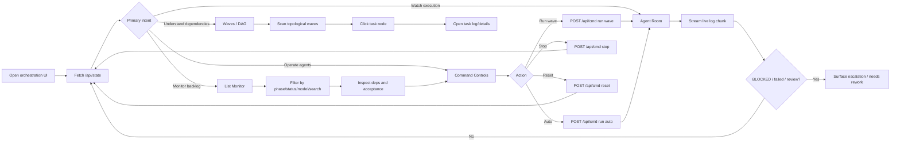
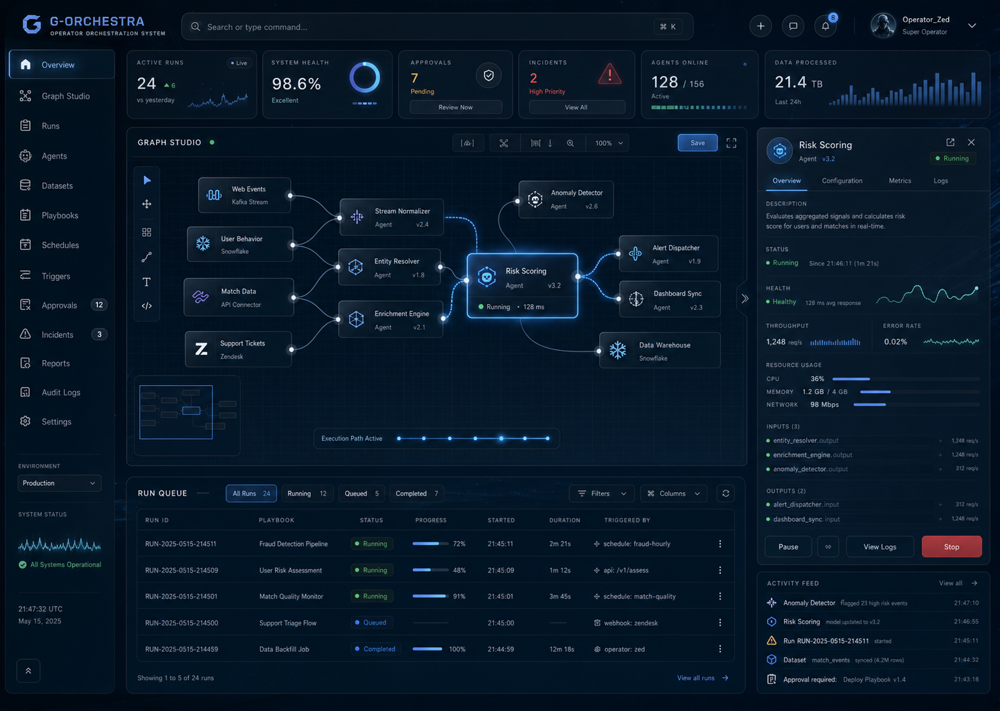

# G-Orchestra UI Sitemap / User Flow / Design Board

> Dev-tool-specific design map for `G-Orchestra`, the real multi-agent orchestrator in this repository.
> Requirements: [SRS--G-ORCHESTRA.md](SRS--G-ORCHESTRA.md)
> Feature spec: [FEAT--MULTI-AGENT-ORCHESTRATOR.md](FEAT--MULTI-AGENT-ORCHESTRATOR.md)
> Current implementation: [../](../) and [public/index.html](../public/index.html)

---

## 1. Product Boundary

`G-Orchestra` คือ internal multi-agent dev tool ที่อยู่ใน `orchestration/`
สำหรับจัดการ task backlog, dependency gating, model routing, worker pool, provider/auth state,
usage, logs, review gate, และ agent execution state ของการพัฒนา `G-Maiden`
ระบบนี้แยกจาก player-facing `G-Maiden` runtime และไม่ใช่ shipped user product แต่ใช้ shared theme เดียวกัน

| Boundary | Decision |
| --- | --- |
| Primary user | Developer / operator / builder |
| Primary job | Inspect and coordinate multi-agent backlog, DAG, workers, providers, usage, logs, and review state |
| Product mood | Command, orchestration, builder, control room |
| Data density | Medium to high |
| Character role | Ambient brand presence only |
| Not this | Player live overlay, voice companion, in-game warning HUD, shipped user product |
| Source of truth | `backlog.json`, `config.json`, `state.json`, `engine.mjs`, `server.mjs` |

## 2. Sitemap

```mermaid
flowchart TD
  A["G-Orchestra"] --> B["List Monitor"]
  A --> C["Waves / DAG"]
  A --> D["Agent Room"]
  A --> E["Provider / Auth"]
  A --> F["Usage Meter"]
  A --> G["Command Controls"]
  A --> H["Logs / Review Gate"]

  B --> B1["Task rows from backlog.json"]
  B --> B2["Status filters"]
  B --> B3["Phase / model filters"]
  B --> B4["Dependency chips"]

  C --> C1["Topological waves"]
  C --> C2["Dependency edges"]
  C --> C3["Ready / running / done state"]
  C --> C4["Clickable task nodes"]

  D --> D1["Live agent tiles"]
  D --> D2["Streaming logs"]
  D --> D3["Running / claimed / reviewing"]
  D --> D4["BLOCKED / escalation surface"]

  E --> E1["Claude plan / API key"]
  E --> E2["Ollama status"]
  E --> E3["Provider registry"]
  E --> E4["Role routing"]

  F --> F1["Session cost"]
  F --> F2["Weekly cost"]
  F --> F3["Token in / out / cache"]

  G --> G1["Run wave"]
  G --> G2["Auto run"]
  G --> G3["Stop pool"]
  G --> G4["Reset state"]

  H --> H1["Task log modal"]
  H --> H2["Reviewer status"]
  H --> H3["Needs rework"]
```

## 3. User Flow

## 4. Presentation Board

### Direction

`Maiden Blue Quiet Luxury Gaming / Esport`, adapted into a real multi-agent command system.

### Visual Priorities

- Backlog, DAG waves, worker pool, provider/auth, usage, and logs are the main hierarchy.
- Denser glass panels than G-Maiden, but still calm and readable.
- Maiden blue/cyan traces for ready/running execution paths.
- Agent Room should feel live: subtle log streaming, active tiles, and state pulses.
- Ambient brand presence only; character art should not compete with operational data.

### Screen Direction

#### Multi-Agent Command Center

Real orchestration surface. List Monitor, Waves/DAG, Agent Room, provider/auth, usage, and command controls are the primary hierarchy.

## 5. Component Notes

| Component | Purpose | UI notes |
| --- | --- | --- |
| `TaskRow` | Real backlog task from `backlog.json` | Status, deps, model badge, claim/dispatch/done/fail/release controls |
| `DagNode` | Topological wave node from `snapshot().waves` | Status color, dependency edge, click-to-log |
| `AgentTile` | Live running/claimed/reviewing worker tile | Streams `/api/log`, supports blocked/review state |
| `ProviderChip` | Claude/Ollama/provider visibility | Plan/API key mode, Ollama up/down, role route awareness |
| `UsageCard` | Cost/token guardrail | Session/weekly cost and token in/out/cache from `usage.jsonl` |
| `CommandControl` | Operational controls | Run wave, auto, stop, reset, dispatch, assign model |
| `ReviewState` | Verify gate state | reviewing / needs-rework / failed state surfaced before completion |

## 6. Acceptance Criteria

- [ ] G-Orchestra remains an internal multi-agent dev tool and does not include live in-game companion HUD.
- [ ] List Monitor, Waves/DAG, Agent Room, Provider/Auth, Usage, and command controls are the core hierarchy.
- [ ] Implementation link resolves to `orchestration/` and `orchestration/public/index.html`.
- [ ] The shared Maiden theme is visible without making the tool feel like the G-Maiden player product.
- [ ] Motion communicates orchestration state, execution path, live agent logs, and command focus.
- [ ] Implementation stays outside the G-Maiden Tauri app unless explicitly promoted later.

---

## CHANGELOG

| Version | Date | Status | Summary | Commit Hash | Agent |
|---------|------|--------|---------|-------------|-------|
| 0.4.0b | 2026-06-24 | candidate | Moved canonical G-Orchestra UI design doc into `orchestration/docs` and linked local SRS/FEAT docs. | pending | ATHER |
| 0.3.0b | 2026-06-24 | candidate | Reframed G-Orchestra around the real `orchestration/` multi-agent system and its current web UI. | pending | ATHER |
| 0.2.0b | 2026-06-24 | candidate | Reframed G-Orchestra as an internal dev tool and linked the standalone implementation path. | pending | ATHER |
| 0.1.0b | 2026-06-24 | candidate | Initial G-Orchestra-specific sitemap, user flow, presentation board, screen direction, and component notes. | pending | ATHER |
